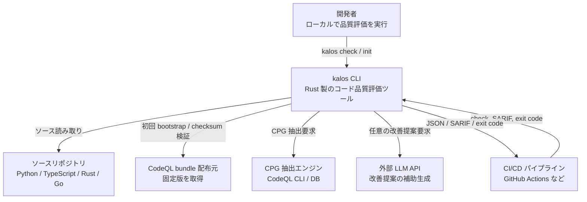
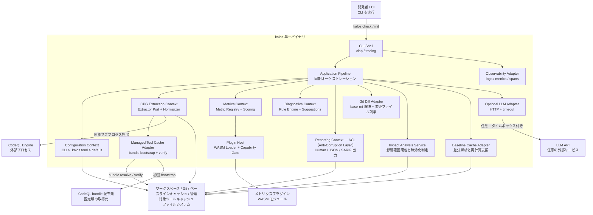
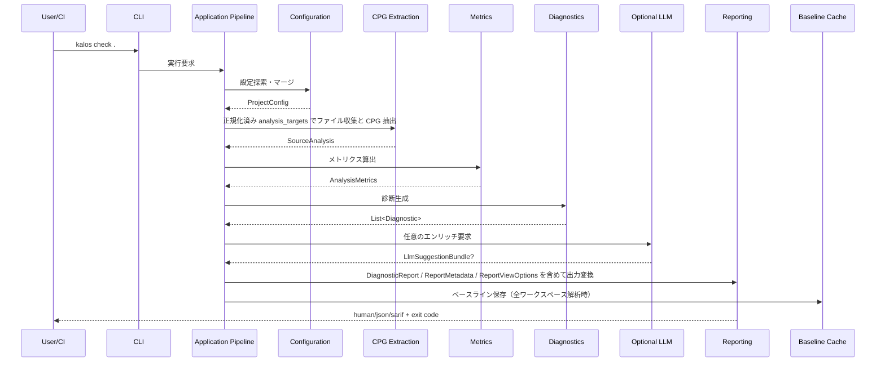
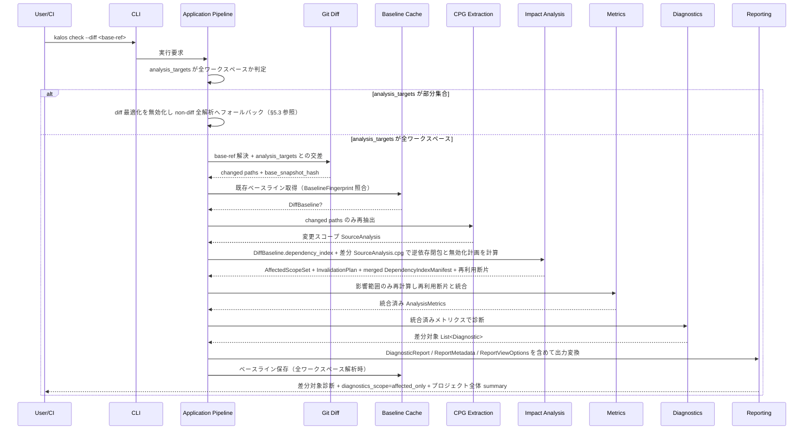

# kalos アーキテクチャ設計書

## メタ情報

| 項目 | 内容 |
|---|---|
| バージョン | 0.3.0 |
| 最終更新日 | 2026-03-21 |
| ステータス | ドラフト |
| 入力 | requirements.md v0.3.0, domain_model.md v0.3.0 |

## 1. 設計目標

### 1.1 目的

kalos は、ソースコードからコードプロパティグラフ（CPG）を抽出し、情報理論・グラフ理論に基づくメトリクスでコード品質を定量評価する CLI ツールである。要件上の主価値は、既存リンターでは出しにくい構造的改善点を、再現可能なスコアと具体的な改善提案として返すことにある。[requirements.md](./requirements.md)

### 1.2 設計方針

- 全体は **単一 Rust バイナリのモジュラーモノリス** とする
- 解析フローは **決定論的な同期パイプライン** とする
- ドメイン境界は `CPG抽出 / 差分解析 / メトリクス算出 / 診断 / 構成管理 / レポート` に一致させる
- 外部通信/外部プロセス依存は **managed CodeQL bundle の bootstrap**、**CPG抽出エンジン**、**任意の LLM** に限定し、いずれもポート経由で隔離する
- 差分解析と拡張性は、コアを崩さずに後付け可能な形で内蔵する

### 1.3 設計ドライバー

| 優先度 | 品質特性 | 根拠 |
|---|---|---|
| 1 | 決定論性 | `REQ-NF-003`, 成功基準 3 |
| 2 | 性能 | `REQ-NF-001`, `REQ-NF-002`, 成功基準 4 |
| 3 | 拡張性 | `REQ-NF-005`, `REQ-NF-006`, `REQ-FUNC-012` |
| 4 | 可搬性 | `REQ-NF-004`, `REQ-FUNC-031`, `REQ-FUNC-032` |
| 5 | 可用性 | `REQ-NF-008`, `REQ-FUNC-015` |
| 6 | 初回利用容易性 | `REQ-NF-007`, `REQ-FUNC-025` |

## 2. 品質特性シナリオ

| ID | 品質特性 | 刺激 | 環境 | 応答 | 測定基準 | 対応要件 |
|---|---|---|---|---|---|---|
| QA-01 | 決定論性 | 同一ソース・同一設定で `kalos check .` を繰り返し実行する | Linux/macOS/Windows の対応環境 | CPG 正規化順、メトリクス集約順、診断出力順を固定し、同一結果を返す | メトリクス値・診断・総合スコア・JSON/SARIF のハッシュが一致 | `REQ-NF-003` |
| QA-02 | 性能 | 1万 LOC 規模のプロジェクトを全階層解析する | `bench-linux-x64`（4 vCPU / 16GB / SSD、managed CodeQL bundle warm、baseline cache empty） | パイプライン各段階を時間予算内で完了する | 全解析 60 秒以内 | `REQ-NF-001` |
| QA-03 | 性能 | 10 ファイル以下の変更を PR で評価する | `bench-linux-x64` + baseline cache warm + stable checkout path | 変更影響範囲のみ再計算し、既存ベースラインを再利用する | 差分解析 10 秒以内 | `REQ-NF-002`, `REQ-FUNC-034` |
| QA-04 | 拡張性 | 新言語を 1 つ追加する | 既存コアを維持したまま機能拡張する | CPG 抽出境界内の parser / normalizer / language profile 追加で対応する | Metrics・Scoring・Reporting・CLI 層の変更不要 | `REQ-NF-005` |
| QA-05 | 拡張性 | 新しい report-only plugin metric を追加する | 既存ルール群が動作中 | メトリクス実装と登録だけでパイプラインに統合される | 既存の CPG 抽出・CLI・設定への変更最小 | `REQ-NF-006`, `REQ-FUNC-012` |
| QA-06 | 可用性 | `--llm` 使用中に LLM がタイムアウトする | ネットワーク遅延または外部障害 | テンプレート提案へフォールバックし、コア評価を継続する | 診断集合・重大度・Exit code が変わらない | `REQ-NF-008`, `REQ-FUNC-015` |

### 2.1 トレードオフ方針

- 決定論性を性能より優先する。無秩序な並列化は採用しない
- 初期リリースでは分散構成を取らず、単一バイナリで性能目標を狙う
- LLM は UX 改善機能であり、診断の正しさや CI 判定に介入させない
- 差分解析は「速いが意味がぶれない」ことを優先し、ベースライン統合を前提にする

## 3. 採用アーキテクチャ

### 3.1 結論

kalos は **単一 Rust バイナリのモジュラーモノリス** を採用し、その内部を **ポート&アダプタ** と **Pipe-and-Filter** で構成する。

- モノリス採用理由:
  - CLI ツールであり、独立デプロイ単位を複数持つ必然性がない
  - `REQ-FUNC-031` の単独配布と `REQ-NF-004` のクロスプラットフォーム対応に有利
  - `REQ-NF-003` の決定論性を分散境界なしで制御しやすい
- モジュラー化理由:
  - ドメインモデルの 6 コンテキストをそのままコード境界に落とし込める
  - `REQ-NF-005/006` を満たす拡張点をコアから独立させられる
- Pipe-and-Filter 採用理由:
  - 要件文書の依存チェーン `CPG → Metrics → Diagnostics → Report` と一致する
  - ステージごとのベンチマーク・キャッシュ・障害切り分けが容易

### 3.2 C4 レベル1: システムコンテキスト図



### 3.3 C4 レベル3: コンポーネント図



## 4. コンポーネント設計

### 4.1 コンテキストと責務

| コンテキスト | 主要責務 | 入力 | 出力 | 対応要件 |
|---|---|---|---|---|
| CLI Shell | コマンド解釈、標準入出力、Exit code 返却 | CLI 引数 | 実行指示、終了コード | `REQ-FUNC-018`, `REQ-FUNC-022`, `REQ-FUNC-023`, `REQ-FUNC-030` |
| Application Pipeline | パイプラインオーケストレーション、diff/full モード選択、`DiagnosticReport` の assemble（summary materialization を含む）、`LlmEnrichmentRequest` 組立、exit code 判定、`--strict` セマンティクスの適用 | 全コンテキスト出力 + `ProjectConfig` | `DiagnosticReport` + `ReportMetadata` + `ReportViewOptions` + exit code | 大部分の `REQ-FUNC-*` を横断 |
| Configuration | 明示/探索ベースの設定解決、`WorkspaceRoot` 解決、`analysis_targets` 正規化・検証、優先順位マージ、デフォルト提供 | CLI（`--config` を含む）、CLI path 引数（省略時は `["."]`）、`.kalos.toml`、既定値 | `ProjectConfig`（`WorkspaceRoot` を含む）、正規化済み `analysis_targets` | `REQ-FUNC-018`, `REQ-FUNC-025`〜`028`, `REQ-FUNC-030`, `REQ-NF-007` |
| Git Diff Adapter | `base-ref` 解決、変更ファイル列挙、`base_snapshot_hash` 取得 | `WorkspaceRoot`、`analysis_targets`、`base-ref` | 変更対象 path 群、`base_snapshot_hash` | `REQ-FUNC-034`, `REQ-NF-002`, `REQ-NF-003` |
| CPG Extraction | ファイル収集、除外適用、抽出エンジン呼び出し、依存定義/lockfile からの外部シンボル解決、`UnifiedCpg` 変換、抑制コメント抽出 | ワークスペース、`ProjectConfig`、依存定義/lockfile、ローカル stub / metadata cache | `SourceAnalysis` | `REQ-FUNC-001`〜`007`, `REQ-FUNC-029`（抽出）, `REQ-FUNC-031` |
| Managed Tool Cache Adapter | CodeQL bundle の bootstrap、checksum 検証、ローカル cache 解決 | kalos release と一体で versioning された固定版 manifest、cache directory | 解決済み extractor bundle | `REQ-FUNC-031`, `REQ-FUNC-032`, `REQ-NF-009`, `REQ-NF-010` |
| Metrics | メトリクス計算、正規化、階層スコア集約。`enabled = false` のルールにバインドされたメトリクスは計算・`metrics` 出力は維持するが、`scope_risk` 算術平均の母集団から除外する | `SourceAnalysis`、`ScoreWeights` | `AnalysisMetrics` | `REQ-FUNC-008`〜`012`, `REQ-NF-003`, `REQ-NF-006` |
| Diagnostics | 閾値判定、パターン検出、テンプレート改善提案、抑制適用。`enabled = false` のルールは診断を生成せず、当該ルールにバインドされたメトリクスは `scope_risk` 集約から除外される（スコアリング・summary・exit code に影響しない） | `AnalysisMetrics`、`SourceAnalysis`、`ProjectConfig` | `List<Diagnostic>` | `REQ-FUNC-013`〜`017`, `REQ-FUNC-026`, `REQ-FUNC-029`（適用）, `REQ-NF-008` |
| Reporting | human / JSON / SARIF への変換、`diagnostics_scope` / `summary_scope` を含む出力整形、`analysis_targets` / `tool_version` / `schema_version` メタデータ付与、`--level` に応じた nullable score 射影、任意 LLM 提案の併記 | `AnalysisMetrics`、`DiagnosticReport`、`ReportMetadata`、`ReportViewOptions`、`LlmSuggestionBundle?` | 標準出力 / ファイル出力 | `REQ-FUNC-019`〜`021`, `REQ-FUNC-024`, `REQ-FUNC-033` |
| Plugin Host | WASM プラグイン検証、SPI 読込、capability 制御 | `ProjectConfig.plugin_manifest`、WASM モジュール、`CpgSubgraph`、`MetricConfig` | `MetricDefinition` 拡張群（v1 では `participation = ReportOnly`） | `REQ-FUNC-012`, `REQ-NF-006`, `REQ-NF-003` |
| Impact Analysis Service | 逆依存インデックス構築、影響範囲閉包、キャッシュ無効化判定 | 差分 `SourceAnalysis`、`DiffBaseline`、`base_snapshot_hash` | `AffectedScopeSet`、`InvalidationPlan`、`merged DependencyIndexManifest`、再利用断片 | `REQ-FUNC-034`, `REQ-NF-002`, `REQ-NF-003` |
| Baseline Cache Adapter | 差分解析用ベースラインの保存と読み戻し | `DiffBaseline`、`BaselineFingerprint` | `DiffBaseline?` | `REQ-FUNC-034`, `REQ-NF-002` |
| Observability Adapter | 構造化ログ、スパン、性能メトリクス | 実行イベント | ログ、内部計測 | `REQ-NF-001`, `REQ-NF-002` |

### 4.2 依存方向

依存方向は以下で固定する。

```text
CLI Shell
  -> Application Pipeline
      -> Configuration
      -> CPG Extraction
      -> Metrics
      -> Diagnostics
      -> Impact Analysis Service
      -> Reporting
      -> Baseline Cache Adapter

Application Pipeline
  -> Diff Source Port
      -> Git Diff Adapter

Application Pipeline
  -> LLM Enrichment Port
      -> Optional LLM Adapter

CPG Extraction
  -> Tool Cache Port
      -> Managed Tool Cache Adapter

Metrics
  -> Plugin Host
      -> WASM Metric Modules

CPG Extraction
  -> Extractor Port
      -> CodeQL Adapter
      -> (将来) 代替エンジン Adapter

CPG Extraction
  -> Dependency Symbol Resolver Port
      -> Cargo/npm/pip/go resolver adapters
```

ルール:

- ドメインコンテキスト同士は公開契約でのみ接続する
- `Reporting` は ACL（Anti-Corruption Layer — 外部出力スキーマからドメインを隔離する境界）としてのみ存在し、ドメインへ逆流しない
- `Configuration` が `--config` を含む CLI 入力から `WorkspaceRoot` を一意に確定し、CLI path 引数（省略時は `["."]`）を `WorkspaceRoot` 基準の `analysis_targets` へ正規化する。正規化済み `analysis_targets` は入力順を保持したまま `ReportMetadata` として下流へ渡す
- `Git Diff Adapter` が `base-ref` の解決、変更ファイル列挙、`base_snapshot_hash` の取得を担当する。`CPG Extraction` は明示的に渡された path 群だけを抽出する
- テンプレート改善提案の生成は `Diagnostics` コンテキスト内部の決定論的ロジックであり、別 adapter/port へ分離しない
- `Diagnostics` は canonical `primary_scope_id` を持つ `Diagnostic` の一覧だけを返し、diff 表示判定や `ScopeDiagnosticSnapshot` の所有単位はその `primary_scope_id` を基準にする。metric 診断では評価対象 `ScopeId`、pattern 診断では主対象 scope、単一の主対象を持たない cross-scope 診断では辞書順最小 `ScopeId` を使う
- `LLM Adapter` は allowlist 済み `LlmEnrichmentRequest` を読み取り、`DiagnosticId` 単位の `LlmSuggestionBundle` だけを返す
- `Application Pipeline` が `Diagnostic` と `SourceAnalysis` から `LlmEnrichmentRequest` を組み立てる。`rule_id`, `severity`, `workspace_relative_path` は `Diagnostic` から、`language` は `Diagnostic.location.file_path` に対応する `SourceAnalysis.source_files` の代表ファイルメタデータから取得する。`SourceAnalysis.source_files` は workspace-relative path 一意かつ path 昇順の決定論的対応表である。`source_excerpt` または `cpg_excerpt` は代表ファイルへ還元できる対象スコープの CPG・ソースから取得し、request を生成する場合は相互排他的に一方のみを設定する。`metric` または `pattern` は `Diagnostic.kind` に応じて排他的に設定する。multi-file / multi-language 診断で必須根拠を代表ファイル断片へ還元できない場合は LLM sidecar を起動しない
- `Application Pipeline` は `List<Diagnostic>` と `summary_scope` から `DiagnosticReport` を assemble する。`summary_scope = listed_diagnostics` では現在の診断一覧から、diff mode かつ `summary_scope = whole_project` では merged post-change `ScopeDiagnosticSnapshot` から summary を materialize する
- `ReportViewOptions.minimum_severity` は診断一覧の表示/出力対象だけを絞り込み、`DiagnosticReport.summary` と exit code の計算母集団は変えない
- `Application Pipeline` は `--strict` を `DiagnosticReport.determine_exit_code(strict)` へ渡すだけで、`Diagnostic.severity` や `DiagnosticReport.summary` を変更しない
- SARIF writer は `Diagnostic.rule_id` を `run.tool.driver.rules[]` と `result.ruleId` / `result.ruleIndex` へ写像し、`Diagnostic.severity` を `result.level`（`error` → `error`, `warning` → `warning`, `info` → `note`）へ写像する
- SARIF writer は `Diagnostic.location` を `result.locations[].physicalLocation` へ写像し、`artifactLocation.uri` には `WorkspaceRoot` 相対パス、`region.startLine` / `endLine` には `location.start_line` / `end_line` を使う。`location.column` が `None` の診断では `startColumn` / `endColumn` を出力しない
- SARIF writer は `Diagnostic.message` → `result.message.text`、`template_suggestion` → `result.properties.kalos.template_suggestion`、`llm_suggestion`（存在する場合）→ `result.properties.kalos.llm_suggestion` の固定写像を用いる
- `Baseline Cache Adapter` は `DiffBaseline`（丸め済み `scope_risk` を含む `ScopeMetrics`、`ScopeDiagnosticSnapshot`、`*_risk`/`*_score` を含む `OverallScore`、`DependencyIndexManifest`）だけを保持し、計算ロジックは持たない
- `Impact Analysis Service` が「どの `ScopeId` を再計算すべきか」の唯一の owner である
- `Plugin Host` は additive-only な `CpgSubgraph` の read-only view と `MetricConfig` だけを SPI 入力として渡し、`MetricDefinition` 登録と `compute(subgraph, config) -> MetricValue` の pure function 契約のみを許容する。各 plugin metric は `MetricDefinition.level` に一致する各 `ScopeId` ごとに 1 回ずつ評価し、入力には `UnifiedCpg.subgraph(scope_id)` を渡す。project metric は正規形 `ScopeId(level = Project, qualified_name = "<project>", file_path = ".")` に対して 1 回だけ評価する。`plugin_manifest` は `workspace_relative_path` 昇順でロードし、乱数・時刻・ネットワーク・ファイル書込を禁止し、`metric_id` 衝突は deterministic なロード失敗として扱う。per-invocation fuel budget と aggregate fuel budget はいずれも WASM fuel metering で制御し（fuel が規範的上限、壁時間は参考値。ADR-0004 参照）、diff mode では現在の実行で失敗またはスキップされたプラグインの baseline cache 済み `MetricValue` を最終出力から除外する
- `Configuration` は `--config` 指定時の `WorkspaceRoot` 解決、CLI path 引数から `analysis_targets` への正規化（省略時は `["."]`）、`analysis_targets` と plugin `path` の `WorkspaceRoot` 内包性検証、`sha256` 構文検証を行い、違反時は設定/入力エラー（exit code 2）として処理する。`Plugin Host` は解決済み `plugin_manifest` だけを受け取り、ファイル読込失敗・checksum 不一致・SPI 不一致・`metric_id` 衝突・fuel budget 超過・メモリ超過・aggregate fuel budget 超過を warning + skip として扱う
- `Plugin Host` は WASM プラグイン invocation ごとに `per-invocation fuel budget = 500_000 fuel`（参考: ~50ms）、`linear_memory_limit = 64MiB`、実行全体では Metrics stage budget の内数として `aggregate fuel budget = 30_000_000 fuel`（全解析、参考: ~3s）/ `5_000_000 fuel`（diff mode、参考: ~0.5s）を適用し、超過時は当該プラグイン評価または残り評価を失敗/skip として打ち切る。fuel が規範的（normative）な上限であり、壁時間は環境により変動する参考値である（ADR-0004 参照）。失敗は運用警告として `stderr` / 構造化ログへ出し、v1 の診断・スコア・Exit code 契約には影響させない

### 4.3 推奨コード構成

```text
src/
├── cli/
│   ├── check.rs
│   └── init.rs
├── application/
│   ├── pipeline.rs
│   ├── commands.rs
│   └── services/
├── domains/
│   ├── config/
│   ├── cpg/
│   ├── impact/
│   ├── metrics/
│   ├── diagnostics/
│   └── reporting/
├── ports/
│   ├── extractor.rs
│   ├── dependency_resolver.rs
│   ├── llm.rs
│   ├── plugin.rs
│   ├── cache.rs
│   ├── tool_cache.rs
│   └── reporter.rs
├── adapters/
│   ├── extractor/codeql/
│   ├── dependency_resolver/{cargo,npm,pip,go}/
│   ├── tool_cache/managed_bundle/
│   ├── llm/http/
│   ├── plugin/wasm/
│   ├── cache/filesystem/
│   └── reporter/{human,json,sarif}.rs
└── platform/
    ├── fs.rs
    ├── process.rs
    └── telemetry.rs
```

## 5. 主要フロー

### 5.1 全解析フロー



### 5.2 差分解析フロー

以下のシーケンス図は `analysis_targets` が全ワークスペースである場合の差分解析フローを示す。`analysis_targets` が部分集合の場合は diff 最適化を適用せず、ベースラインの読み書きも行わない（§5.3 参照）。



差分解析では、以下を不変条件とする。

- `scores.overall` は常に `AnalysisMetrics.OverallScore` の写像であり、診断件数から逆算しない。`--level all`（デフォルト）では変更後のプロジェクト全体メトリクス、`--level` で階層を限定した場合は変更後の指定階層メトリクスを意味する
- `--level` は報告対象を絞るだけであり、内部的には全階層（function / module / project）のメトリクス算出・診断生成を実行する。ベースラインキャッシュの保存不変条件（§5.3、ADR-0003）として全階層の結果が必要なためである。`--level` で選択されなかった階層の結果は報告・スコア集約の対象にはならない
- そのため、変更が及ばないスコープのメトリクスはベースラインから再利用する。ただし、プラグインメトリクスの再利用は当該プラグインが現在の実行で正常にロード・評価された場合に限り、失敗またはスキップされたプラグインの cache 済み `MetricValue` は除外する
- 個別診断の一覧は `AffectedScopeSet` に属するスコープだけを表示する
- `DiagnosticReport.summary` と exit code は `summary_scope` の母集団を基準に解釈する。`--level all`（デフォルト）では `whole_project`、`--level` で階層を限定した場合は `listed_diagnostics` となる。summary 自体は Application Pipeline が materialize し、diff mode かつ `summary_scope = whole_project` では merged post-change `ScopeDiagnosticSnapshot` から再構成する
- full mode の `diagnostics_scope = whole_project` は「選択された `--level` に関する診断集合が完全」を意味し、未選択階層の診断欠落を意味しない
- 機械可読出力は `diagnostics_scope` と `summary_scope` を明示する
- `analysis_targets` は CLI 入力順を保持した `WorkspaceRoot` 相対 path 群であり、human/json/sarif すべて同一の `ReportMetadata` を参照する
- `ReportMetadata.schema_version` の初期値は `"1.0.0"` とする。バンプポリシー: payload shape とセマンティクスの双方に影響しない明確化・注記追加は patch、後方互換な optional フィールド追加は minor、フィールド削除・型変更・必須化・既存フィールドのセマンティクス変更は major とする
- `--diff` の最適化が有効な実行では `Impact Analysis Service` が `Project` scope を `recompute_scopes` に必ず含め、project-level metrics と `scores.overall` / `scores.project` を post-change 状態から再構成する
- `analysis_targets` が全ワークスペースの部分集合である実行、ベースライン不在、互換性不一致、影響範囲を安全に確定できない、または project scope を安全に再計算できない場合は、要求された `analysis_targets` / `--level` を保った non-diff 全解析へフォールバックする（要求された `analysis_targets` のみを対象とし、全ワークスペースへ拡張しない）
- **ベースラインキャッシュ write-back 契約**:
  - **書き込み条件**: 全ワークスペース解析が正常完了した場合のみ（exit code 0 または 1）
  - **書き込みタイミング**: `DiagnosticReport` の assemble 完了後、exit code 返却前
  - **書き込まない条件**: `analysis_targets` が部分集合の実行、kalos 自体の実行エラー（exit code 2）
  - **原子性**: 一時ファイルへ書き込み後にリネームする（部分書き込みを防ぐ）

### 5.3 差分解析の契約

- **全ワークスペース / 部分集合の判定基準**: CLI path 引数省略時（デフォルト `["."]`）は全ワークスペースとして扱う。CLI path 引数が明示的に指定された場合は、明示的指定が `WorkspaceRoot` 配下の全対象ファイルを網羅するかどうかは判定せず、常に部分集合として扱う（REQ-FUNC-034、ADR-0003 参照）
- 影響範囲の owner は `Impact Analysis Service` とし、`UnifiedCpg` から生成したモジュール/関数依存グラフの逆閉包で `AffectedScopeSet` を求める
- **Merged dependency graph 生成契約**: `Impact Analysis Service` が merged dependency graph の生成と逆閉包計算の唯一の owner である
  - **入力**: (1) `DiffBaseline.dependency_index`（ベースラインの `DependencyIndexManifest` — 全スコープ間の依存辺）、(2) 差分 `SourceAnalysis.cpg`（変更されたファイルから抽出した `UnifiedCpg`）
  - **処理**: (1) 差分 `UnifiedCpg` から変更スコープの依存辺を抽出する → (2) baseline `DependencyIndexManifest` の変更スコープに関する辺を差分 CPG 由来の辺で **置換** する → (3) 未変更スコープの辺は baseline をそのまま保持する → (4) 統合した依存グラフ上で変更スコープを起点に **逆** 推移的閉包を計算し、`AffectedScopeSet` を求める
  - **フォールバック**: baseline に `DependencyIndexManifest` が存在しない場合 → `fallback_to_full = true`。依存辺の統合でグラフ整合性を保証できない場合（未解決参照が多数等） → `fallback_to_full = true`
  - **出力**: merged `DependencyIndexManifest`（次回ベースライン保存用） + `AffectedScopeSet`
- `InvalidationPlan.recompute_scopes` は diff 最適化が有効な限り `ScopeId(level = Project, qualified_name = "<project>", file_path = ".")` を必ず含む。project-level metrics と `OverallScore` は merged post-change snapshot から再計算し、baseline の project 断片をそのまま最終結果へ流用しない
- ベースライン断片の保存単位は、丸め済み `scope_risk` を含む `ScopeMetrics(function/module/project)`、`ScopeDiagnosticSnapshot`、丸め済み `function_risk` / `module_risk` / `project_risk` / `overall_risk` と整数 `*_score` を含む `OverallScore`、`DependencyIndexManifest` とする
- `WorkspaceRoot` は Configuration が `--config <path>` 指定時はその `.kalos.toml` の親を、未指定時は `nearest .kalos.toml parent -> nearest .git parent -> current working directory` の順で一意に解決し、内部 `FilePath` / `workspace_relative_path` / `plugin_manifest` / `analysis_targets` はすべてこの基準から導出する
- ベースライン識別子は `workspace_root_hash + base_snapshot_hash + config_hash + analysis_targets_hash + rule_catalog_version + extractor_version + kalos_version` とする
- `workspace_root_hash` は `WorkspaceRoot` の正規化済み絶対パスから算出したハッシュであり、異なるチェックアウトパス間でベースラインキャッシュが誤って共有されないことを保証する
- `analysis_targets_hash` は `analysis_targets` の正規化済み path 群から算出したハッシュであり、解析対象パスが変わった場合にベースラインの不正な再利用を防ぐ
- ベースラインキャッシュは `--level` に関わらず全階層の `ScopeMetrics` と `ScopeDiagnosticSnapshot` を保存する。`--level` は報告対象の制限であり、キャッシュの保存範囲には影響しない
- ベースラインキャッシュの永続化対象は全ワークスペース解析に限定する。`analysis_targets` が部分集合の実行は cache を生成せず、既存 cache も読まない。この場合 `--diff` 最適化は無効化し、要求された `analysis_targets` のみを対象とした non-diff 全解析へフォールバックする（全ワークスペースへ拡張しない）
- `base_snapshot_hash` は `--diff <base-ref>` の基準側 tree を表し、現在ワークツリーのハッシュは含めない
- 外部シンボル解決は `Dependency Symbol Resolver Port` の責務であり、依存定義・lockfile・ローカル stub / metadata cache だけを入力に使う。解決失敗は `SourceAnalysis.warnings` として下流へ渡し、解析時の追加ネットワーク通信は行わない
- Managed Tool Cache Adapter が参照する bundle manifest（version/checksum）は kalos release の一部として versioning され、GitHub Action はその manifest を差し替えずに prewarm / restore/save の wrapper として振る舞う
- 次の場合は差分再利用を諦めて全解析へフォールバックする
  - ベースラインが存在しない
  - `workspace_root_hash`、`base_snapshot_hash`、`config_hash`、`analysis_targets_hash` のいずれかが一致しない
  - 版情報が一致しない
  - 逆依存閉包が未解決で `AffectedScopeSet` を安全に確定できない
  - project scope を安全に再計算できない
  - 抽出エンジンまたはルールカタログの版が変わっている

## 6. 技術選定

| 領域 | 採用 | 理由 | 関連 ADR |
|---|---|---|---|
| 実装言語 | Rust | 単一バイナリ配布、性能、メモリ安全性 | ADR-0001 |
| CLI | `clap` | 宣言的な引数定義とクロスプラットフォーム互換 | ADR-0001 |
| 設定 | `serde` + `toml` | `.kalos.toml` と型安全なマージに適する | ADR-0001 |
| グラフ処理 | `petgraph` | CPG と依存グラフのアルゴリズム実装に適する | ADR-0001 |
| 並列化 | `rayon` を限定使用 | CPG 正規化後の独立スコープ単位でのみ使用し、reduce 順序を固定する | ADR-0003 |
| CPG 抽出 | Extractor Port + 初期実装は CodeQL Adapter | 要件の前提を守りつつ、将来の代替エンジン差し替えを可能にする | ADR-0002 |
| 差分キャッシュ | ファイルシステムベースの Baseline Cache | ローカル実行・CI キャッシュの両方で利用しやすい | ADR-0003 |
| プラグイン | WASM ホスト + 安定 SPI | ユーザー定義メトリクスをクロスプラットフォームに配布しやすい | ADR-0004 |
| LLM 連携 | HTTP Adapter、API キーは環境変数 | コアと切り離しやすく、障害時フォールバックを実装しやすい | ADR-0005 |

### 6.1 CPG 抽出エンジンの扱い

初期リリースでは **CodeQL を既定の抽出アダプタ** とする。ただし、`ExtractorPort` の外部公開契約は `SourceAnalysis` に固定し、`UnifiedCpg` はその内部公開言語として扱う。CodeQL 依存は `ExtractorPort` の背後に閉じ込める。

これにより:

- 要件の「CodeQL 前提」を満たす
- CodeQL bundle が未配置でも、Managed Tool Cache Adapter が固定バージョン + checksum 検証付きで初回取得できる
- 外部シンボル解決も extractor 境界内の language-specific resolver adapters へ閉じ込め、解析時ネットワーク不要の契約を守れる
- `REQ-NF-005` に従い、新言語追加時の変更面は CPG 抽出境界内の parser / normalizer / language profile へ閉じる
- 性能 PoC の結果次第で代替エンジンへ置換できる

### 6.2 決定論性の実装規約

`REQ-NF-003` を満たすため、以下を設計規約とする。

- ファイル列挙順は正規化された絶対パス昇順
- `Map` 相当は外部出力前にソートし、順序が観測可能な箇所では `BTreeMap` 系を用いる
- 浮動小数点集約は `ScopeId` の辞書順 `(<level>, <qualified_name>, <file_path>)` で行う。`AnalysisLevel` の順序は `function < module < project` に固定する
- project scope の `ScopeId` 正規形は `(<project>, ".")` とし、比較器・キャッシュキー・外部出力で一貫して用いる
- `raw_value` / `normalized_risk` / `overflow_ratio` / 集約途中値は小数第 6 位で round-half-up する
- 並列処理の結果マージは deterministic reduce を使う
- JSON / SARIF 出力はキー順と要素順を安定化させる
- LLM 由来テキストは `LlmSuggestionBundle` としてレポート層でのみ併記し、コア診断と混在させない
- WASM プラグインは `CpgSubgraph + MetricConfig -> MetricValue` の pure function とし、外部時刻・乱数・I/O へ触れさせない
- plugin の per-invocation fuel budget と aggregate fuel budget は WASM fuel metering で制御し（fuel が規範的上限。ADR-0004 参照）、同一入力で `MetricValue` の有無が環境負荷に依存しないようにする

## 7. 運用設計

### 7.1 監視・オブザーバビリティ

CLI 製品なので常駐監視は持たないが、リリース品質を担保するため以下を実装する。

| 項目 | 内容 |
|---|---|
| 構造化ログ | `stage`, `duration_ms`, `file_count`, `diagnostic_count`, `cache_hit_ratio` を出す |
| トレース | `check` 実行全体と各ステージに span を付与する |
| ベンチマーク | 10k LOC コーパスと差分コーパスを CI で定期測定する |
| 失敗分類 | config error / bootstrap warning / extractor error / plugin warning / analysis warning / llm timeout を区別して記録する |

### 7.2 セキュリティ設計

| 観点 | 方針 |
|---|---|
| シークレット管理 | API キーは環境変数のみ。設定ファイルへ保存しない |
| 外部ツール取得 | CodeQL bundle は kalos release 同梱の managed bundle manifest で version/checksum を固定し、managed cache へ初回取得して SHA-256 を検証する |
| 外部プロセス呼出 | CodeQL 呼出は引数配列で実行し、シェル展開しない |
| LLM 送信データ | `--llm` 明示時のみ送信し、対象コード断片または `CpgSubgraphExcerpt` を最小化する。エンドポイント URL は `KALOS_LLM_ENDPOINT_URL` 環境変数で設定する（REQ-NF-009 参照） |
| LLM タイムボックス | `connect timeout = 3s`, `overall timeout = 30s`, `retry = 0` |
| オフライン | managed CodeQL bundle が warm で `--llm` を使わない場合はネットワーク不要。bundle 未取得時は bootstrap 要求エラーで fail-fast する |
| 出力データ | SARIF/JSON に機密情報を埋め込まない。ファイルパスの正規化を行う |
| プラグイン | WASM 実行時はネットワーク・ファイル書込を禁止し、plugin invocation ごとに `per-invocation fuel budget = 500_000 fuel`（参考: ~50ms）、`linear_memory_limit = 64MiB`、Metrics stage 内数の `aggregate fuel budget = 30_000_000 fuel`（全解析、参考: ~3s）/ `5_000_000 fuel`（diff mode、参考: ~0.5s）を適用する。fuel が規範的上限（ADR-0004 参照） |

### 7.3 デプロイ / 配布

| 項目 | 方針 |
|---|---|
| 配布単位 | 各 OS/arch 向けプリビルド単一バイナリ |
| リリース経路 | GitHub Releases に成果物を配置し、公式 Action から取得 |
| 付随資産 | CodeQL bundle は kalos release と一体で versioning される managed bundle manifest に従い、Managed Tool Cache Adapter が初回取得・checksum 検証・キャッシュする |
| CI 統合 | GitHub Action は `check` 実行、managed bundle / baseline cache の prewarm・restore/save、SARIF upload をラップする。bootstrap と検証の正本は kalos CLI 側に置く。差分解析の性能前提（QA-03: 10 秒以内）を満たすには、checkout path を実行間で安定させ `workspace_root_hash` のキャッシュヒット率を高める運用が必要である（ADR-0003 参照） |
| ロールバック | 以前のバイナリへバージョンダウンするだけで復旧可能 |

### 7.4 性能予算

以下の予算は `--llm` 無効のコア評価経路に適用する。LLM は別の optional sidecar budget として扱い、コアの `REQ-NF-001/002` には含めない。

#### 全解析 60 秒予算

| ステージ | 予算 |
|---|---|
| ファイル収集・除外解決 | 5 秒 |
| CPG 抽出 | 30 秒 |
| `UnifiedCpg` 正規化 | 5 秒 |
| メトリクス算出 | 10 秒 |
| 診断生成 | 5 秒 |
| 出力整形 | 5 秒 |

#### 差分解析 10 秒予算

| ステージ | 予算 |
|---|---|
| `git diff` と対象決定 | 1 秒 |
| ベースライン取得 | 1 秒 |
| 差分 CPG 抽出 | 4 秒 |
| 影響範囲メトリクス再計算 | 2 秒 |
| 診断と出力 | 2 秒 |

plugin aggregate fuel budget（全解析 `30_000_000 fuel`、参考: ~3s / 差分 `5_000_000 fuel`、参考: ~0.5s）は、それぞれ Metrics stage budget の内数として会計する。fuel が規範的上限であり、壁時間は参考値（ADR-0004 参照）。

#### LLM sidecar 予算

| 項目 | 予算 |
|---|---|
| connect timeout | 3 秒 |
| overall timeout | 30 秒 |
| retry | 0 |
| 失敗時の挙動 | `llm_suggestion` を省略し、コア診断・スコア・Exit code は不変 |

## 8. 適合度関数

### 適合度関数: 決定論性

- **計測対象**: 同一入力・同一設定で 10 回実行した `AnalysisMetrics` と `DiagnosticReport` のハッシュ
- **閾値**: 10 回すべて一致
- **計測方法**: CI で固定コーパスに対し JSON 出力をハッシュ比較
- **違反時のアクション**: マージ禁止。順序不安定箇所か丸め規則の逸脱を修正する

### 適合度関数: 全解析性能

- **計測対象**: 10k LOC コーパスに対する `kalos check .`
- **閾値**: p95 <= 60 秒
- **計測方法**: nightly ベンチマーク CI
- **違反時のアクション**: 直近変更を perf regression として扱い、原因を切り分ける

### 適合度関数: 差分解析性能

- **計測対象**: 10 ファイル以下の差分コーパスに対する `kalos check --diff`
- **閾値**: p95 <= 10 秒
- **計測方法**: ベースライン付き統合テスト
- **違反時のアクション**: キャッシュ無効化規則または影響範囲計算を見直す

### 適合度関数: 言語追加の変更面

- **計測対象**: 新言語追加時に変更されたモジュール群
- **閾値**: `domains/cpg`、`adapters/extractor`、および extractor 境界の language profile 定義に限定
- **計測方法**: サンプル言語追加のアーキテクチャテスト
- **違反時のアクション**: `UnifiedCpg` 契約か責務分割を見直す

### 適合度関数: メトリクス追加の変更面

- **計測対象**: 新メトリクス追加時の変更ファイル
- **閾値**: メトリクス実装と登録設定に限定
- **計測方法**: サンプルメトリクス追加のアーキテクチャテスト
- **違反時のアクション**: `MetricDefinition` SPI かレジストリ設計を見直す

### 適合度関数: モジュール依存 DAG

- **計測対象**: `application` / `domains/*` / `ports` / `adapters` 間の依存グラフ
- **閾値**: 定義済み依存方向に従い、循環依存が 0 件
- **計測方法**: import / module dependency を検査するアーキテクチャテスト
- **違反時のアクション**: 依存逆流または境界崩壊としてマージ禁止。境界設計かモジュール配置を修正する

### 適合度関数: LLM フォールバック不変条件

- **計測対象**: LLM 正常系と LLM タイムアウト時の診断集合・スコア・Exit code
- **閾値**: 一致
- **計測方法**: LLM Adapter をモックした統合テスト
- **違反時のアクション**: LLM 連携がコア診断へ干渉しているため修正する

## 9. リスクと PoC

| 項目 | リスク | 対応 |
|---|---|---|
| CodeQL 性能 | `REQ-NF-001` を満たせない可能性 | 10k LOC コーパスで PoC。未達なら代替アダプタを比較する |
| 外部シンボル解決 | 4 言語で精度・性能・オフライン性を両立できない可能性 | lockfile / stub / local metadata を使う resolver adapter を PoC し、解決不能時の warning 契約を確認する |
| 差分スコア意味論 | プロジェクト全体スコアが不正確になる可能性 | ベースライン統合を実装し、未取得時は全解析へフォールバックする |
| `f64` の完全一致 | 全 OS でビット一致しない可能性 | 丸め戦略 PoC を実施し、必要なら固定小数点へ切替える |
| WASM プラグインのオーバーヘッド | 解析速度を悪化させる可能性 | 組み込みメトリクスとの差を測り、上限を定める |
| LLM 応答遅延 | CLI UX が悪化する可能性 | タイムアウトとテンプレート先出しを採用する |

### 9.1 PoC 項目

1. CodeQL Adapter で 10k LOC / 4 言語混在コーパスを 60 秒以内に処理できるか
2. `--diff` 実行でベースライン再利用込み 10 秒以内を達成できるか
3. 同一入力 10 回実行で全出力ハッシュが一致するか
4. 新言語追加を CPG 抽出境界内の `Extractor Adapter + UnifiedCpg mapper + language profile` だけで実現できるか
5. 新しい report-only plugin metric を `MetricDefinition` 実装と `.kalos.toml` 登録だけで差し込めるか
6. 各言語の dependency symbol resolver adapter が lockfile / stub / local metadata だけで外部公開 API を解決し、解析時ネットワーク不要を守れるか

## 10. ADR 一覧

| ADR | 概要 |
|---|---|
| [ADR-0001](./adr/0001-adopt-modular-monolith.md) | 単一バイナリのモジュラーモノリス + Ports & Adapters + Pipe-and-Filter を採用する |
| [ADR-0002](./adr/0002-extractor-port-with-codeql-adapter.md) | `ExtractorPort` の背後に初期実装として CodeQL Adapter を置く |
| [ADR-0003](./adr/0003-deterministic-core-and-baseline-cache.md) | 決定論性規約と差分解析用ベースラインキャッシュを同時に採用する |
| [ADR-0004](./adr/0004-wasm-metric-plugin-runtime.md) | ユーザー定義メトリクス拡張に WASM ベースのプラグイン境界を採用する |
| [ADR-0005](./adr/0005-optional-llm-enrichment.md) | LLM を任意の後段エンリッチとして隔離し、コア診断に介入させない |

## 変更履歴

| バージョン | 日付 | 変更内容 | 変更者 |
|---|---|---|---|
| 0.3.0 | 2026-03-21 | レビュー指摘解決: 版メタ同期、`enabled = false` のスコア集約除外セマンティクス追記、merged dependency graph 生成契約追加、Application Pipeline 責務表追加、C4 レベル3 名称修正 + Git Diff Adapter 追加、ベースライン write-back ライフサイクル追加、subset fallback 文言明確化、`summary_scope` 表記統一 | Claude |
| 0.2.12 | 2026-03-20 | Diagnostics 出力を `List<Diagnostic>` に整理し、Application Pipeline の report assembly / summary materialization、`primary_scope_id` 契約、plugin baseline 再利用ゲートと aggregate fuel budget を反映 | Codex |
| 0.2.11 | 2026-03-19 | `Diagnostic.location` フィールド名を `start_line`/`end_line`/`column` に統一、plugin の level-to-subgraph 契約と `schema_version` 初期値 `"1.0.0"` / バンプポリシーを定義 | Claude |
| 0.2.10 | 2026-03-19 | `analysis_targets` 正規化の owner を Configuration へ移動、CLI path 省略時のデフォルト `["."]` を明記、SARIF の rule/severity/location/message 写像規則を同期 | Claude |
| 0.2.9 | 2026-03-19 | 明示 `--config` の `WorkspaceRoot` 解決、`analysis_targets` 検証 owner、plugin load order、diff fallback 条件を同期 | Codex |
| 0.2.8 | 2026-03-19 | `scores.overall` と summary の責務分離、project scope 再計算、subset diff fallback、plugin 検証境界、`schema_version` メタデータを反映 | Codex |
| 0.2.7 | 2026-03-19 | Git Diff Adapter の責務、plugin `metric_id` 衝突契約、diff フローの責務分離を反映 | Codex |
| 0.2.6 | 2026-03-19 | ベースライン識別子に analysis_targets_hash 追加、パターンルール入力の内部算出契約、全階層ベースライン保存を明文化 | Claude |
| 0.2.5 | 2026-03-19 | `SourceAnalysis` を ExtractorPort 公開契約に統一し、resolver/report metadata/DAG fitness/managed manifest 契約を追加 | Codex |
| 0.2.4 | 2026-03-19 | `requirements.md` / `domain_model.md` v0.2.4 への入力参照を同期 | Codex |
| 0.2.3 | 2026-03-19 | plugin aggregate budget を Metrics stage 内数へ調整し、PoC と LLM excerpt one-of 契約を整合 | Codex |
| 0.2.2 | 2026-03-19 | `WorkspaceRoot` 解決、Go package owner scope、plugin report-only/aggregate budget、LLM representative-file skip 契約を反映 | Codex |
| 0.2.1 | 2026-03-19 | Tool Cache owner、plugin/config hash、LLM representative file、core/LLM budget 分離、言語拡張境界を明文化 | Codex |
| 0.2.0 | 2026-03-19 | 差分ベースライン契約、CodeQL managed bundle、LLM 入力契約、Application Pipeline 中心のシーケンス図へ更新 | Codex |
| 0.1.1 | 2026-03-18 | LLM sidecar 契約と差分解析契約、plugin host の可視化を反映 | Codex (`architecture-designer` スキル) |
| 0.1.0 | 2026-03-18 | 初版作成 | Codex (`architecture-designer` スキル) |
