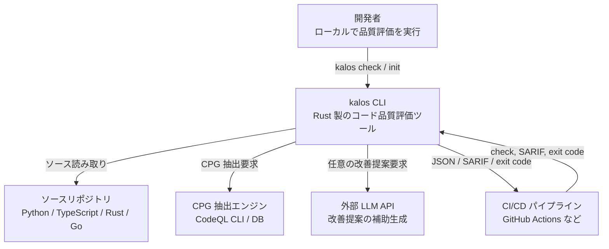
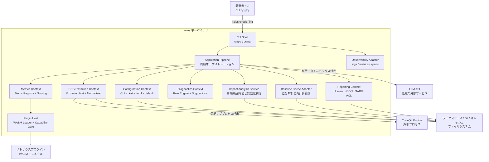
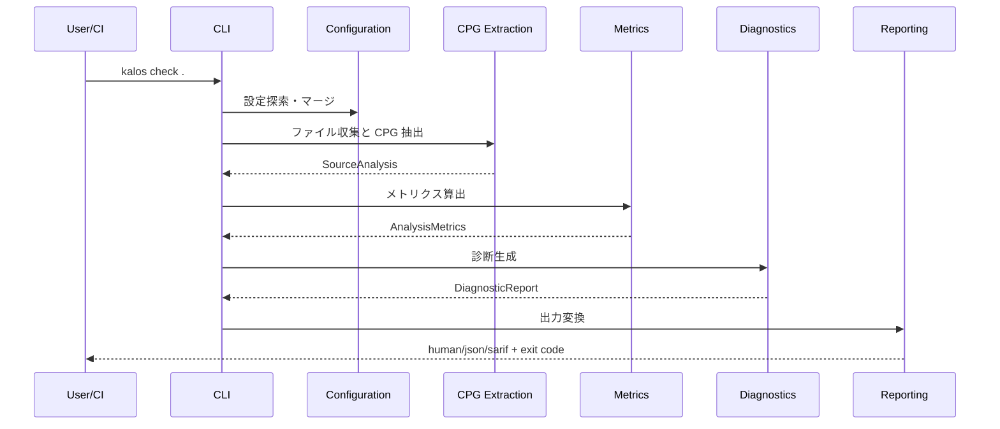
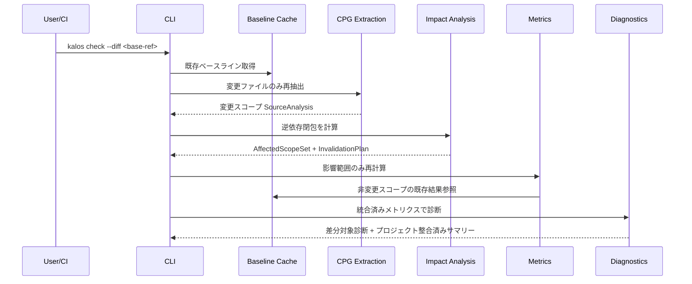

# kalos アーキテクチャ設計書

## メタ情報

| 項目 | 内容 |
|---|---|
| バージョン | 0.1.1 |
| 最終更新日 | 2026-03-18 |
| ステータス | ドラフト |
| 入力 | requirements.md v0.1.0, domain_model.md v0.1.1 |

## 1. 設計目標

### 1.1 目的

kalos は、ソースコードからコードプロパティグラフ（CPG）を抽出し、情報理論・グラフ理論に基づくメトリクスでコード品質を定量評価する CLI ツールである。要件上の主価値は、既存リンターでは出しにくい構造的改善点を、再現可能なスコアと具体的な改善提案として返すことにある。[requirements.md](./requirements.md)

### 1.2 設計方針

- 全体は **単一 Rust バイナリのモジュラーモノリス** とする
- 解析フローは **決定論的な同期パイプライン** とする
- ドメイン境界は `CPG抽出 / メトリクス算出 / 診断 / 構成管理 / レポート` に一致させる
- 外部通信/外部プロセス依存は **CPG抽出エンジン** と **任意の LLM** に限定し、どちらもポート経由で隔離する
- 差分解析と拡張性は、コアを崩さずに後付け可能な形で内蔵する

### 1.3 設計ドライバー

| 優先度 | 品質特性 | 根拠 |
|---|---|---|
| 1 | 決定論性 | `REQ-NF-003`, 成功基準 3 |
| 2 | 性能 | `REQ-NF-001`, `REQ-NF-002`, 成功基準 4 |
| 3 | 拡張性 | `REQ-NF-005`, `REQ-NF-006`, `REQ-FUNC-012` |
| 4 | 可搬性 | `REQ-NF-004`, `REQ-FUNC-031`, `REQ-FUNC-032` |
| 5 | 可用性 | `REQ-NF-008`, `REQ-FUNC-015` |
| 6 | 初回利用容易性 | `REQ-NF-007`, `REQ-FUNC-025` |

## 2. 品質特性シナリオ

| ID | 品質特性 | 刺激 | 環境 | 応答 | 測定基準 | 対応要件 |
|---|---|---|---|---|---|---|
| QA-01 | 決定論性 | 同一ソース・同一設定で `kalos check .` を繰り返し実行する | Linux/macOS/Windows の対応環境 | CPG 正規化順、メトリクス集約順、診断出力順を固定し、同一結果を返す | メトリクス値・診断・総合スコア・JSON/SARIF のハッシュが一致 | `REQ-NF-003` |
| QA-02 | 性能 | 1万 LOC 規模のプロジェクトを全階層解析する | 標準的な 4 コア / 8GB マシン | パイプライン各段階を時間予算内で完了する | 全解析 60 秒以内 | `REQ-NF-001` |
| QA-03 | 性能 | 10 ファイル以下の変更を PR で評価する | 差分解析モード | 変更影響範囲のみ再計算し、既存ベースラインを再利用する | 差分解析 10 秒以内 | `REQ-NF-002`, `REQ-FUNC-034` |
| QA-04 | 拡張性 | 新言語を 1 つ追加する | 既存コアを維持したまま機能拡張する | 言語アダプタと `UnifiedCpg` 変換だけで対応する | CLI・診断・レポート層の変更不要 | `REQ-NF-005` |
| QA-05 | 拡張性 | 新しいメトリクスを追加する | 既存ルール群が動作中 | メトリクス実装と登録だけでパイプラインに統合される | 既存の CPG 抽出・CLI・設定への変更最小 | `REQ-NF-006`, `REQ-FUNC-012` |
| QA-06 | 可用性 | `--llm` 使用中に LLM がタイムアウトする | ネットワーク遅延または外部障害 | テンプレート提案へフォールバックし、コア評価を継続する | 診断集合・重大度・Exit code が変わらない | `REQ-NF-008`, `REQ-FUNC-015` |

### 2.1 トレードオフ方針

- 決定論性を性能より優先する。無秩序な並列化は採用しない
- 初期リリースでは分散構成を取らず、単一バイナリで性能目標を狙う
- LLM は UX 改善機能であり、診断の正しさや CI 判定に介入させない
- 差分解析は「速いが意味がぶれない」ことを優先し、ベースライン統合を前提にする

## 3. 採用アーキテクチャ

### 3.1 結論

kalos は **単一 Rust バイナリのモジュラーモノリス** を採用し、その内部を **ポート&アダプタ** と **Pipe-and-Filter** で構成する。

- モノリス採用理由:
  - CLI ツールであり、独立デプロイ単位を複数持つ必然性がない
  - `REQ-FUNC-031` の単独配布と `REQ-NF-004` のクロスプラットフォーム対応に有利
  - `REQ-NF-003` の決定論性を分散境界なしで制御しやすい
- モジュラー化理由:
  - ドメインモデルの 5 コンテキストをそのままコード境界に落とし込める
  - `REQ-NF-005/006` を満たす拡張点をコアから独立させられる
- Pipe-and-Filter 採用理由:
  - 要件文書の依存チェーン `CPG → Metrics → Diagnostics → Report` と一致する
  - ステージごとのベンチマーク・キャッシュ・障害切り分けが容易

### 3.2 C4 レベル1: システムコンテキスト図



### 3.3 C4 レベル2: コンテナ図



## 4. コンポーネント設計

### 4.1 コンテキストと責務

| コンテキスト | 主要責務 | 入力 | 出力 | 対応要件 |
|---|---|---|---|---|
| CLI Shell | コマンド解釈、標準入出力、Exit code 返却 | CLI 引数 | 実行指示、終了コード | `REQ-FUNC-018`, `REQ-FUNC-022`, `REQ-FUNC-030` |
| Configuration | 設定探索・優先順位マージ・デフォルト提供 | CLI、`.kalos.toml`、既定値 | `ProjectConfig` | `REQ-FUNC-025`〜`030`, `REQ-NF-007` |
| CPG Extraction | ファイル収集、除外適用、抽出エンジン呼び出し、`UnifiedCpg` 変換 | ワークスペース、`ProjectConfig` | `SourceAnalysis` | `REQ-FUNC-001`〜`007` |
| Metrics | メトリクス計算、正規化、階層スコア集約 | `SourceAnalysis`、`ScoreWeights` | `AnalysisMetrics` | `REQ-FUNC-008`〜`012`, `REQ-NF-003`, `REQ-NF-006` |
| Diagnostics | 閾値判定、パターン検出、テンプレート改善提案、抑制適用 | `AnalysisMetrics`、`SourceAnalysis`、`RuleConfig` | `DiagnosticReport` | `REQ-FUNC-013`〜`017`, `REQ-NF-008` |
| Reporting | human / JSON / SARIF への変換、テンプレート提案と任意 LLM 提案の併記 | `AnalysisMetrics`、`DiagnosticReport`、`LlmSuggestionBundle?` | 標準出力 / ファイル出力 | `REQ-FUNC-019`〜`021`, `REQ-FUNC-024`, `REQ-FUNC-033` |
| Plugin Host | WASM プラグイン検証、SPI 読込、capability 制御 | プラグイン manifest、WASM モジュール | `MetricDefinition` 拡張群 | `REQ-FUNC-012`, `REQ-NF-006` |
| Impact Analysis Service | 逆依存インデックス構築、影響範囲閉包、キャッシュ無効化判定 | 差分 `SourceAnalysis`、ベースライン manifest | `AffectedScopeSet`、`InvalidationPlan` | `REQ-FUNC-034`, `REQ-NF-002`, `REQ-NF-003` |
| Baseline Cache Adapter | 差分解析用の前回結果保存と読み戻し | 解析結果、完全キャッシュキー | ベースライン断片 | `REQ-FUNC-034`, `REQ-NF-002` |
| Observability Adapter | 構造化ログ、スパン、性能メトリクス | 実行イベント | ログ、内部計測 | `REQ-NF-001`, `REQ-NF-002` |

### 4.2 依存方向

依存方向は以下で固定する。

```text
CLI Shell
  -> Application Pipeline
      -> Configuration
      -> CPG Extraction
      -> Metrics
      -> Diagnostics
      -> Impact Analysis Service
      -> Reporting
      -> Baseline Cache Adapter

Diagnostics
  -> Template Suggestion Adapter

Application Pipeline
  -> LLM Enrichment Port
      -> Optional LLM Adapter

Metrics
  -> Plugin Host
      -> WASM Metric Modules

CPG Extraction
  -> Extractor Port
      -> CodeQL Adapter
      -> (将来) 代替エンジン Adapter
```

ルール:

- ドメインコンテキスト同士は公開契約でのみ接続する
- `Reporting` は ACL としてのみ存在し、ドメインへ逆流しない
- `LLM Adapter` は `DiagnosticReport` を読み取り、`DiagnosticId` 単位の `LlmSuggestionBundle` だけを返す
- `Baseline Cache Adapter` は `AnalysisMetrics` と `DiagnosticReport` のスナップショットを保持するが、計算ロジックは持たない
- `Impact Analysis Service` が「どの `ScopeId` を再計算すべきか」の唯一の owner である

### 4.3 推奨コード構成

```text
src/
├── cli/
│   ├── check.rs
│   └── init.rs
├── application/
│   ├── pipeline.rs
│   ├── commands.rs
│   └── services/
├── domains/
│   ├── config/
│   ├── cpg/
│   ├── metrics/
│   ├── diagnostics/
│   └── reporting/
├── ports/
│   ├── extractor.rs
│   ├── llm.rs
│   ├── plugin.rs
│   ├── cache.rs
│   └── reporter.rs
├── adapters/
│   ├── extractor/codeql/
│   ├── llm/http/
│   ├── plugin/wasm/
│   ├── cache/filesystem/
│   └── reporter/{human,json,sarif}.rs
└── platform/
    ├── fs.rs
    ├── process.rs
    └── telemetry.rs
```

## 5. 主要フロー

### 5.1 全解析フロー



### 5.2 差分解析フロー



差分解析では、以下を不変条件とする。

- 総合スコアは「変更後のプロジェクト全体」を意味する
- そのため、変更が及ばないスコープのメトリクスはベースラインから再利用する
- ベースライン不在時は全解析へフォールバックする

### 5.3 差分解析の契約

- 影響範囲の owner は `Impact Analysis Service` とし、`UnifiedCpg` から生成したモジュール/関数依存グラフの逆閉包で `AffectedScopeSet` を求める
- ベースライン断片の保存単位は `ScopeMetrics(function/module/project)`, `OverallScore`, `DiagnosticSummary`, `DependencyIndexManifest` とする
- キャッシュキーは `workspace_root_hash + source_snapshot_hash + config_hash + rule_catalog_version + plugin_manifest_version + extractor_version + kalos_version` とする
- 次の場合は差分再利用を諦めて全解析へフォールバックする
  - ベースラインが存在しない
  - キャッシュキーが一致しない
  - 逆依存閉包が未解決で `AffectedScopeSet` を安全に確定できない
  - 抽出エンジン、プラグイン manifest、ルールカタログの版が変わっている

## 6. 技術選定

| 領域 | 採用 | 理由 | 関連 ADR |
|---|---|---|---|
| 実装言語 | Rust | 単一バイナリ配布、性能、メモリ安全性 | ADR-0001 |
| CLI | `clap` | 宣言的な引数定義とクロスプラットフォーム互換 | ADR-0001 |
| 設定 | `serde` + `toml` | `.kalos.toml` と型安全なマージに適する | ADR-0001 |
| グラフ処理 | `petgraph` | CPG と依存グラフのアルゴリズム実装に適する | ADR-0001 |
| 並列化 | `rayon` を限定使用 | CPG 正規化後の独立スコープ単位でのみ使用し、reduce 順序を固定する | ADR-0003 |
| CPG 抽出 | Extractor Port + 初期実装は CodeQL Adapter | 要件の前提を守りつつ、将来の代替エンジン差し替えを可能にする | ADR-0002 |
| 差分キャッシュ | ファイルシステムベースの Baseline Cache | ローカル実行・CI キャッシュの両方で利用しやすい | ADR-0003 |
| プラグイン | WASM ホスト + 安定 SPI | ユーザー定義メトリクスをクロスプラットフォームに配布しやすい | ADR-0004 |
| LLM 連携 | HTTP Adapter、API キーは環境変数 | コアと切り離しやすく、障害時フォールバックを実装しやすい | ADR-0005 |

### 6.1 CPG 抽出エンジンの扱い

初期リリースでは **CodeQL を既定の抽出アダプタ** とする。ただし、`UnifiedCpg` を外部公開契約として固定し、CodeQL 依存は `ExtractorPort` の背後に閉じ込める。

これにより:

- 要件の「CodeQL 前提」を満たす
- `REQ-NF-005` に従い、新言語追加時はアダプタ層と変換層で閉じる
- 性能 PoC の結果次第で代替エンジンへ置換できる

### 6.2 決定論性の実装規約

`REQ-NF-003` を満たすため、以下を設計規約とする。

- ファイル列挙順は正規化された絶対パス昇順
- `Map` 相当は外部出力前にソートし、順序が観測可能な箇所では `BTreeMap` 系を用いる
- 浮動小数点集約はスコープ昇順で行い、丸め桁数を固定する
- 並列処理の結果マージは deterministic reduce を使う
- JSON / SARIF 出力はキー順と要素順を安定化させる
- LLM 由来テキストは `LlmSuggestionBundle` としてレポート層でのみ併記し、コア診断と混在させない

## 7. 運用設計

### 7.1 監視・オブザーバビリティ

CLI 製品なので常駐監視は持たないが、リリース品質を担保するため以下を実装する。

| 項目 | 内容 |
|---|---|
| 構造化ログ | `stage`, `duration_ms`, `file_count`, `diagnostic_count`, `cache_hit_ratio` を出す |
| トレース | `check` 実行全体と各ステージに span を付与する |
| ベンチマーク | 10k LOC コーパスと差分コーパスを CI で定期測定する |
| 失敗分類 | config error / extractor error / analysis warning / llm timeout を区別して記録する |

### 7.2 セキュリティ設計

| 観点 | 方針 |
|---|---|
| シークレット管理 | API キーは環境変数のみ。設定ファイルへ保存しない |
| 外部プロセス呼出 | CodeQL 呼出は引数配列で実行し、シェル展開しない |
| LLM 送信データ | `--llm` 明示時のみ送信し、対象コード断片を最小化する |
| 出力データ | SARIF/JSON に機密情報を埋め込まない。ファイルパスの正規化を行う |
| プラグイン | WASM 実行時はネットワーク・ファイル書込を禁止する |

### 7.3 デプロイ / 配布

| 項目 | 方針 |
|---|---|
| 配布単位 | 各 OS/arch 向けプリビルド単一バイナリ |
| リリース経路 | GitHub Releases に成果物を配置し、公式 Action から取得 |
| CI 統合 | GitHub Action は `check` 実行と SARIF upload をラップする |
| ロールバック | 以前のバイナリへバージョンダウンするだけで復旧可能 |

### 7.4 性能予算

#### 全解析 60 秒予算

| ステージ | 予算 |
|---|---|
| ファイル収集・除外解決 | 5 秒 |
| CPG 抽出 | 30 秒 |
| `UnifiedCpg` 正規化 | 5 秒 |
| メトリクス算出 | 10 秒 |
| 診断生成 | 5 秒 |
| 出力整形 | 5 秒 |

#### 差分解析 10 秒予算

| ステージ | 予算 |
|---|---|
| `git diff` と対象決定 | 1 秒 |
| ベースライン取得 | 1 秒 |
| 差分 CPG 抽出 | 4 秒 |
| 影響範囲メトリクス再計算 | 2 秒 |
| 診断と出力 | 2 秒 |

## 8. 適合度関数

## 適合度関数: 決定論性

- **計測対象**: 同一入力・同一設定で 10 回実行した `AnalysisMetrics` と `DiagnosticReport` のハッシュ
- **閾値**: 10 回すべて一致
- **計測方法**: CI で固定コーパスに対し JSON 出力をハッシュ比較
- **違反時のアクション**: マージ禁止。順序不安定箇所か丸め規則の逸脱を修正する

## 適合度関数: 全解析性能

- **計測対象**: 10k LOC コーパスに対する `kalos check .`
- **閾値**: p95 <= 60 秒
- **計測方法**: nightly ベンチマーク CI
- **違反時のアクション**: 直近変更を perf regression として扱い、原因を切り分ける

## 適合度関数: 差分解析性能

- **計測対象**: 10 ファイル以下の差分コーパスに対する `kalos check --diff`
- **閾値**: p95 <= 10 秒
- **計測方法**: ベースライン付き統合テスト
- **違反時のアクション**: キャッシュ無効化規則または影響範囲計算を見直す

## 適合度関数: 言語追加の変更面

- **計測対象**: 新言語追加時に変更されたモジュール群
- **閾値**: `domains/cpg` と `adapters/extractor` 配下に限定
- **計測方法**: サンプル言語追加のアーキテクチャテスト
- **違反時のアクション**: `UnifiedCpg` 契約か責務分割を見直す

## 適合度関数: メトリクス追加の変更面

- **計測対象**: 新メトリクス追加時の変更ファイル
- **閾値**: メトリクス実装と登録設定に限定
- **計測方法**: サンプルメトリクス追加のアーキテクチャテスト
- **違反時のアクション**: `MetricDefinition` SPI かレジストリ設計を見直す

## 適合度関数: LLM フォールバック不変条件

- **計測対象**: LLM 正常系と LLM タイムアウト時の診断集合・スコア・Exit code
- **閾値**: 一致
- **計測方法**: LLM Adapter をモックした統合テスト
- **違反時のアクション**: LLM 連携がコア診断へ干渉しているため修正する

## 9. リスクと PoC

| 項目 | リスク | 対応 |
|---|---|---|
| CodeQL 性能 | `REQ-NF-001` を満たせない可能性 | 10k LOC コーパスで PoC。未達なら代替アダプタを比較する |
| 差分スコア意味論 | プロジェクト全体スコアが不正確になる可能性 | ベースライン統合を実装し、未取得時は全解析へフォールバックする |
| `f64` の完全一致 | 全 OS でビット一致しない可能性 | 丸め戦略 PoC を実施し、必要なら固定小数点へ切替える |
| WASM プラグインのオーバーヘッド | 解析速度を悪化させる可能性 | 組み込みメトリクスとの差を測り、上限を定める |
| LLM 応答遅延 | CLI UX が悪化する可能性 | タイムアウトとテンプレート先出しを採用する |

### 9.1 PoC 項目

1. CodeQL Adapter で 10k LOC / 4 言語混在コーパスを 60 秒以内に処理できるか
2. `--diff` 実行でベースライン再利用込み 10 秒以内を達成できるか
3. 同一入力 10 回実行で全出力ハッシュが一致するか
4. 新言語追加を `Extractor Adapter + UnifiedCpg mapper` のみで実現できるか
5. 新メトリクス追加を `MetricDefinition` 実装だけで差し込めるか

## 10. ADR 一覧

| ADR | 概要 |
|---|---|
| [ADR-0001](./adr/0001-adopt-modular-monolith.md) | 単一バイナリのモジュラーモノリス + Ports & Adapters + Pipe-and-Filter を採用する |
| [ADR-0002](./adr/0002-extractor-port-with-codeql-adapter.md) | `ExtractorPort` の背後に初期実装として CodeQL Adapter を置く |
| [ADR-0003](./adr/0003-deterministic-core-and-baseline-cache.md) | 決定論性規約と差分解析用ベースラインキャッシュを同時に採用する |
| [ADR-0004](./adr/0004-wasm-metric-plugin-runtime.md) | ユーザー定義メトリクス拡張に WASM ベースのプラグイン境界を採用する |
| [ADR-0005](./adr/0005-optional-llm-enrichment.md) | LLM を任意の後段エンリッチとして隔離し、コア診断に介入させない |

## 変更履歴

| バージョン | 日付 | 変更内容 | 変更者 |
|---|---|---|---|
| 0.1.1 | 2026-03-18 | LLM sidecar 契約と差分解析契約、plugin host の可視化を反映 | Codex (`architecture-designer` スキル) |
| 0.1.0 | 2026-03-18 | 初版作成 | Codex (`architecture-designer` スキル) |
