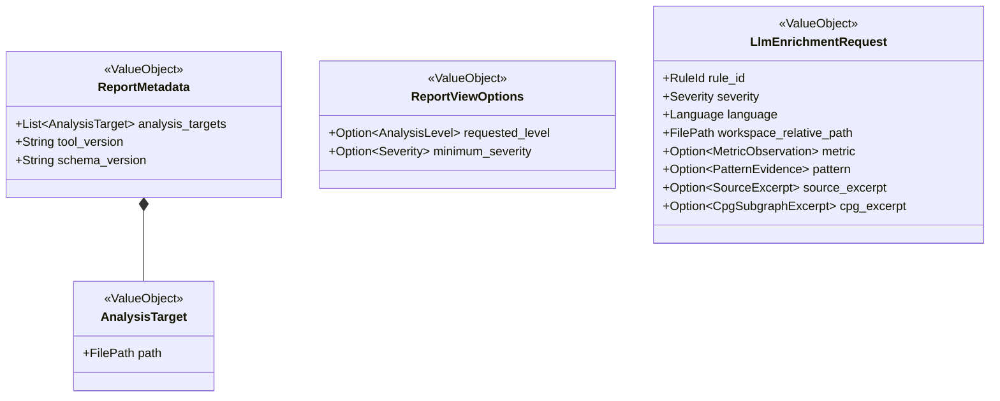

# kalos/docs レビュー指摘 解決メモ

## メタ情報

| 項目 | 内容 |
|---|---|
| 作成日 | 2026-03-21 |
| 最終更新日 | 2026-03-27 |
| 対象レビュー | requirements.md / architecture.md / domain_model.md / ADR 横断レビュー（4 レビュー文書、初回 19 指摘 + v0.4.0 フォローアップ根拠 4 件（F-1–F-4）+ v0.4.1 フォローアップ 2 件、計 §1–§21 + F-1–F-4） |
| 目的 | 上記 21 §（設計判断）および 4 F 項（v0.4.0 追加根拠）のレビュー指摘に対する設計判断を確定し、文書更新タスクの仕様を定義する |
| 適用範囲 | v0.3.0–v0.4.1 の文書更新バッチ（§1–§21 の設計判断 + F-1–F-4 の v0.4.0 追加根拠）。v0.4.2 以降のレビュー起因更新は本メモの対象外であり、各文書の変更履歴を参照のこと |

**注意**: 本メモは v0.3.0–v0.4.1 バッチで解決した 21 § の設計判断と、v0.4.0 フォローアップ 4 件（F-1–F-4）の追加根拠の履歴記録である。全判断は対象文書に適用済みである。v0.4.2 以降に行われたレビュー起因の文書更新（版メタ同期、scope semantics 整合、Plugin Host 責務表拡充、PoC 参照番号修正等）は本メモの対象外であり、各文書の変更履歴を正本とする。本メモ内の § 参照は初回適用前の文書構成に基づくため、セクション番号の軽微なずれが生じうる。v0.4.3 で本メモ内の PoC 参照番号を #6 → #3（requirements.md §5）に修正した。

---

## 1. 版メタ情報の同期ポリシー（must × 3 文書）

### 指摘

requirements.md / architecture.md / domain_model.md の先頭メタ情報が `0.2.11 / 2026-03-19` のまま、変更履歴は `0.2.12 / 2026-03-20` まで更新されている。

### 判断

**ポリシー**: 先頭メタ情報は常に変更履歴の最新エントリと一致させる。初回修正バッチでは全文書を `0.3.0 / 2026-03-21` へ同時に上げた。再レビュー指摘の反映バッチでは `0.4.0 / 2026-03-22` へ更新する。

**同期ルール（今後適用）**:
1. 変更履歴にエントリを追加するとき、先頭メタ情報を同じバージョン・日付に更新する
2. architecture.md の「入力」欄は参照先文書のバージョンと一致させる
3. domain_model.md の「入力」欄も同様

### 更新対象

| 文書 | 更新内容 |
|---|---|
| `requirements.md` 先頭メタ情報 | `0.4.0` / `2026-03-22` に更新 |
| `architecture.md` 先頭メタ情報 | `0.4.0` / `2026-03-22` に更新。入力欄を `requirements.md v0.4.0, domain_model.md v0.4.0` に更新 |
| `domain_model.md` 先頭メタ情報 | `0.4.0` / `2026-03-22` に更新。入力欄を `requirements.md v0.4.0` に更新 |
| 各文書の変更履歴末尾 | `0.4.0 / 2026-03-22` エントリを追加 |

---

## 2. `rules.<RuleId>.enabled = false` のセマンティクス（must）

### 指摘

`enabled = false` がメトリクス系ルール（例: `KAL-F001`）に対して何を止めるのか未定義。診断だけか、スコア集約・metrics 出力・exit code 判定からも除外されるのか不明。

### 判断

`enabled = false` は **ルールのユーザー向け効果（診断生成・スコアリング参加・exit code 判定）を抑制する**。ユーザーが特定ルールを無効化した場合、そのルールが報告にもスコアにも exit code にも影響しないことを期待するため。ただし、内部計算とメトリクス観測は明示的に維持する（下表参照）。

#### メトリクスルール（例: `KAL-F001`）の場合

**抑制される効果（ユーザー向け）**:

| 観点 | `enabled = true`（デフォルト） | `enabled = false` |
|---|---|---|
| 診断生成 | 閾値違反で生成 | **生成しない** |
| `scope_risk` 集約への参加 | `ScoredAndDiagnosable` として参加 | **除外**（スコアリング時に当該メトリクスを `scope_risk` 算出から除外） |
| `scores` への影響 | 間接的に反映 | **なし** |
| `summary` 件数 | 診断があれば計上 | **なし**（診断なし） |
| `exit code` 判定 | 診断があれば影響 | **なし**（診断なし） |

**維持される内部動作（観測用）**:

| 観点 | `enabled = true`（デフォルト） | `enabled = false` |
|---|---|---|
| メトリクス計算 | 実行する | **実行する**（他ルールの内部依存のため。例: `KAL-PAT001` が `M-F002` を参照） |
| `metrics` 出力 | 含む | **含む**（計算結果の観測は維持。disabled ルールの計算値もメトリクス一覧に含まれる） |

**設計根拠**: メトリクス計算を維持する理由は 2 つある。(1) 他の enabled なルールが当該メトリクスを内部依存として参照する可能性がある。(2) `metrics` 出力にメトリクス値を含めることで、ユーザーがルールを無効化しても計算値を観測・比較できる。これらは「ルールの効果」ではなく「メトリクス基盤の観測契約」であり、`enabled` フラグの管轄外である。

#### パターンルール（例: `KAL-PAT003`）の場合

| 観点 | `enabled = true` | `enabled = false` |
|---|---|---|
| パターン検出 | 実行する | **実行しない** |
| 診断生成 | 検出時に生成 | **生成しない** |
| `summary` / `exit code` | 診断があれば影響 | **なし** |

#### スコアリング除外の実装指針

`scope_risk` の算出ステップ（REQ-FUNC-011 ステップ 1）で、disabled なルールにバインドされたメトリクスの `normalized_risk` を算術平均の母集団から除外する。`level_risk` 以降の集約は変更なし。あるスコープで全メトリクスが disabled の場合、そのスコープの `scope_risk` は `0.0`（リスクなし）とする。

### 更新対象

| 文書 | 更新内容 |
|---|---|
| `requirements.md` REQ-FUNC-026 | 説明を拡充: メトリクスルールとパターンルールそれぞれの `enabled = false` の影響範囲（diagnostics, scores, metrics 出力, summary, exit code）を明文化する。受け入れ基準を追加: `Given KAL-F001 を enabled = false に設定, When 解析実行, Then KAL-F001 の診断は報告されず、KAL-F001 バインドのメトリクスは scope_risk 集約から除外される` |
| `requirements.md` REQ-FUNC-011 | ステップ 1 に注記を追加: `enabled = false` のルールにバインドされたメトリクスは `scope_risk` 算術平均の母集団から除外する |
| `domain_model.md` 診断コンテキストの設計意図 | `RuleConfig.enabled = false` 時のスコアリング除外契約を追記 |
| `architecture.md` Diagnostics/Metrics の責務説明 | `enabled = false` のルールが scores 集約に参加しない旨を責務境界で明記 |

---

## 3. 差分解析の merged dependency graph 責務（must）

### 指摘

差分フローで `changed paths` だけ再抽出するとき、未変更スコープの依存辺をどこで合成して逆閉包を計算するかが未定義。Impact Analysis Service が owner とされるが、baseline の `DependencyIndexManifest` と今回の差分 `UnifiedCpg` を「誰がどう統合して closure を計算するか」が書かれていない。

### 判断

**Impact Analysis Service が merged dependency graph の生成と逆閉包計算の唯一の owner** である。以下の契約を architecture.md §5.3 に追加する。

#### Merged dependency graph 生成契約

- **入力**:
  1. `DiffBaseline.dependency_index`（ベースラインの `DependencyIndexManifest` — 全スコープ間の依存辺）
  2. 差分 `SourceAnalysis.cpg`（変更されたファイルから抽出した `UnifiedCpg`）
- **処理**:
  1. 差分 `UnifiedCpg` から変更スコープの依存辺を抽出する
  2. baseline `DependencyIndexManifest` の変更スコープに関する辺を差分 CPG 由来の辺で **置換** する
  3. 未変更スコープの辺は baseline をそのまま保持する
  4. 統合した依存グラフ上で変更スコープを起点に **逆** 推移的閉包を計算し、`AffectedScopeSet` を求める
- **フォールバック**:
  - baseline に `DependencyIndexManifest` が存在しない場合 → `fallback_to_full = true`
  - 依存辺の統合でグラフ整合性を保証できない場合（未解決参照が多数等） → `fallback_to_full = true`
- **出力**: merged `DependencyIndexManifest`（次回ベースライン保存用） + `AffectedScopeSet`

### 更新対象

| 文書 | 更新内容 |
|---|---|
| `architecture.md` §5.3 差分解析の契約 | 上記の「merged dependency graph 生成契約」を新たな箇条として追加する。Impact Analysis Service の入力に `DiffBaseline.dependency_index` と差分 `SourceAnalysis.cpg` を明示する |
| `architecture.md` §5.2 差分解析フロー（シーケンス図） | Impact Analysis への入力矢印に `DiffBaseline.dependency_index` を明示する |
| `domain_model.md` §3.4 差分解析コンテキストの設計意図 | merged dependency graph の統合手順（baseline 辺の置換方式）と、`DependencyIndexManifest` の更新タイミング（成功時のベースライン保存時に最新の merged index を含める）を追記 |

---

## 4. `ScoreWeights` の正規化・再配分契約（must）

### 指摘

`domain_model.md` は `ScoreWeights` を「`> 0.0` かつ有限」としか定義していないが、`requirements.md` は「合計 ≠ 1.0 時の比例再正規化」と「0 件階層の重み再配分」を必須にしている。

### 判断

正規化と再配分は **`OverallScore` 算出時の計算不変条件** であり、`ScoreWeights` 値オブジェクト自体の不変条件ではない。`ScoreWeights` は入力値を保持するだけで、正規化はスコアリング関数が担う。

#### 不変条件の配置

| 不変条件 | 配置先 |
|---|---|
| 各重みが `> 0.0` かつ有限 | `ScoreWeights` 値オブジェクト（`ProjectConfig.resolve()` が検証） |
| 合計 ≠ 1.0 時の比例再正規化: `adjusted_weight[l] = weight[l] / Σ(weights)` | `OverallScore` 算出ロジック（メトリクス算出コンテキスト） |
| 0 件階層の重み再配分: disabled 階層の重みを残存階層へ比例再配分 | `OverallScore` 算出ロジック（メトリクス算出コンテキスト） |

### 更新対象

| 文書 | 更新内容 |
|---|---|
| `domain_model.md` §3.2 設計意図の `OverallScore` 項目 | 「re-normalization」と「empty-level redistribution」の計算不変条件を明記する。requirements.md REQ-FUNC-011 ステップ 3–4 を参照先として示す |
| `domain_model.md` §3.2 `ScoreWeights` 設計意図 | `ScoreWeights` 自体は入力検証のみ（`> 0.0` かつ有限）を担い、正規化はスコアリング時に行う旨を明記 |

---

## 5. Subset `analysis_targets` のフォールバックセマンティクス（must）

### 指摘

ADR-0003 で `analysis_targets` が部分集合の場合のフォールバックが「要求 target の再解析」と「全ワークスペース全解析」の両方に読める。

### 判断

subset `analysis_targets` の場合は **要求された `analysis_targets` のみを non-diff で全解析する**。全ワークスペースへの拡張は行わない。

これは `InvalidationPlan.fallback_to_full`（§13 参照）とは別の概念である。両者の関係を以下に整理する。

#### `analysis_targets` 制約と `fallback_to_full` の関係

| 概念 | 決定するもの | 適用タイミング |
|---|---|---|
| **subset `analysis_targets` 制約** | 解析対象のファイル集合（全ワークスペースか、指定パスのみか） | パイプライン開始時に判定 |
| **`InvalidationPlan.fallback_to_full`** | diff 最適化の適用有無（baseline を使ったスコープ再利用か、全スコープ再計算か） | diff 解析フロー内で Impact Analysis Service が判定 |

- subset `analysis_targets` の場合、diff 最適化は常に無効（ベースラインを生成も消費もしない）。この判定は `fallback_to_full` フラグより**上流**で行われる
- `fallback_to_full = true` は全ワークスペース解析の diff フロー内で発生するフォールバックであり、解析対象の**ファイル集合自体は変更しない**（全ワークスペースのまま）

#### subset `analysis_targets` 確定セマンティクス

1. `analysis_targets` が全ワークスペースの部分集合であると判定された場合:
   - `--diff` 最適化を無効化する
   - ベースラインを生成しない、既存ベースラインも消費しない
   - **要求された `analysis_targets` だけ** を non-diff 全解析する（全ワークスペースに拡張しない）
   - `--level` は指定通り保持する
   - 出力の `analysis_targets` は要求された path 群をそのまま反映する
2. 「全ワークスペースの部分集合」の判定: 位置引数が明示的に指定された場合は、`WorkspaceRoot` 配下の全対象ファイルを網羅するかどうかに関わらず常に部分集合として扱う（実行時の網羅性判定は行わない）。位置引数省略時（デフォルト `.`）は全ワークスペースとして扱う

#### 文言の統一

- 「non-diff 全解析」は「要求された `analysis_targets` 内の全スコープを non-diff で解析する」の意味で使う
- 「全ワークスペース解析」（full-workspace analysis）は「`WorkspaceRoot` 配下の全対象ファイルを解析する」の意味で使い、上記と明確に区別する
- `fallback_to_full` は「diff 最適化を無効化して全スコープを再計算する」の意味に限定し、解析対象ファイル集合の拡張を含意しない

### 更新対象

| 文書 | 更新内容 |
|---|---|
| `requirements.md` REQ-FUNC-034 の diff fallback 記述 | 「要求された `analysis_targets` のみを non-diff で解析する」と明記し、全ワークスペースへの拡張がないことを明確にする |
| `architecture.md` §5.2 不変条件リスト | フォールバック説明を「要求された `analysis_targets` / `--level` を保った non-diff 解析」に修正し、括弧書きで「全ワークスペースに拡張しない」を付加 |
| `domain_model.md` §3.4 `InvalidationPlan.fallback_to_full` 設計意図 | 同上の文言修正 |
| `adr/0003-deterministic-core-and-baseline-cache.md` 判断セクション subset fallback 記述 | 「要求された `analysis_targets` / `--level` を保った non-diff 全解析へフォールバックする」に修正し、直後に「全ワークスペースへ拡張しない」を注記する |

---

## 6. `KAL-PAT002` の受け入れ基準（should）

### 指摘

`KAL-PAT001` と `KAL-PAT003` には受け入れ基準があるが、`KAL-PAT002`（Feature Envy）にはない。

### 判断

以下の受け入れ基準を追加する。

```
- Given 関数の foreign_accesses >= 5 かつ foreign_accesses / (foreign_accesses + local_accesses) >= 0.70,
  When 診断実行, Then KAL-PAT002 として検出される
- Given 関数の foreign_accesses / (foreign_accesses + local_accesses) < 0.70,
  When 診断実行, Then その関数に対して KAL-PAT002 は報告されない
```

### 更新対象

| 文書 | 更新内容 |
|---|---|
| `requirements.md` REQ-FUNC-014 受け入れ基準 | 上記 2 件の受け入れ基準を追加 |

---

## 7. `summary_scope` / `diagnostics_scope` の表記統一（should）

### 指摘

`whole_project | listed_diagnostics`（snake_case）と `WholeProject / ListedDiagnostics`（PascalCase）が混在。

### 判断

**外部出力値（JSON フィールド値）は snake_case を正とする**。文書中で enum の内部表現に言及する場合は PascalCase を使ってよいが、初出時に JSON 値との対応を示す。

`SummaryScope` と `DiagnosticsScope` は別の enum であり、取りうる値が異なる。混同を防ぐため、値の所属を明示して記述する。

#### 各 enum の値一覧

| enum | 内部表現（PascalCase） | JSON 値（snake_case） | 意味 |
|---|---|---|---|
| `SummaryScope` | `WholeProject` | `"whole_project"` | summary の母集団が解決済み `analysis_targets` 内の全階層の診断（`--level all` 時、または diff mode の merged post-change） |
| `SummaryScope` | `ListedDiagnostics` | `"listed_diagnostics"` | summary の母集団が `diagnostics` リストに含まれる指定階層の診断のみ（`--level` で階層限定時） |
| `DiagnosticsScope` | `WholeProject` | `"whole_project"` | `diagnostics` 一覧が選択された `--level` に関して完全（non-diff モード） |
| `DiagnosticsScope` | `AffectedOnly` | `"affected_only"` | `diagnostics` 一覧が影響範囲のみ（diff mode） |

**注意**: `"whole_project"` は両 enum に存在するが意味が異なる。`"listed_diagnostics"` は `SummaryScope` 専用、`"affected_only"` は `DiagnosticsScope` 専用である。

### 更新対象

| 文書 | 更新内容 |
|---|---|
| `requirements.md` `SummaryScope` / `DiagnosticsScope` 定義 | `WholeProject` / `ListedDiagnostics` を snake_case に統一するか、初出で JSON 値との対応を明記。`SummaryScope` と `DiagnosticsScope` の値を混同しない記述に修正 |
| `domain_model.md` の `DiagnosticsScope` / `SummaryScope` enum 定義 | 同上。各 enum の値一覧を上記の表に合わせて整理 |
| `architecture.md` の差分解析契約 | 同上 |

---

## 8. デフォルト閾値・カットオフの校正根拠（should）

### 指摘

固定値（閾値、パターン検出カットオフ、重大度境界）の根拠が不明。

### 判断

v1 の閾値は **一般的なソフトウェア品質メトリクスの知見を参考にした設計時判断による暫定値** であり、特定の実証研究に裏付けられたものではない。以下の注記を追加する。

### 更新対象

| 文書 | 更新内容 |
|---|---|
| `requirements.md` §3.2 冒頭または REQ-FUNC-013 直前 | 注記を追加: 「v1 のデフォルト閾値・重大度境界・パターン検出カットオフは、一般的なソフトウェア品質メトリクスの知見を参考にした設計時判断による暫定値であり、特定の実証研究に裏付けられたものではない。実プロジェクトでのフィードバックに基づき v2 以降で校正を予定する。見直し条件: (1) 偽陽性率が 30% を超える、(2) 偽陰性率が 20% を超える、(3) ユーザーフィードバックで特定の閾値に苦情が集中する」 |

---

## 9. 要件文中の内部コンポーネント名への参照（should）

### 指摘

`Configuration`、`Plugin Host`、`Application Pipeline`、`CLI Shell`、`DiagnosticReport` が前置きなく登場し、要件単体での可読性が低い。

### 判断

requirements.md の用語集（§2）にアーキテクチャ由来の内部コンポーネント名の短い定義を追加し、architecture.md への参照を示す。

### 更新対象

| 文書 | 更新内容 |
|---|---|
| `requirements.md` 用語集（§2） | `Configuration`、`Plugin Host`、`Application Pipeline`、`CLI Shell`、`DiagnosticReport` の短い定義（1–2 文）と architecture.md §4.1 への参照を追加 |

---

## 10. `Application Pipeline` の責務表への追加（should）

### 指摘

architecture.md §4.1 の責務表に `Application Pipeline` がなく、実質的な orchestration owner が表から抜けている。

### 判断

`Application Pipeline` を責務表に追加する。

### 更新対象

| 文書 | 更新内容 |
|---|---|
| `architecture.md` §4.1 責務表 | 以下の行を追加: `Application Pipeline` / パイプラインオーケストレーション、diff/non-diff モード選択、`DiagnosticReport` の assemble（summary materialization を含む）、`LlmEnrichmentRequest` 組立、exit code 判定、`--strict` セマンティクスの適用 / 全コンテキスト出力 + `ProjectConfig` / `DiagnosticReport` + `ReportMetadata` + `ReportViewOptions` + exit code / `REQ-FUNC-018`, `REQ-FUNC-022`〜`024`, `REQ-FUNC-034`, `REQ-NF-001`〜`003` |

---

## 11. C4 レベル 2 図の名称と内容修正（should）

### 指摘

「C4 レベル2: コンテナ図」が実際にはコンポーネント粒度で描かれており、`Git Diff Adapter` が載っていない。

### 判断

- セクション名を **「C4 レベル3: コンポーネント図」** に改称する（kalos 単一バイナリ = コンテナ、その内部構成 = コンポーネント）
- `Git Diff Adapter` を Kalos サブグラフ内に追加する
- `Application Pipeline` の位置付けを図上で明確にする

### 更新対象

| 文書 | 更新内容 |
|---|---|
| `architecture.md` §3.3 | セクション見出しを「C4 レベル3: コンポーネント図」に変更。Mermaid 図に `Git Diff Adapter` を追加し、`APP --> GIT` の依存辺を描く |

---

## 12. ベースラインキャッシュの write-back ライフサイクル（should）

### 指摘

`Baseline Cache Adapter` の write-back タイミングが主要フローに現れていない。

### 判断

差分解析フロー（§5.2）の不変条件リストに write-back 契約を追加する。

#### Write-back 契約

- **書き込み条件**: 全ワークスペース解析が正常完了した場合のみ（exit code 0 または 1）
- **書き込みタイミング**: `DiagnosticReport` の assemble 完了後、exit code 返却前
- **書き込まない条件**:
  - `analysis_targets` が部分集合の実行
  - kalos 自体の実行エラー（exit code 2）
- **原子性**: 一時ファイルへ書き込み後にリネームする（部分書き込みを防ぐ）

### 更新対象

| 文書 | 更新内容 |
|---|---|
| `architecture.md` §5.2 の不変条件リスト末尾 | 上記の write-back 契約を箇条書きで追加 |
| `architecture.md` §5.1 全解析フロー（シーケンス図） | Report 出力の後に `APP->>Cache: ベースライン保存（全ワークスペース解析時）` のステップを追加 |
| `architecture.md` §5.2 差分解析フロー（シーケンス図） | 同様に保存ステップを追加 |

---

## 13. `InvalidationPlan` の集合不変条件（should）

### 指摘

`recompute_scopes` と `reuse_scopes` の排他性、`AffectedScopeSet` との関係、`fallback_to_full = true` 時の解釈が不明。

### 判断

以下の不変条件を domain_model.md に追加する。

| 不変条件 | 説明 |
|---|---|
| `recompute_scopes ∩ reuse_scopes = ∅` | 同一スコープが再計算と再利用の両方に属することはない |
| `recompute_scopes ∪ reuse_scopes = 全既知スコープ`（`fallback_to_full = false` 時） | 全スコープがいずれかに分類される |
| `AffectedScopeSet.scopes ⊆ recompute_scopes` | 影響を受けたスコープは必ず再計算対象 |
| `fallback_to_full = true` 時 | `recompute_scopes` と `reuse_scopes` は無視され、現在の `analysis_targets` 内の全スコープを対象に non-diff 再計算が実行される（`analysis_targets` の拡張は行わない。§5 参照） |

### 更新対象

| 文書 | 更新内容 |
|---|---|
| `domain_model.md` §3.4 設計意図 | 上記 4 件の不変条件を `InvalidationPlan` の設計意図に追記 |

---

## 14. `SourceFile` の Entity / Value Object 分類（should）

### 指摘

`SourceFile` が Entity として宣言されているが、`path` と `language` だけを持ち、独立したライフサイクルや可変状態がない。

### 判断

`SourceFile` を **Value Object** に再分類する。

- `SourceFile` は `SourceAnalysis.source_files` マップで `FilePath` をキーとして管理されており、`path` は Entity としての同一性ではなくマップキーとして機能している
- 可変状態を持たない（`path` と `language` は解析実行ごとに決定され変更されない）
- `SourceAnalysis` 集約の外で独立に追跡・参照されることはない

### 更新対象

| 文書 | 更新内容 |
|---|---|
| `domain_model.md` §3.1 クラス図 | `<<Entity>>` を `<<ValueObject>>` に変更 |
| `domain_model.md` §3.1 設計意図 | `SourceFile` を VO とする根拠（マップキーとして同定され、独立ライフサイクルなし）を追記 |

---

## 15. `Configuration` の名称混在の解消（should）

### 指摘

「Configuration」がコンテキスト名・責務主体・`ProjectConfig` の別名として混在している。

### 判断

以下の命名規則を適用する。

| 用途 | 使う名称 | 例 |
|---|---|---|
| 境界づけられたコンテキスト名 | 構成管理コンテキスト / Configuration Context | コンテキストマップ上の表記 |
| 集約ルート / 型名 | `ProjectConfig` | コード・ドメインモデル図の表記 |
| 設定解決の操作主体 | `ProjectConfig.resolve()` | 設計意図の記述 |

「Configuration が ○○ する」という主語を `ProjectConfig.resolve()` または「構成管理コンテキスト」に置き換える。

### 更新対象

| 文書 | 更新内容 |
|---|---|
| `domain_model.md` §3.5 設計意図 | 「Configuration は」を「`ProjectConfig.resolve()` は」に修正 |
| `domain_model.md` §5.5 構成管理用語集 | `WorkspaceRoot` の定義で「Configuration が解決した」を「`ProjectConfig.resolve()` が解決した」に修正 |
| `domain_model.md` 本文中の「Configuration」が責務主体として使われている他の箇所 | 同様に修正（全文検索で「Configuration は」「Configuration が」を特定） |

---

## 16. レポートコンテキストの value object 図の追加（should）

### 指摘

`ReportMetadata`、`AnalysisTarget`、`ReportViewOptions`、`LlmEnrichmentRequest` が図に現れず、構造把握が困難。

### 判断

§3.6 に簡略クラス図を追加する。



### 更新対象

| 文書 | 更新内容 |
|---|---|
| `domain_model.md` §3.6 | 上記クラス図を既存のテキスト説明の前に挿入 |

---

## 17. ADR-0001: 単一バイナリの保証範囲（should）

### 指摘

「単一バイナリ配布」の効用が、後続 ADR の外部アーティファクト前提（CodeQL bundle, WASM plugin）と噛み合わない。

### 判断

ADR-0001 の帰結に保証範囲の明確化を追加する。CodeQL bundle と WASM plugin はライフサイクルが異なるため、責務を分けて記述する。

> 「単一バイナリ」は kalos 実行ファイル自体を指す。以下の外部アーティファクトは kalos バイナリに同梱されないが、ライフサイクルの管理責務が異なる。
>
> | アーティファクト | 管理モデル | 取得 | 配置 | 検証 | キャッシュ |
> |---|---|---|---|---|---|
> | **CodeQL bundle**（ADR-0002） | Managed artifact | kalos（Managed Tool Cache Adapter が初回 bootstrap で自動取得） | kalos（`$KALOS_CACHE_DIR` 配下に配置） | kalos（バージョン整合性を検証） | kalos（キャッシュ管理を担う） |
> | **WASM plugin**（ADR-0004） | User-supplied artifact | ユーザー（ユーザーが入手） | ユーザー（ワークスペース内に配置し `.kalos.toml` の `[[plugins]] { path, sha256 }` で登録） | kalos（`sha256` チェックサム照合・SPI バージョン検証） | なし（ワークスペース内の配置をそのまま使用） |
>
> 配布物としてはバイナリ単体を単位とする。

### 更新対象

| 文書 | 更新内容 |
|---|---|
| `adr/0001-adopt-modular-monolith.md` §帰結 ポジティブ | 1 番目の箇条の後に上記の保証範囲注記を追加 |

---

## 18. ADR-0003: ベースラインキャッシュの運用帰結（should）

### 指摘

保存内容が重いのに、保持期間・削除責任・容量肥大化の帰結がない。

### 判断

ADR-0003 のネガティブ帰結に運用ガイダンスを追加する。

> - ベースラインキャッシュはリポジトリ規模に比例して増大する。v1 では自動 eviction を提供しない
> - **CI**: キャッシュは best-effort。CI の cache restore/save メカニズム（GitHub Actions `actions/cache` 等）で管理し、checkout path を安定化させて `workspace_root_hash` のヒット率を高める運用が必要
> - **ローカル**: ユーザーがキャッシュディレクトリを手動削除できる。将来の改善候補として LRU eviction またはサイズベースの pruning を検討する
> - **保存場所**: `$KALOS_CACHE_DIR`（未設定時のプラットフォーム別既定: Linux/macOS は `$XDG_CACHE_HOME/kalos` または `~/.cache/kalos`、Windows は `%LOCALAPPDATA%\kalos`）

### 更新対象

| 文書 | 更新内容 |
|---|---|
| `adr/0003-deterministic-core-and-baseline-cache.md` §帰結 ネガティブ | 上記の運用ガイダンスを追加 |

---

## 19. ADR-0005: LLM 連携の運用帰結（should）

### 指摘

`source_excerpt` / `cpg_excerpt` を外部 LLM に送る判断を含むのに、API キー管理・outbound 通信前提・監査/ログ境界がネガティブ帰結にない。

### 判断

ADR-0005 のネガティブ帰結に運用上の考慮事項を追加する。

> - **API キー管理**: 環境変数 `KALOS_LLM_API_KEY` で提供する。kalos は永続化しない
> - **Outbound 通信**: `--llm` は設定済み LLM エンドポイントへのネットワークアクセスを暗示する。エンドポイント URL は info レベルでログ出力する（ペイロードは出力しない）
> - **データ機密性**: `source_excerpt` / `cpg_excerpt` はプロプライエタリコードを含む可能性がある。`--llm` の指定をもってユーザーの明示的オプトインとする
> - **監査境界**: リクエスト/レスポンスのメタデータ（タイムスタンプ、トークン数、ステータスコード）は debug レベルで構造化ログに出力する。コンテンツ自体はログに含めない

### 更新対象

| 文書 | 更新内容 |
|---|---|
| `adr/0005-optional-llm-enrichment.md` §帰結 ネガティブ | 上記の運用考慮事項を追加 |

---

## 20. REQ-NF-005 の言語追加完了条件に resolver adapter を明記（should）（v0.4.1）

### 指摘

`REQ-NF-005`（言語サポートの追加）は「CPG 抽出境界内の parser / normalizer / language profile の追加で対応可能」と記述しているが、完全な言語サポートには `Dependency Symbol Resolver Port` の language-specific resolver adapter（`REQ-FUNC-007`）も必要であり、この関係が明示されていない。architecture.md の QA-04 適合度関数も同様にコア拡張性のみを計測対象としており、resolver adapter の位置付けが不明確だった。

### 判断

`REQ-NF-005` の完了条件に resolver adapter との関係を注記として追加する。コア拡張性の保証（CPG 抽出境界内の変更面限定）は維持しつつ、完全な言語サポートには `Dependency Symbol Resolver Port` の adapter（`REQ-FUNC-007`）が別途必要である旨を明文化する。

architecture.md では以下を更新する:
- **QA-04 適合度関数**: スコープ注記に resolver adapter が閾値外だが必要である旨を追加
- **§6.1 CPG 抽出エンジンの扱い**: resolver adapter が PoC 項目 #3（requirements.md §5）で追跡される旨を追加

### 更新対象

| 文書 | 更新内容 |
|---|---|
| `requirements.md` REQ-NF-005 | 完了条件注記として `Dependency Symbol Resolver Port` の language-specific resolver adapter（`REQ-FUNC-007`）との関係を追加 |
| `architecture.md` QA-04 適合度関数 | スコープ注記に resolver adapter（`REQ-FUNC-007`）が `adapters/dependency_resolver/` への追加であり閾値外だが完全な言語サポートには必要である旨を追加 |
| `architecture.md` §6.1 | resolver adapter が extractor 境界内に閉じ込められ、PoC 項目 #3（requirements.md §5）で追跡される旨を追加 |
| `adr/0002-extractor-port-with-codeql-adapter.md` スコープ注記 | resolver adapter が本 ADR の判断範囲外であることの明確化（「新言語追加時のスコープに関する注記」で `Dependency Symbol Resolver Port` の境界を明示）、ADR 間参照の整合確認 |

---

## 21. LLM provider 契約の伝播（should）（v0.4.1）

### 指摘

ADR-0005 と `REQ-NF-009` で LLM 連携の設計意図は定義されていたが、architecture.md 上でプロバイダ選択メカニズム（`KALOS_LLM_PROVIDER` によるリクエスト形式・デフォルトエンドポイント URL の決定）が §4.2 ルール・§6 技術選定・§7.2 セキュリティ設計に伝播されていなかった。

### 判断

`KALOS_LLM_PROVIDER` 環境変数がリクエスト形式とデフォルトエンドポイント URL を決定する契約を architecture.md の関連セクションに伝播する:
- **§4.2 依存/ルール**: LLM Adapter の依存関係表に provider 選択を追加
- **§6 技術選定表**: LLM 連携の行に provider 契約を追加
- **§7.2 セキュリティ設計**: LLM 送信データの行に provider 選択と preflight failure の契約を追加

### 更新対象

| 文書 | 更新内容 |
|---|---|
| `architecture.md` §4.2 | LLM Adapter 依存関係に `KALOS_LLM_PROVIDER` によるプロバイダ選択を追記 |
| `architecture.md` §6 技術選定表 | LLM 連携行に「プロバイダ選択（`KALOS_LLM_PROVIDER`）がリクエスト形式とデフォルトエンドポイント URL を決定する」を追記 |
| `architecture.md` §7.2 セキュリティ設計 | LLM 送信データ行に provider 契約と preflight failure 条件を追記 |

---

## v0.4.0 フォローアップ根拠

再レビュー指摘に基づき、v0.4.0 フォローアップとして以下の更新を行った。これらは §1–§21 の設計判断を拡張するものであり、更新対象一覧で「（v0.4.0）」と表示される項目の設計根拠を提供する。

### F-1. Project scope 正規形の 3-field 表記統一（§5・§13 拡張）

**指摘**: `ScopeId` の project-level 表現が文書間で不統一（2-field と 3-field が混在）。

**判断**: project scope の正規形を `ScopeId(level = Project, qualified_name = "<project>", file_path = ".")` の 3-field 表記に統一する。domain_model.md の `ScopeId` 値オブジェクト定義が `level`, `qualified_name`, `file_path` の 3-field 構造であり、project scope もこの構造に合わせて全フィールドを明示するのが一貫性の観点から妥当である。§5（`analysis_targets` セマンティクス）および §13（`InvalidationPlan` 不変条件）で scope 表現を参照しているため、両 § の文脈における一貫性を確保する。なお、ADR-0004 が後に追加した ScopeId 直列化契約（v0.4.5、本メモ対象外）も同じ 3-field レイアウトを採用しており、本判断と整合する。

**更新文書**: architecture.md、domain_model.md

### F-2. `normalized_risk` の invalid-value セマンティクス（§2 拡張、ADR-0004 連動）

**指摘**: WASM プラグインが返す `normalized_risk` の NaN / ±Inf / 範囲外値に対する振る舞いが未定義であり、`MetricValue` の不変条件とスコアリングパイプラインの整合性が保証されなかった。

**判断**: ADR-0004 に invalid-value contract を追加する:
- `NaN` または `±Inf` → 当該呼び出しをプラグイン評価失敗として扱い、`MetricValue` を生成しない
- 有限だが `[0.0, 1.0]` 範囲外 → `clamp(normalized_risk, 0.0, 1.0)` で補正し warning を出力

requirements.md と domain_model.md にも同セマンティクスを伝播する。これにより `REQ-NF-003`（決定論性）の保護と、§2（`enabled = false` のスコアリング除外）で前提とする `MetricValue` の整合性を維持する。

**更新文書**: requirements.md、domain_model.md、adr/0004-wasm-metric-plugin-runtime.md

### F-3. Aggregate fuel budget の diff→全解析フォールバック規約（§5 拡張、ADR-0004 連動）

**指摘**: diff 解析から全解析にフォールバックした場合（`InvalidationPlan.fallback_to_full = true`）の aggregate fuel budget の切替規則が未定義。

**判断**: フォールバック時は実際の実行パスに従い全解析用 budget（`30_000_000 fuel`）を適用する。diff mode budget（`5_000_000 fuel`）のままでは全スコープ再計算に対してリソース不足のリスクがある。§5 の fallback セマンティクス（`analysis_targets` を拡張しない）と ADR-0004 の fuel budget 定義を整合させる。

**更新文書**: requirements.md、architecture.md、domain_model.md、adr/0004-wasm-metric-plugin-runtime.md

### F-4. ADR-0004 ランタイム契約の明文化

**指摘**: ADR-0004 が WASM instance のライフサイクル（初期化・評価・破棄）、線形メモリ管理（上限・トラップ動作）を規定しておらず、Plugin Host の実行モデルが不明確だった。

**判断**: Plugin Host の実行モデルを以下のように明文化した:
- **WASM instance lifecycle**: モジュールごとに 1 instance を生成し、`kalos check` 実行スコープに限定して破棄する。実行間で instance を再利用しない
- **線形メモリ管理**: instance ごとに独立した線形メモリ空間を持ち、`linear_memory_limit`（v1 暫定値: `64 MiB`）超過時はトラップとして扱い、当該プラグインの評価を打ち切る
- **評価前 state リセット**: 各 `kalos_plugin_evaluate` 呼び出し前に guest state（グローバル変数、線形メモリ）を初期化完了直後のスナップショットにリセットし、pure function 契約（`CpgSubgraph + MetricConfig -> MetricValue`）を instance レベルで保証する

これらは `REQ-NF-003`（決定論性）および `REQ-NF-001/002`（性能バジェット）との整合性を補強する。

**更新文書**: adr/0004-wasm-metric-plugin-runtime.md

---

## 更新対象文書の一覧

本一覧は §1–§21 および F-1–F-4 の全バッチ（v0.3.0–v0.4.1）を含む: 初回バッチ（v0.3.0、§1–§19）、再レビュー指摘に基づく v0.4.0 フォローアップ（F-1–F-4 として設計根拠を文書化）、および追加レビューに基づく v0.4.1 フォローアップ（§20–§21）。v0.4.0 フォローアップで追加された項目には末尾に「（v0.4.0, F-N）」と対応する F 番号を付記する。v0.4.1 フォローアップで追加された項目には末尾に「（v0.4.1）」を付記する。v0.4.2 以降のレビュー起因更新は本メモの対象外である。

| # | 文書 | 必要な更新の要約 |
|---|---|---|
| 1 | `requirements.md` | 版メタ同期、REQ-FUNC-026 拡充（enabled=false: 診断・スコアリング・exit code 抑制、内部計算・metrics 観測維持）、REQ-FUNC-011 注記、REQ-FUNC-014 受け入れ基準追加、summary_scope/diagnostics_scope 表記統一・値分離、閾値校正根拠注記、用語集コンポーネント定義追加、REQ-FUNC-034 fallback 明確化（subset targets と fallback_to_full の区別）、`normalized_risk` の `NaN`/`Inf`/out-of-range セマンティクス追加（v0.4.0, F-2）、aggregate fuel budget の diff→全解析フォールバック規約追加（v0.4.0, F-3）、REQ-NF-005 完了条件に resolver adapter（`REQ-FUNC-007`）との関係を注記（v0.4.1） |
| 2 | `architecture.md` | 版メタ同期、§5.3 merged dependency graph 契約追加、§4.1 Application Pipeline 行追加、§3.3 C4 名称変更 + Git Diff Adapter 追加、§5.1/5.2 baseline write-back ステップ追加、enabled=false 責務境界明記、summary_scope/diagnostics_scope 表記統一・値分離、fallback 文言修正（fallback_to_full と subset targets の関係明確化）、project scope 正規形を 3-field 表記に統一（v0.4.0, F-1）、aggregate fuel budget の diff→全解析フォールバック規約追加（v0.4.0, F-3）、QA-04 適合度関数・§6.1 に resolver adapter（`REQ-FUNC-007`）の位置付けを明記（v0.4.1）、LLM provider 契約（`KALOS_LLM_PROVIDER`）を §4.2・§6・§7.2 に伝播（v0.4.1） |
| 3 | `domain_model.md` | 版メタ同期、ScoreWeights 正規化不変条件追記、InvalidationPlan 集合不変条件追記（fallback_to_full の定義を §5 と整合）、SourceFile を VO に変更、Configuration 名称修正、§3.6 レポート VO 図追加、enabled=false スコアリング除外追記、merged dependency graph 統合手順追記、fallback 文言修正、summary_scope/diagnostics_scope 表記統一・値分離、`ScopeId` 用語集の project scope 正規形を 3-field 表記に統一（v0.4.0, F-1）、`normalized_risk` の `NaN`/`Inf`/out-of-range セマンティクス追加（v0.4.0, F-2）、aggregate fuel budget の diff→全解析フォールバック規約追加（v0.4.0, F-3） |
| 4 | `adr/0001-adopt-modular-monolith.md` | 単一バイナリ保証範囲の注記追加（CodeQL managed bundle と WASM user-supplied plugin のライフサイクル責務を区別） |
| 5 | `adr/0003-deterministic-core-and-baseline-cache.md` | subset fallback 文言修正、キャッシュ運用帰結追加 |
| 6 | `adr/0004-wasm-metric-plugin-runtime.md` | WASM instance lifecycle（初期化・評価・破棄）の契約追加（v0.4.0, F-4）、線形メモリ管理の上限・トラップ動作追加（v0.4.0, F-4）、invalid-value contract（NaN/±Inf 拒否・範囲外 clamp）追加（v0.4.0, F-2）、diff→full フォールバック時の aggregate fuel budget 切替規則追加（v0.4.0, F-3）。ADR-0004 改訂履歴の v0.4.0–v0.4.3 に対応。v0.4.4 以降の改訂（SPI v1 ABI normative 仕様、ScopeId 直列化契約等）は本メモの対象外 |
| 7 | `adr/0005-optional-llm-enrichment.md` | LLM 運用帰結追加 |
| 8 | `adr/0002-extractor-port-with-codeql-adapter.md` | ADR 間参照整合、resolver adapter スコープ注記の明確化（v0.4.1）。ADR-0002 改訂履歴では v0.4.0 として記録 |

## 変更履歴

| 日付 | 変更内容 |
|---|---|
| 2026-03-27 | レビュー findings 解決: §10 の Application Pipeline 対応要件を具体的な REQ-ID に置換（`大部分の REQ-FUNC-*` → 個別 ID） |
| 2026-03-27 | レビュー findings 解決: §8 enum 一覧と §10 更新対象表の `full mode` を `non-diff モード` に統一 |
| 2026-03-26 | §16 の `LlmEnrichmentRequest` 図で `MetricContext`/`PatternContext` を定義済みの `MetricObservation`/`PatternEvidence` に置換 |
| 2026-03-26 | 出所整合修正: ADR-0002 行の出所タグを凡例準拠の `（v0.4.1）` に修正、F-1 根拠から対象外の ADR-0004 ScopeId 直列化契約への依存を除去し domain_model.md の ScopeId 定義に差し替え |
| 2026-03-26 | 追跡性・出所修正: v0.4.0 フォローアップ根拠セクション（F-1–F-4）追加、ADR-0004 行の出所を改訂履歴と整合（全項目を v0.4.0 に帰属）、§20 更新対象に ADR-0002 を追加、更新対象一覧に ADR-0002 行を追加 |
| 2026-03-22 | 第2次レビュー指摘解決: 初回件数を 18→19 に修正、`SummaryScope.WholeProject` の定義に `analysis_targets` 限定句を追加、最終更新日・変更履歴を追加 |
| 2026-03-22 | PoC 参照番号を #6 → #3 に修正（v0.4.3 対応） |
| 2026-03-21 | 初版作成（v0.3.0–v0.4.1 バッチの 21 項設計判断を記録） |
