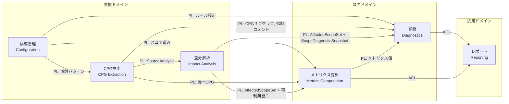
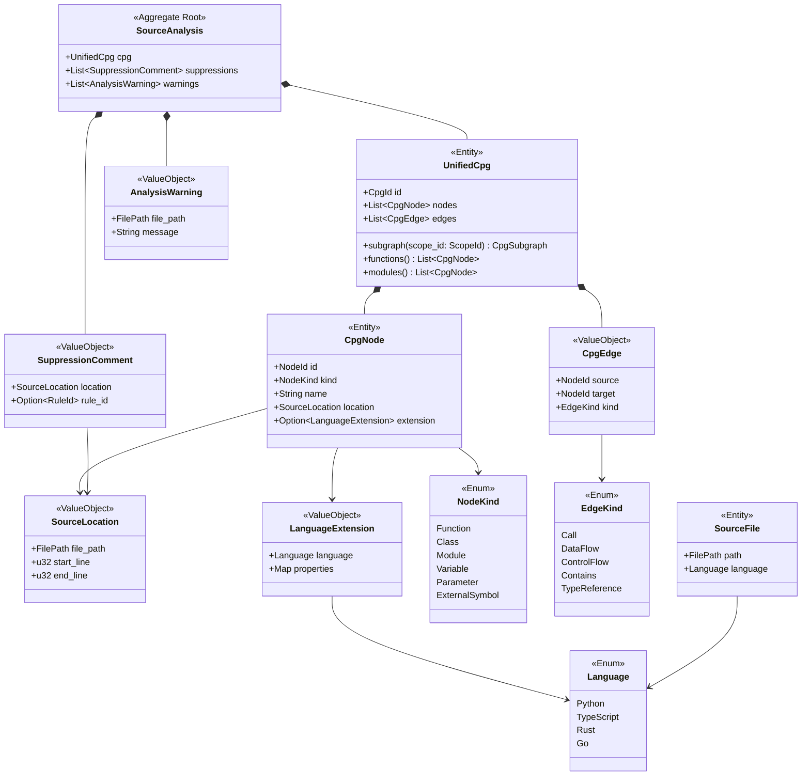
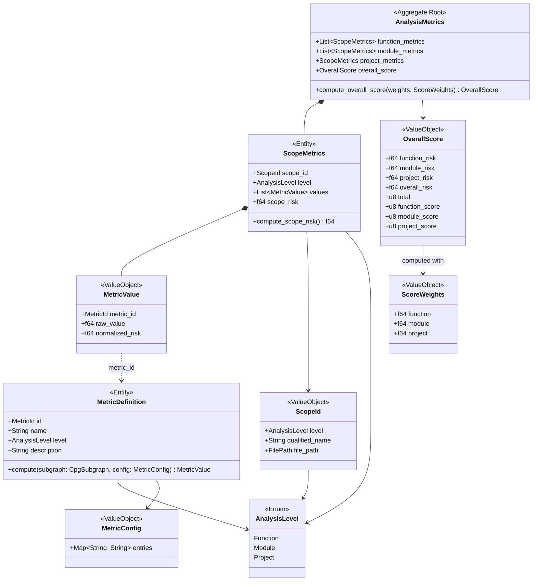
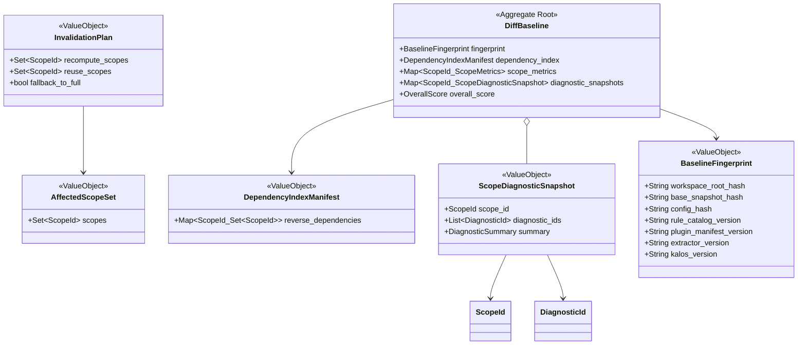
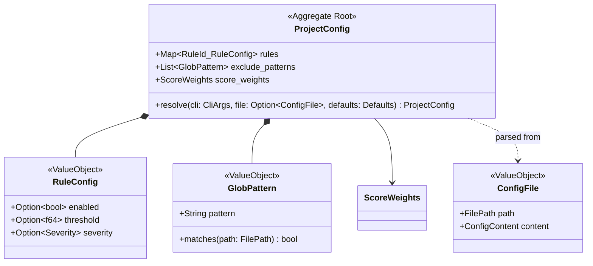
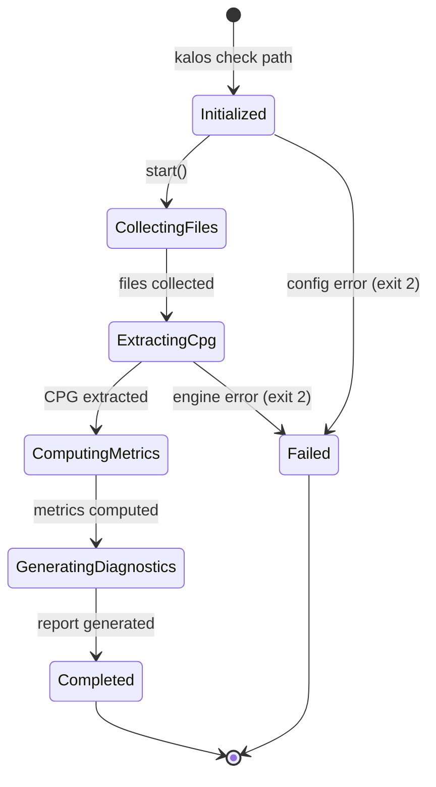
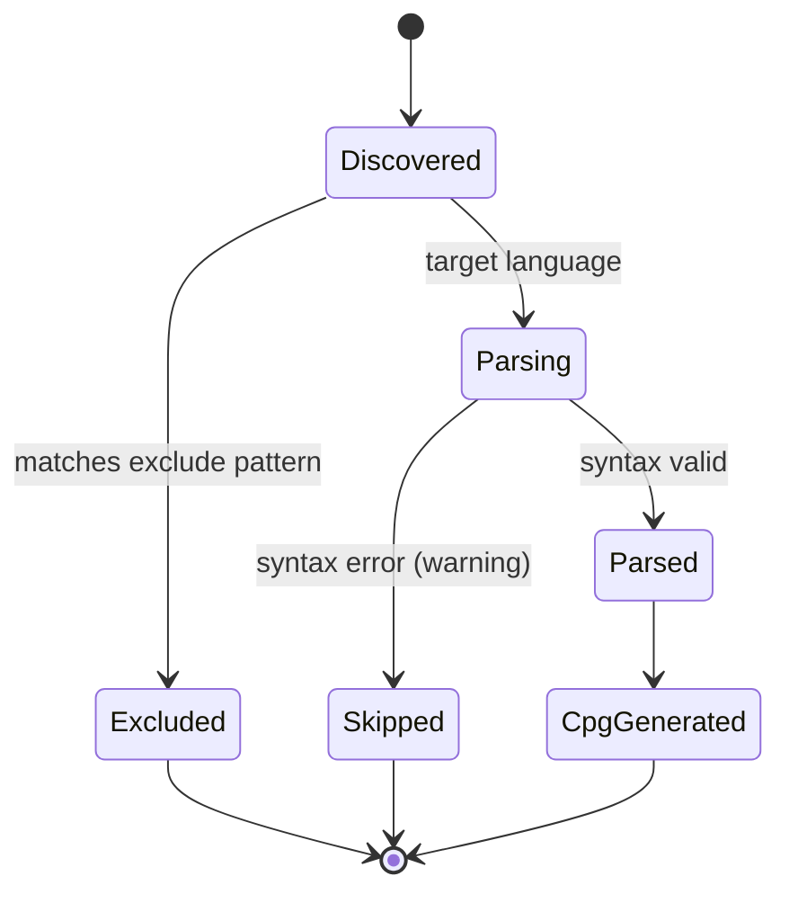

# kalos ドメインモデル

## メタ情報

| 項目 | 内容 |
|---|---|
| バージョン | 0.2.0 |
| 最終更新日 | 2026-03-19 |
| ステータス | ドラフト |
| 入力 | requirements.md v0.2.0 |

## 1. サブドメイン分類

| 分類 | コンテキスト | 根拠 |
|---|---|---|
| **コアドメイン** | メトリクス算出、診断 | kalos の差別化要因。情報理論・グラフ理論に基づく評価と改善提案が本ツールの価値の本質 |
| **支援ドメイン** | CPG抽出、差分解析、構成管理 | 必要不可欠だが、差別化の本質ではない。CPG抽出は外部エンジン（CodeQL等）に依存し、差分解析は性能要件を支える支援能力である |
| **汎用ドメイン** | レポート | 出力フォーマット変換。標準仕様（SARIF等）への準拠が主 |

## 2. コンテキストマップ



> PL = Published Language（公開言語）、ACL = Anti-Corruption Layer（腐敗防止層）

### 統合パターンの選定理由

- **PL（パイプライン内）**: CPG→メトリクス→診断のデータフローは kalos 内部で完結し、共通のデータ構造（統一CPG、MetricValue等）を公開言語として共有する
- **PL（差分解析）**: 差分解析コンテキストは `SourceAnalysis` とベースライン断片から `AffectedScopeSet` / `InvalidationPlan` を計算し、再計算と再利用の境界を公開言語として下流へ渡す
- **ACL（レポート境界）**: レポートコンテキストはドメインオブジェクトを外部形式（SARIF、JSON）に変換する。外部スキーマの変更がドメインモデルに波及しないよう ACL で遮断する
- **構成管理→各コンテキスト**: 構成管理が公開言語として設定値を提供し、各コンテキストは自身の関心に必要な設定のみを受け取る

### パイプライン依存チェーン

```
ソースコード → [CPG抽出] → SourceAnalysis(CPG + 抑制 + 警告)
                                    ↓
                 [差分解析] ← DiffBaseline + base_snapshot_hash
                      ↓
      AffectedScopeSet + InvalidationPlan + 再利用断片
                      ↓
               [メトリクス算出] ← ScoreWeights
                      ↓
               AnalysisMetrics(OverallScore を含む)
                      ↓
               [診断] ← ProjectConfig + SuppressionComment
                      ↓
        DiagnosticReport(診断 + テンプレート提案 + ExitCode)
                      ↓
  Optional LlmSuggestionBundle(DiagnosticId ごとの補助提案)
                      ↓
                [レポート] → human / JSON / SARIF
```

## 3. ドメインモデル図

### 3.1 CPG抽出コンテキスト



**設計意図:**

- `SourceAnalysis` が集約ルート。CPG抽出の完全な出力を束ね、CPG・抑制情報・警告を一体で下流に渡す
- `UnifiedCpg` は言語非依存なグラフ構造に専念し、メタ情報（抑制コメント・警告）を含まない
- `LanguageExtension` で言語固有概念（Rust の所有権、Go の goroutine 等）を保持。共通構造を汚さずに拡張可能（REQ-NF-005）
- `ExternalSymbol`（NodeKind）で外部依存の解決済みシンボルを表現（REQ-FUNC-007）
- `SuppressionComment` はソース解析時に `kalos-ignore` コメントから抽出され、診断コンテキストの `InlineSuppression` に変換される。ルール指定は exact `RuleId` のみを許可する（REQ-FUNC-029）

### 3.2 メトリクス算出コンテキスト



**設計意図:**

- `MetricDefinition` はメトリクス計算のインターフェース。組み込みメトリクスもプラグインメトリクス（REQ-FUNC-012）も同じ `compute(subgraph, config)` を実装する（REQ-NF-006）
- `MetricConfig` はプラグイン SPI へ渡す正規化済み設定マップ。ホストが設定ファイル由来の値を解決してから渡す
- `MetricValue.raw_value` と `MetricValue.normalized_risk` は算出直後に小数第 6 位で round-half-up した値を保持する。正規化は MetricDefinition の責務（REQ-FUNC-008〜010）
- `ScopeMetrics.scope_risk` は、そのスコープに属する `normalized_risk` の算術平均を小数第 6 位で round-half-up した値。差分キャッシュの再利用単位でもある
- `OverallScore` は ScoreWeights による重み付き集約の結果。`function_risk` / `module_risk` / `project_risk` / `overall_risk` は丸め済みリスク値、`total` と各階層スコアは 0〜100 の整数で保持する。デフォルト重み: function 0.4, module 0.35, project 0.25（REQ-FUNC-011）
- スコアリングを独立コンテキストとせず `AnalysisMetrics` 内に配置。現在の重み付き平均は単純であり、分離のオーバーヘッドが利点を上回る

### 3.3 診断コンテキスト

```mermaid
classDiagram
    class DiagnosticReport {
        <<Aggregate Root>>
        +List~Diagnostic~ diagnostics
        +DiagnosticSummary summary
        +DiagnosticsScope diagnostics_scope
        +SummaryScope summary_scope
        +compute_summary(scope: SummaryScope) DiagnosticSummary
        +determine_exit_code(strict: bool) ExitCode
    }
    class Diagnostic {
        <<Entity>>
        +DiagnosticId id
        +RuleId rule_id
        +DiagnosticKind kind
        +Severity severity
        +FileLocation location
        +String message
        +Option~MetricObservation~ metric
        +Option~PatternEvidence~ pattern
        +TemplateSuggestion template_suggestion
    }
    class MetricRule {
        <<Entity>>
        +RuleId id
        +MetricId metric_id
        +f64 default_threshold
        +String description
        +String suggestion_template
        +evaluate(obs: MetricObservation, config: RuleConfig) Option~Diagnostic~
    }
    class PatternRule {
        <<Entity>>
        +RuleId id
        +PatternType pattern_type
        +Severity default_severity
        +String description
        +String suggestion_template
        +detect(cpg: CpgSubgraph) List~Diagnostic~
    }
    class DiagnosticId {
        <<ValueObject>>
        +String value
    }
    class TemplateSuggestion {
        <<ValueObject>>
        +String explanation
        +Option~String~ code_example
    }
    class MetricObservation {
        <<ValueObject>>
        +MetricId metric_id
        +f64 raw_value
        +f64 normalized_risk
        +f64 threshold
        +f64 overflow_ratio
    }
    class PatternEvidence {
        <<ValueObject>>
        +PatternType pattern_type
        +List~ScopeId~ evidence_scopes
        +String evidence_message
    }
    class LlmSuggestionBundle {
        <<ValueObject>>
        +Map~DiagnosticId_LlmSuggestion~ enrichments
    }
    class LlmSuggestion {
        <<ValueObject>>
        +String explanation
        +Option~String~ code_example
    }
    class RuleId {
        <<ValueObject>>
        +String value
    }
    class Severity {
        <<Enum>>
        Error
        Warning
        Info
    }
    class DiagnosticKind {
        <<Enum>>
        Metric
        Pattern
    }
    class FileLocation {
        <<ValueObject>>
        +FilePath file_path
        +u32 start_line
        +u32 end_line
        +Option~u32~ column
    }
    class DiagnosticSummary {
        <<ValueObject>>
        +u32 error_count
        +u32 warning_count
        +u32 info_count
    }
    class DiagnosticsScope {
        <<Enum>>
        WholeProject
        AffectedOnly
    }
    class SummaryScope {
        <<Enum>>
        ListedDiagnostics
        WholeProject
    }
    class ExitCode {
        <<Enum>>
        Success
        DiagnosticFailure
        ToolError
    }
    class PatternType {
        <<Enum>>
        GodUnit
        FeatureEnvy
        CircularDependency
    }
    class InlineSuppression {
        <<ValueObject>>
        +FileLocation location
        +Option~RuleId~ rule_id
    }

    DiagnosticReport *-- Diagnostic
    DiagnosticReport --> DiagnosticSummary
    DiagnosticReport --> DiagnosticsScope
    DiagnosticReport --> SummaryScope
    DiagnosticReport --> ExitCode
    Diagnostic --> DiagnosticId
    Diagnostic --> RuleId
    Diagnostic --> DiagnosticKind
    Diagnostic --> Severity
    Diagnostic --> FileLocation
    Diagnostic --> MetricObservation
    Diagnostic --> PatternEvidence
    Diagnostic --> TemplateSuggestion
    MetricRule --> RuleId
    MetricRule --> MetricObservation
    PatternRule --> RuleId
    PatternRule --> Severity
    PatternRule --> PatternType
    LlmSuggestionBundle *-- LlmSuggestion
    LlmSuggestionBundle ..> DiagnosticId
    InlineSuppression --> FileLocation
    InlineSuppression ..> RuleId
```



**設計意図:**

- ルールを `MetricRule`（メトリクス値→閾値比較）と `PatternRule`（CPG→パターンマッチ）に分離。入力データと評価ロジックが根本的に異なるため、単一 Rule では閾値・メトリクス値フィールドが PatternRule に対して無意味になり不変条件が弱まる
- `Diagnostic` は `kind` を discriminant とし、`MetricObservation` または `PatternEvidence` のどちらか一方だけを持つ。これによりメトリクス診断とパターン診断の出力契約を同一 aggregate の中で型安全に表現できる
- メトリクス診断の重大度は `MetricRule` に固定値を持たせず、`overflow_ratio` と `RuleConfig.severity` オーバーライドから導出する。固定のデフォルト重大度を持つのは `PatternRule` のみ
- `FileLocation` は全診断で必須とする。cross-scope 診断では、根拠 scope 群のうち辞書順最小 `file_path` の `line = 1`, `end_line = 1`, `column = None` を代表位置として使う
- `DiagnosticReport.diagnostics_scope` は `diagnostics` 一覧の完全性を表す。full mode では `WholeProject`、diff mode では `AffectedOnly` を取り、reporting が JSON/SARIF の completeness 契約を確定する source of truth になる
- `DiagnosticReport.summary_scope` は summary がどの母集団に対する集計かを表す。diff mode では `diagnostics` が `AffectedScopeSet` のみでも、`summary_scope = WholeProject` により summary は変更後プロジェクト全体値を表現できる
- `SummaryScope.ListedDiagnostics` は `--level` で解析階層が限定された場合に使用され、summary は `diagnostics` リストに含まれる指定階層の診断のみを母集団とする（REQ-FUNC-023）
- `TemplateSuggestion` は決定論的コアの出力として `Diagnostic.template_suggestion` に保持する。LLM による補助提案は `LlmSuggestionBundle` として report 境界で `DiagnosticId` ごとに併記し、外部出力では `template_suggestion` / `llm_suggestion` として区別して表現する（REQ-FUNC-015, REQ-NF-008）
- `LlmEnrichmentRequest` は Application Pipeline が `Diagnostic` と `SourceAnalysis` から組み立てる allowlist 済みの application/report 境界の sidecar 入力である。`rule_id`, `severity`, `repo_relative_path` は `Diagnostic` から、`language` は `SourceAnalysis` から、`source_excerpt` / `cpg_excerpt` は対象スコープの CPG・ソースから取得する。`metric` と `pattern` は `Diagnostic.kind` に応じて排他的に設定される
- `InlineSuppression` は CPG 抽出コンテキストの `SuppressionComment` を変換したもの。`rule_id` が None の場合は該当行の全診断を抑制（REQ-FUNC-029）
- `ExitCode` の決定ロジックは `DiagnosticReport.determine_exit_code()` の責務。`--strict` フラグで warning → error 昇格（REQ-FUNC-022）

### 3.4 差分解析コンテキスト



**設計意図:**

- `Impact Analysis` が `AffectedScopeSet` と `InvalidationPlan` の導出ロジックの唯一の owner であり、結果値そのものは公開言語として下流コンテキストへ渡す
- `BaselineFingerprint.workspace_root_hash` はワークスペースのルートディレクトリの正規化済み絶対パスから算出したハッシュ。異なるチェックアウトパス間でベースラインキャッシュが誤って共有されないことを保証する
- `BaselineFingerprint.base_snapshot_hash` は「現在のワークスペース」ではなく `base-ref` 側のスナップショットを表す。これにより、同じ基準コミットに対する差分実行でベースラインを再利用できる
- `ScopeDiagnosticSnapshot` を保持することで、差分モードでもプロジェクト全体の重大度件数を再構成できる。完全な `DiagnosticReport` をキャッシュへ保存する必要はない

### 3.5 構成管理コンテキスト



**設計意図:**

- `ProjectConfig.resolve()` が設定の優先順位（CLI > ファイル > デフォルト）をカプセル化（REQ-FUNC-025）
- `RuleConfig` の各フィールドは `Option` 型。None は「デフォルト値を使用」を意味し、マージロジックがシンプルになる
- ルールの「定義」（MetricRule/PatternRule）は診断コンテキスト、「設定」（RuleConfig）は構成管理コンテキストに分離。「何を評価するか」はドメイン知識、「閾値をいくつにするか」はプロジェクト固有の設定

### 3.6 レポートコンテキスト

レポートコンテキストは ACL として機能し、ドメインオブジェクトを外部形式に変換する薄い層である。固有のエンティティや集約は持たず、以下の変換を担う。`--llm` 指定時は application/report 境界で組み立てられた `LlmEnrichmentRequest` の結果として `LlmSuggestionBundle` を受け取り、出力へ併記する。

| 入力（ドメイン） | 出力形式 | 関連要件 |
|---|---|---|
| DiagnosticReport + AnalysisMetrics + Option~LlmSuggestionBundle~ | human（端末表示） | REQ-FUNC-019 |
| 同上 | JSON | REQ-FUNC-020 |
| 同上 | SARIF 2.1.0 | REQ-FUNC-021 |

## 4. 状態遷移図

### 4.1 解析パイプライン



### 4.2 ソースファイル処理



## 5. 用語集

### 5.1 用語集: CPG抽出コンテキスト

| 用語 | 定義 | 関連概念 |
|---|---|---|
| ソース解析結果 (SourceAnalysis) | CPG抽出の完全な出力を束ねる集約ルート。統一CPG・抑制コメント・解析警告を含む | UnifiedCpg, SuppressionComment, AnalysisWarning |
| 統一CPG (UnifiedCpg) | 4言語のソースコードを言語非依存な共通構造で表現したコードプロパティグラフ | CpgNode, CpgEdge |
| CPGノード (CpgNode) | CPG内の構成要素。関数、クラス、モジュール、変数等を表す | NodeKind, SourceLocation |
| CPGエッジ (CpgEdge) | ノード間の関係。呼び出し、データフロー、制御フロー等 | EdgeKind |
| ソース位置 (SourceLocation) | ファイルパスと行範囲でコード上の位置を特定する値 | — |
| 言語拡張 (LanguageExtension) | 言語固有の概念（Rustの所有権、Goのgoroutine等）を保持するノード付属データ | Language |
| ソースファイル (SourceFile) | 解析対象の個別ファイル。パスと言語で識別される | Language |
| 外部シンボル (ExternalSymbol) | 外部依存から解決された型情報・関数シグネチャを表すノード種別 | NodeKind |
| 抑制コメント (SuppressionComment) | ソースコード中の `kalos-ignore` コメント。位置と optional な exact `RuleId` を持つ | SourceLocation |
| 解析警告 (AnalysisWarning) | CPG抽出中に発生した非致命的な問題（構文エラーによるスキップ、外部依存解決失敗等） | — |

### 5.2 用語集: メトリクス算出コンテキスト

| 用語 | 定義 | 関連概念 |
|---|---|---|
| メトリクスID (MetricId) | 固定メトリクスを識別する値。`M-F001`, `M-M001`, `M-P001` 形式 | MetricDefinition |
| メトリクス定義 (MetricDefinition) | メトリクスの計算方法を定義するエンティティ。組み込みとプラグインの両方が同じインターフェースを実装する | MetricId, AnalysisLevel |
| メトリクス設定 (MetricConfig) | `MetricDefinition.compute()` に渡す正規化済み設定マップ。plugin host が SPI 入力として供給する | MetricDefinition |
| メトリクス値 (MetricValue) | 算出された生値と0〜1の正規化リスク値のペア | MetricDefinition |
| スコープメトリクス (ScopeMetrics) | 特定のスコープ（関数、モジュール等）に対する全メトリクス値の集合。丸め済み `scope_risk` を保持する | ScopeId, AnalysisLevel |
| 解析メトリクス (AnalysisMetrics) | 全階層のメトリクス結果と総合スコアを束ねる集約ルート | ScopeMetrics, OverallScore |
| 総合スコア (OverallScore) | 全階層のメトリクスを重み付き集約した丸め済みリスク値と、0〜100の整数評価値・各階層の整数部分スコア | ScoreWeights |
| スコープID (ScopeId) | メトリクス算出対象を一意に識別する値。階層・修飾名・ファイルパスで構成 | AnalysisLevel |
| スコア重み (ScoreWeights) | 総合スコア算出時の各階層の重み。デフォルト: function 0.4, module 0.35, project 0.25 | — |
| 解析階層 (AnalysisLevel) | メトリクス算出の粒度: Function / Module / Project | — |

### 5.3 用語集: 診断コンテキスト

| 用語 | 定義 | 関連概念 |
|---|---|---|
| 診断 (Diagnostic) | 閾値違反または構造的パターン検出の結果。`kind` に応じて `MetricObservation` または `PatternEvidence` を持つ | MetricRule, PatternRule |
| 診断レポート (DiagnosticReport) | 診断一覧、一覧の完全性、summary、summary の母集団、Exit code を束ねる集約ルート | Diagnostic, DiagnosticSummary, DiagnosticsScope, SummaryScope |
| メトリクスルール (MetricRule) | メトリクス値を閾値と比較して診断を生成するルール。`KAL-Fxxx` / `KAL-Mxxx` / `KAL-Pxxx` 形式の RuleId で識別し、重大度は `overflow_ratio` と設定オーバーライドから導出する | RuleId |
| パターンルール (PatternRule) | CPGから構造的パターンを直接検出するルール。`KAL-PATxxx` 形式の RuleId で識別 | PatternType |
| 診断ID (DiagnosticId) | 診断を一意に識別する値。LLM 補助提案との関連付けに使う | Diagnostic |
| メトリクス観測値 (MetricObservation) | メトリクス診断の詳細。`metric_id`, `raw_value`, `normalized_risk`, `threshold`, `overflow_ratio` を含む | MetricId |
| パターン根拠 (PatternEvidence) | パターン診断の詳細。`pattern_type`, `evidence_scopes`, `evidence_message` を含む | PatternType |
| テンプレート改善提案 (TemplateSuggestion) | 何が問題か・なぜ問題か・どう改善すべきかを含む決定論的な提案。外部出力では `template_suggestion` フィールドに写像する | Diagnostic |
| ルールID (RuleId) | ルールの一意識別子。`KAL-F001`, `KAL-M001`, `KAL-P001`, `KAL-PAT001` 形式 | — |
| 重大度 (Severity) | 診断の深刻さ: Error（品質基準を明確に逸脱）/ Warning（改善を強く推奨）/ Info（許容範囲内だが改善の余地あり） | — |
| インライン抑制 (InlineSuppression) | `kalos-ignore` コメントによる診断抑制。ルールID指定で個別抑制、省略で全抑制 | RuleId |
| 診断一覧スコープ (DiagnosticsScope) | `diagnostics` 一覧が全診断か影響範囲限定かを表す値。WholeProject / AffectedOnly | DiagnosticReport |
| 診断サマリー (DiagnosticSummary) | 重大度別の診断件数集計 | — |
| Exit code | 解析結果のプロセス終了コード: Success(0) / DiagnosticFailure(1) / ToolError(2) | — |

### 5.4 用語集: 差分解析コンテキスト

| 用語 | 定義 | 関連概念 |
|---|---|---|
| 差分ベースライン (DiffBaseline) | 差分解析の再利用に必要な断片を束ねる集約ルート。メトリクス断片、診断断片、依存インデックス、フィンガープリントを持つ | BaselineFingerprint, DependencyIndexManifest |
| 影響範囲集合 (AffectedScopeSet) | 差分再計算が必要な `ScopeId` の集合 | ScopeId |
| 無効化計画 (InvalidationPlan) | 再計算対象、再利用対象、全解析フォールバック要否を表す値 | AffectedScopeSet |
| 依存インデックス manifest (DependencyIndexManifest) | `ScopeId` 間の逆依存関係を永続化した値 | ScopeId |
| ベースライン識別子 (BaselineFingerprint) | 差分ベースラインの互換性判定に使う版情報とハッシュ集合。`workspace_root_hash` と `base_snapshot_hash` を含む | DiffBaseline |
| ワークスペースルートハッシュ (workspace_root_hash) | `BaselineFingerprint` の構成要素。ワークスペースのルートディレクトリの正規化済み絶対パスから算出したハッシュ値。異なるワークスペース間でベースラインキャッシュが衝突しないことを保証する | BaselineFingerprint |
| スコープ診断断片 (ScopeDiagnosticSnapshot) | ある `ScopeId` に属する既知診断の断片とサマリー | DiagnosticId, DiagnosticSummary |

### 5.5 用語集: 構成管理コンテキスト

| 用語 | 定義 | 関連概念 |
|---|---|---|
| プロジェクト設定 (ProjectConfig) | ルール設定・除外パターン・スコア重みをマージした最終的な設定。優先順位: CLI > ファイル > デフォルト | RuleConfig, GlobPattern |
| ルール設定 (RuleConfig) | 個別ルールの有効/無効・閾値・重大度のオーバーライド。各フィールドは Option で、None は「デフォルト値を使用」 | RuleId |
| 除外パターン (GlobPattern) | 解析対象から除外するファイル/ディレクトリのglobパターン | — |
| 設定ファイル (ConfigFile) | `.kalos.toml` ファイル。カレントから親方向に探索される（monorepo対応） | ProjectConfig |

### 5.6 用語集: レポートコンテキスト

| 用語 | 定義 | 関連概念 |
|---|---|---|
| LLM補助提案バンドル (LlmSuggestionBundle) | `DiagnosticId` ごとに report 層で併記される任意の補助提案集合。コア診断は変更しない | DiagnosticId, LlmSuggestion |
| LLM補助提案 (LlmSuggestion) | LLM が生成する任意の補助提案テキスト。テンプレート提案の代替ではなく補足 | LlmSuggestionBundle |
| LLMエンリッチ要求 (LlmEnrichmentRequest) | Application Pipeline が `Diagnostic` と `SourceAnalysis` から組み立てる allowlist 済み sidecar 入力 `{ rule_id, severity, language, repo_relative_path, metric?, pattern?, source_excerpt?, cpg_excerpt? }`。`language` は `SourceAnalysis` から取得する | Diagnostic, SourceAnalysis |
| CPG抜粋 (CpgSubgraphExcerpt) | LLM 送信に使う、診断に必要な最小部分だけへ正規化した CPG 表現 | ScopeId |

## 6. 判断記録

### 6.1 判断記録: SourceAnalysis 集約の導入

- **日付**: 2026-03-18
- **関連コンテキスト**: CPG抽出
- **判断内容**: CPG 抽出の出力を `UnifiedCpg` 単体から `SourceAnalysis`（CPG + 抑制情報 + 警告）に変更
- **根拠**:
  - 観測事実: `kalos-ignore` コメントの抑制（REQ-FUNC-029）と構文エラーの警告出力（REQ-FUNC-001〜004）は CPG 抽出と同時に発見されるが、CPG のグラフ構造とは異質
  - 代替案: (A) CpgNode に Comment 種別を追加して CPG 内に含める (B) 診断コンテキストがソースファイルを直接再読み込みする
  - 分離証人: 代替案 A は CPG のノード/エッジモデルにグラフ構造でないメタ情報が混入し、メトリクス算出時にフィルタリングが必要になる。代替案 B はソースファイルの二重読み込みが発生し、CPG 抽出との処理順序依存が生じる
- **等価性への影響**: 観測的等価（外部インターフェースは拡張のみ）
- **語彙への影響**: `SourceAnalysis`, `SuppressionComment`, `AnalysisWarning` を用語集に追加

### 6.2 判断記録: MetricRule と PatternRule の分離

- **日付**: 2026-03-18
- **関連コンテキスト**: 診断
- **判断内容**: ルールを MetricRule（メトリクス値→閾値比較）と PatternRule（CPG→パターンマッチ）に分離
- **根拠**:
  - 観測事実: REQ-FUNC-013 は数値比較、REQ-FUNC-014 は構造的パターンマッチ。入力データと評価ロジックが根本的に異なる
  - 代替案: 単一の Rule エンティティで両方を表現（evaluate メソッド内で分岐）
  - 分離証人: PatternRule.detect() は CPG サブグラフを直接入力とし、メトリクス値を経由しない。単一 Rule では「閾値」「メトリクス値」フィールドが PatternRule に対して無意味になり、不変条件が弱まる
- **等価性への影響**: 理論等価（どちらの設計でも同じ診断結果を表現可能だが、型安全性が異なる）
- **語彙への影響**: なし

### 6.3 判断記録: スコアリングをメトリクス算出コンテキストに配置

- **日付**: 2026-03-18
- **関連コンテキスト**: メトリクス算出
- **判断内容**: 総合スコアの算出を独立コンテキストとせず、メトリクス算出コンテキスト内の `AnalysisMetrics.compute_overall_score()` に配置
- **根拠**:
  - 観測事実: 総合スコアは各階層メトリクスの重み付き集約（REQ-FUNC-011）。入力も出力もメトリクスの延長
  - 代替案: 独立した「スコアリングコンテキスト」として分離
  - 分離証人: 現在のスコアリングロジック（重み付き平均）は単純であり、独立コンテキストのオーバーヘッド（コンテキスト間通信、マッピング）が利点を上回る。将来、ピア比較や非線形集約が必要になった場合に分離を再検討する
- **等価性への影響**: 理論等価
- **語彙への影響**: なし

### 6.4 判断記録: ルール「定義」と「設定」のコンテキスト分離

- **日付**: 2026-03-18
- **関連コンテキスト**: 診断、構成管理
- **判断内容**: ルールの定義（MetricRule: デフォルト閾値・提案テンプレート、PatternRule: デフォルト重大度・提案テンプレート）は診断コンテキスト、ルールの設定オーバーライド（RuleConfig: enabled/threshold/severity）は構成管理コンテキストに配置
- **根拠**:
  - 観測事実: ルールの「何を評価するか」はドメイン知識（診断の関心）、「閾値をいくつにするか」はプロジェクト固有の設定（構成管理の関心）
  - 代替案: Rule と RuleConfig を同一コンテキストに配置
  - 分離証人: 設定ファイルの構文エラー処理（REQ-FUNC-025）や設定の優先順位マージ（CLI > ファイル > デフォルト）は構成管理の関心であり、診断ロジックに混入させると責務が肥大化する
- **等価性への影響**: 理論等価
- **語彙への影響**: なし

## 変更履歴

| バージョン | 日付 | 変更内容 | 変更者 |
|---|---|---|---|
| 0.2.0 | 2026-03-19 | 差分解析コンテキスト、診断の discriminated union、提案スキーマ統一、MetricConfig、RuleConfig の Option 契約を追加 | Codex |
| 0.1.1 | 2026-03-18 | LLM 補助提案を report 境界の sidecar に分離し、用語集とレポート入力を更新 | Codex (`architecture-designer` スキル) |
| 0.1.0 | 2026-03-18 | 初版作成 | Claude（domain-modeler スキル） |
