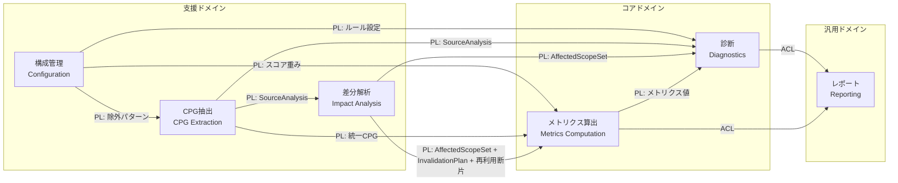
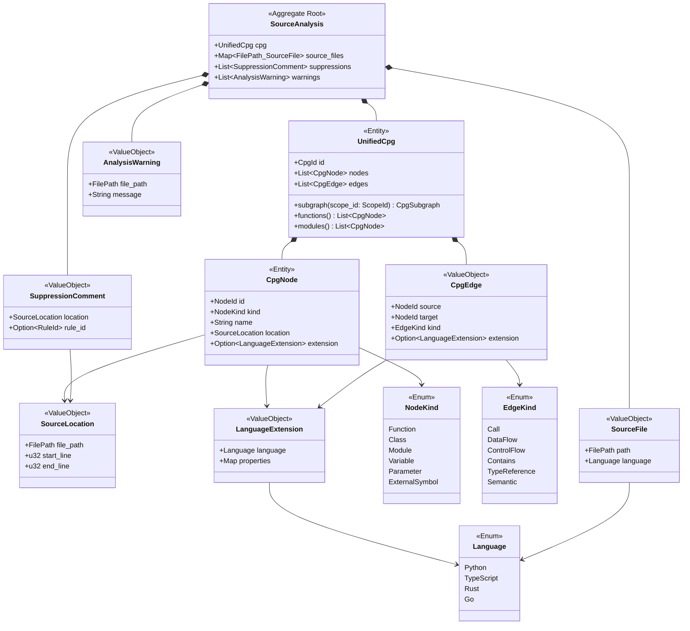
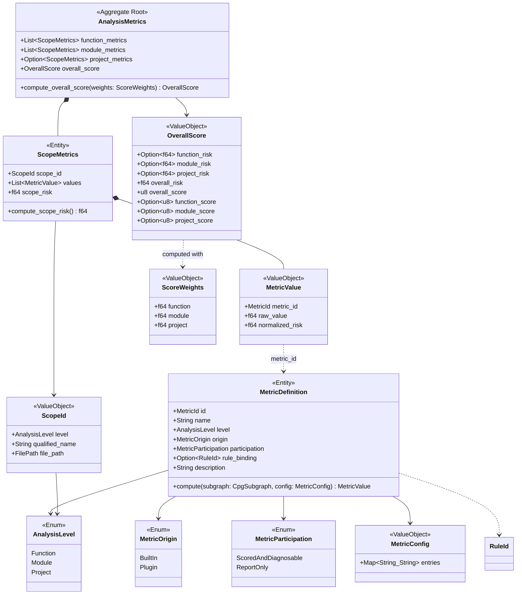
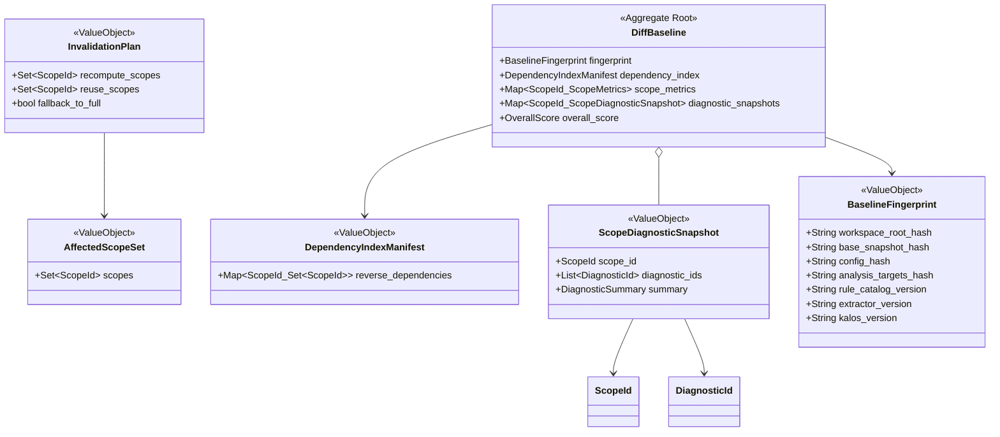
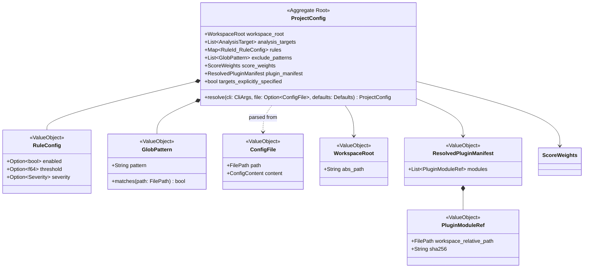
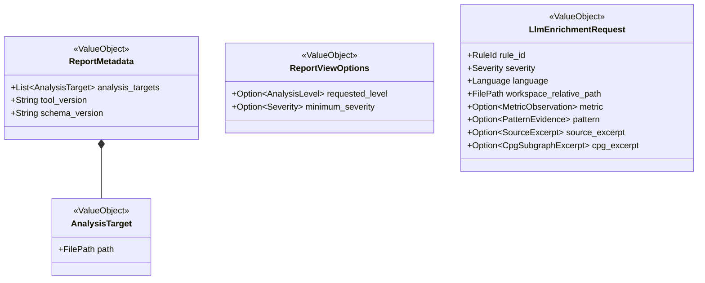
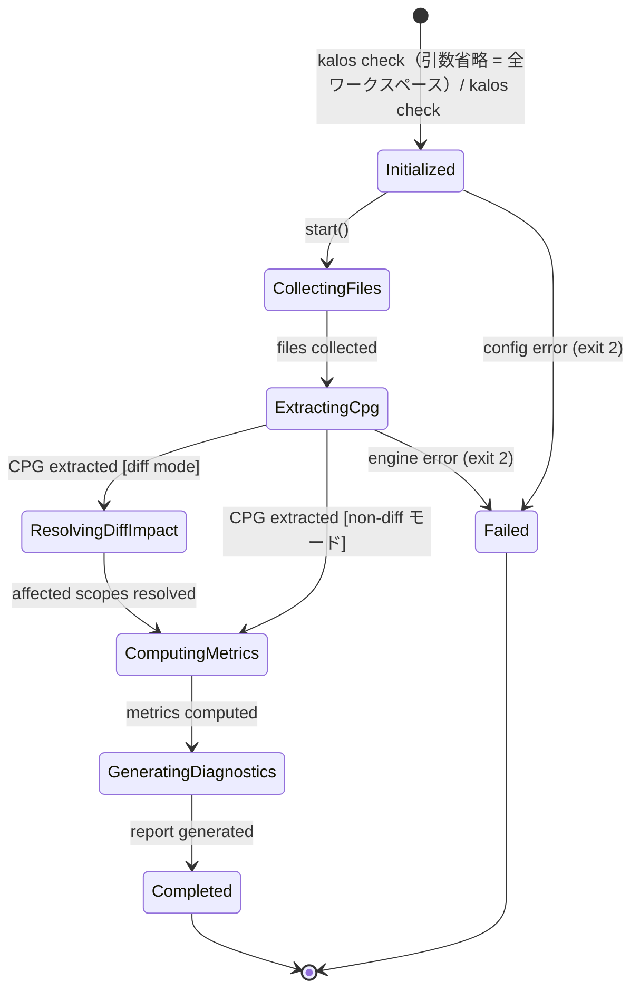
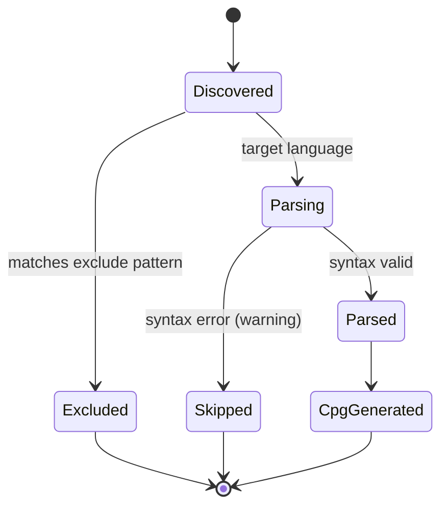

# kalos ドメインモデル

## メタ情報

| 項目 | 内容 |
|---|---|
| バージョン | 0.4.12 |
| 最終更新日 | 2026-03-27 |
| ステータス | ドラフト |
| 入力 | requirements.md v0.4.13 |

## 1. サブドメイン分類

| 分類 | コンテキスト | 根拠 |
|---|---|---|
| **コアドメイン** | メトリクス算出、診断 | kalos の差別化要因。情報理論・グラフ理論に基づく評価と改善提案が本ツールの価値の本質 |
| **支援ドメイン** | CPG抽出、差分解析、構成管理 | 必要不可欠だが、差別化の本質ではない。CPG抽出は外部エンジン（CodeQL等）に依存し、差分解析は性能要件を支える支援能力である |
| **汎用ドメイン** | レポート | 出力フォーマット変換。標準仕様（SARIF等）への準拠が主 |

## 2. コンテキストマップ



> PL = Published Language（公開言語）、ACL = Anti-Corruption Layer（腐敗防止層）

### 統合パターンの選定理由

- **PL（パイプライン内）**: CPG→メトリクス→診断のデータフローは kalos 内部で完結し、共通のデータ構造（統一CPG、MetricValue等）を公開言語として共有する
- **PL（差分解析）**: 差分解析コンテキストは `SourceAnalysis` とベースライン断片から `AffectedScopeSet` / `InvalidationPlan` を計算し、再計算と再利用の境界を公開言語として下流へ渡す
- **ACL（レポート境界）**: レポートコンテキストはドメインオブジェクトを外部形式（SARIF、JSON）に変換する。外部スキーマの変更がドメインモデルに波及しないよう ACL で遮断する
- **構成管理→各コンテキスト**: 構成管理が公開言語として設定値を提供し、各コンテキストは自身の関心に必要な設定のみを受け取る

### パイプライン依存チェーン

```
ソースコード → [CPG抽出] → SourceAnalysis(CPG + 抑制 + 警告)
                                    ↓
                 [差分解析] ← DiffBaseline + base_snapshot_hash
                      ↓
      AffectedScopeSet + InvalidationPlan + 再利用断片
                      ↓
               [メトリクス算出] ← ScoreWeights
                      ↓
               AnalysisMetrics(OverallScore を含む)
                      ↓
               [診断] ← ProjectConfig + SourceAnalysis
                      ↓
 List<Diagnostic>(テンプレート提案と canonical scope を含む)
                      ↓
 [Application Pipeline] summary materialization + scope 判定
                      ↓
        DiagnosticReport(診断 + summary + diagnostics_scope + summary_scope)
                      ↓
  Optional LlmSuggestionBundle(DiagnosticId ごとの補助提案)
                      ↓
                [レポート] → human / JSON / SARIF
```

## 3. ドメインモデル図

### 3.1 CPG抽出コンテキスト



**設計意図:**

- `SourceAnalysis` が集約ルート。CPG抽出の完全な出力を束ね、CPG・ソースファイルメタデータ・抑制情報・警告を一体で下流に渡す
- `SourceAnalysis.source_files` は、正規化済み workspace-relative `FilePath` をキーとする決定論的対応表である。各 `SourceFile.path` は一意で、列挙順は `path` 昇順に固定する。LLM sidecar の `language` 解決や representative file の照合はここを source of truth とする
- `UnifiedCpg` は言語非依存なグラフ構造に専念し、メタ情報（抑制コメント・警告）を含まない
- managed CodeQL bundle の bootstrap / verify / cache やオフライン成功条件は `Managed Tool Cache Adapter` の責務であり、CPG 抽出ドメインモデルには持ち込まない。抽出ドメインが扱うのは解決済み bundle を使って生成された `SourceAnalysis` だけである
- `LanguageExtension` はノードと semantic edge の両方に付与でき、言語固有概念（Rust の ownership / borrow / lifetime relation、Go の goroutine、owner/public semantics を決める language profile 等）を保持する。共通構造を汚さずに拡張可能（REQ-NF-005）
- `ExternalSymbol`（NodeKind）で外部依存の解決済みシンボルを表現（REQ-FUNC-007）
- `NodeKind` / `EdgeKind` の SPI v1 における `u32` discriminant mapping（バリアント→整数値の規範的対応）は ADR-0004 の「NodeKind / EdgeKind discriminant mapping」で定義する。ドメインモデル上の enum 宣言順が SPI の整数値割当てと一致するため、バリアントの追加・削除・順序変更は SPI 破壊的変更を伴う
- `SourceFile` は Value Object である。`SourceAnalysis.source_files` マップで `FilePath` をキーとして管理されており、`path` は Entity としての同一性ではなくマップキーとして機能する。可変状態を持たず（`path` と `language` は解析実行ごとに決定され変更されない）、`SourceAnalysis` 集約の外で独立に追跡・参照されることはない
- `SuppressionComment` はソース解析時に `kalos-ignore` コメントから抽出され、診断コンテキストの `InlineSuppression` に変換される。ルール指定は exact `RuleId` のみを許可する（REQ-FUNC-029）

### 3.2 メトリクス算出コンテキスト



**設計意図:**

- `MetricDefinition` はメトリクス計算のインターフェース。組み込みメトリクスもプラグインメトリクス（REQ-FUNC-012）も同じ `compute(subgraph, config)` を実装する（REQ-NF-006）。v1 では組み込みは `origin = BuiltIn`, `participation = ScoredAndDiagnosable`, `rule_binding = Some(RuleId)`、プラグインは `origin = Plugin`, `participation = ReportOnly`, `rule_binding = None` を取る
- `MetricDefinition.id` は組み込みとプラグインを横断してグローバル一意でなければならない。Plugin Host は `plugin_manifest` を `workspace_relative_path` 昇順でロードし、既存 ID と衝突したプラグインを deterministic なロード失敗として warning 付きで無効化する。**登録の原子性**: `kalos_plugin_init` 完了後、初期化中のいずれかの `metric_register` が衝突（`-1`）を返したか、または `kalos_plugin_init` 自体が非 0 を返した場合、当該モジュールの全 `MetricDefinition` をロールバックし部分登録を残さない（ADR-0004 参照）
- Plugin Host は各 plugin `MetricDefinition` を `level` に一致する各 `ScopeId` ごとに 1 回ずつ評価し、入力には `UnifiedCpg.subgraph(scope_id)` の read-only view を渡す。project metric は正規形 `ScopeId(level = Project, qualified_name = "<project>", file_path = ".")` に対して 1 回だけ評価する
- `MetricConfig` はプラグイン SPI へ渡す正規化済み設定マップ。ホストが設定ファイル由来の値を解決してから渡す
- `MetricValue.raw_value` と `MetricValue.normalized_risk` は算出直後に小数第 6 位で round-half-up した値を保持する。`MetricObservation.overflow_ratio` も同じく算出直後に round-half-up し、その丸め済み値を重大度判定と外部出力に使う。正規化は MetricDefinition の責務（REQ-FUNC-008〜010）。`raw_value` または `normalized_risk` の算出結果が `NaN` または `Inf` の場合は評価失敗として扱い、warning を出力し `MetricValue` を生成しない。`normalized_risk` が有限だが `[0.0, 1.0]` 範囲外の場合は warning を出力したうえで `[0.0, 1.0]` にクランプし、クランプ後の値に対して round-half-up する
- `ScopeMetrics.scope_risk` は、そのスコープに属する `participation = ScoredAndDiagnosable` な `normalized_risk` の算術平均を小数第 6 位で round-half-up した値。差分キャッシュの再利用単位でもある。`enabled = false` のルールにバインドされたメトリクスは母集団から除外する。母集団が空の場合（全メトリクスが除外された場合）、`scope_risk = 0.0`（リスクなし）とする
- `AnalysisMetrics` は `--level` の指定に関わらず常に全階層（function / module / project）の `ScopeMetrics` を算出し保持する（ADR-0003 保存不変条件、architecture.md §5.2 不変条件参照）。`--level` による非対象階層のメトリクス・診断・スコアの報告除外（must exclude）は Reporting コンテキストが `ReportViewOptions.requested_level` に基づいて担う射影であり、`AnalysisMetrics` 自体のデータ保持には影響しない（REQ-FUNC-011 ステップ 8、REQ-FUNC-023 参照）。`project_metrics = None` は project スコープが存在しないことを意味し、`--level` による除外や未計算を意味しない。plugin metric は `values` へ保持されるが、v1 のスコア・診断契約には参加しない
- `OverallScore` は ScoreWeights による重み付き集約の結果。`overall_risk` と `overall_score` は常に存在し、`function_risk` / `module_risk` / `project_risk` と各階層スコアは計算可能なスコープが存在する階層のみ `Some`、スコープが存在しない階層は `None` を許容する（`--level` による報告対象の制限とは無関係であり、`DiffBaseline` に永続化される `OverallScore` も同じ規則に従う）。`overall_score` は常にメトリクス集約の写像であり、summary 件数や exit code 判定から逆算しない。デフォルト重み: function 0.4, module 0.35, project 0.25（REQ-FUNC-011, REQ-FUNC-023）。`OverallScore` 算出時の計算不変条件: (1) **re-normalization** — 合計 ≠ 1.0 の場合、`adjusted_weight[l] = weight[l] / Σ(weights)` で比例再正規化する、(2) **empty-level redistribution** — 対象スコープが 0 件の階層（disabled ルールにより全メトリクスが除外された場合を含む）の重みを残存階層へ比例再配分する。詳細は requirements.md REQ-FUNC-011 ステップ 3–4 を参照
- `ScopeMetrics` の階層は `scope_id.level` から導出する。ドメインモデル上で `level` を別フィールドとして重複保持しない
- `ScopeId` の決定論的順序は `(level, qualified_name, file_path)` の辞書順とし、`AnalysisLevel` の順序は `Function < Module < Project` に固定する。project スコープの正規形は `ScopeId(level = Project, qualified_name = "<project>", file_path = ".")` の単一値とし、スコア集約・診断生成・差分キャッシュ統合はこの comparator を共通で用いる
- プラグインのロード失敗、checksum 不一致、fuel budget 超過、メモリ超過、aggregate fuel budget 超過、および評価戻り値の `raw_value` または `normalized_risk` が `NaN` / `±Inf` の場合は `MetricValue` を生成しない非致命の運用イベントとして扱う（有限だが `[0.0, 1.0]` 範囲外の `normalized_risk` は `clamp` で補正し warning を出力する。fuel が規範的上限であり、diff mode から全解析へフォールバックした場合は全解析の budget を適用する。具体的な budget 数値は暫定値であり PoC で確定予定。ADR-0004 参照）。`AnalysisMetrics` は成功したメトリクスだけを束ね、失敗通知は `stderr` / 構造化ログ側へ分離する
- スコアリングを独立コンテキストとせず `AnalysisMetrics` 内に配置。現在の重み付き平均は単純であり、分離のオーバーヘッドが利点を上回る

### 3.3 診断コンテキスト

```mermaid
classDiagram
    class DiagnosticReport {
        <<Aggregate Root>>
        +List~Diagnostic~ diagnostics
        +DiagnosticSummary summary
        +DiagnosticsScope diagnostics_scope
        +SummaryScope summary_scope
        +determine_exit_code(strict: bool) ExitCode
    }
    class Diagnostic {
        <<Entity>>
        +DiagnosticId id
        +ScopeId primary_scope_id
        +RuleId rule_id
        +DiagnosticKind kind
        +Severity severity
        +FileLocation location
        +String message
        +Option~MetricObservation~ metric
        +Option~PatternEvidence~ pattern
        +TemplateSuggestion template_suggestion
    }
    class MetricRule {
        <<Entity>>
        +RuleId id
        +MetricId metric_id
        +f64 default_threshold
        +String description
        +String suggestion_template
        +evaluate(obs: MetricObservation, config: RuleConfig) Option~Diagnostic~
    }
    class PatternRule {
        <<Entity>>
        +RuleId id
        +PatternType pattern_type
        +AnalysisLevel evaluation_scope
        +Severity default_severity
        +String description
        +String suggestion_template
        +detect(cpg: CpgSubgraph, metrics: AnalysisMetrics, config: RuleConfig) List~Diagnostic~
    }
    class DiagnosticId {
        <<ValueObject>>
        +String value
    }
    class TemplateSuggestion {
        <<ValueObject>>
        +String explanation
        +Option~String~ code_example
    }
    class MetricObservation {
        <<ValueObject>>
        +MetricId metric_id
        +f64 raw_value
        +f64 normalized_risk
        +f64 threshold
        +f64 overflow_ratio
    }
    class PatternEvidence {
        <<ValueObject>>
        +PatternType pattern_type
        +List~ScopeId~ evidence_scopes
        +String evidence_message
    }
    class LlmSuggestionBundle {
        <<ValueObject>>
        +Map~DiagnosticId_LlmSuggestion~ enrichments
    }
    class LlmSuggestion {
        <<ValueObject>>
        +String explanation
        +Option~String~ code_example
    }
    class SourceExcerpt {
        <<ValueObject>>
        +FilePath file_path
        +u32 start_line
        +u32 end_line
        +String text
    }
    class CpgSubgraphExcerpt {
        <<ValueObject>>
        +List~ScopeId~ scopes
        +String representation
    }
    class RuleId {
        <<ValueObject>>
        +String value
    }
    class Severity {
        <<Enum>>
        Error
        Warning
        Info
    }
    class DiagnosticKind {
        <<Enum>>
        Metric
        Pattern
    }
    class FileLocation {
        <<ValueObject>>
        +FilePath file_path
        +u32 start_line
        +u32 end_line
        +Option~u32~ column
    }
    class DiagnosticSummary {
        <<ValueObject>>
        +u32 error_count
        +u32 warning_count
        +u32 info_count
    }
    class DiagnosticsScope {
        <<Enum>>
        WholeProject
        AffectedOnly
    }
    class SummaryScope {
        <<Enum>>
        ListedDiagnostics
        WholeProject
    }
    note for DiagnosticsScope "JSON値: whole_project, affected_only"
    note for SummaryScope "JSON値: listed_diagnostics, whole_project"
    class ExitCode {
        <<Enum>>
        Success
        DiagnosticFailure
        ToolError
    }
    class PatternType {
        <<Enum>>
        GodUnit
        FeatureEnvy
        CircularDependency
    }
    class InlineSuppression {
        <<ValueObject>>
        +FileLocation location
        +Option~RuleId~ rule_id
    }

    DiagnosticReport *-- Diagnostic
    DiagnosticReport --> DiagnosticSummary
    DiagnosticReport --> DiagnosticsScope
    DiagnosticReport --> SummaryScope
    DiagnosticReport --> ExitCode
    Diagnostic --> DiagnosticId
    Diagnostic --> ScopeId
    Diagnostic --> RuleId
    Diagnostic --> DiagnosticKind
    Diagnostic --> Severity
    Diagnostic --> FileLocation
    Diagnostic --> MetricObservation
    Diagnostic --> PatternEvidence
    Diagnostic --> TemplateSuggestion
    MetricRule --> RuleId
    MetricRule --> MetricObservation
    PatternRule --> RuleId
    PatternRule --> Severity
    PatternRule --> PatternType
    PatternRule --> AnalysisLevel
    LlmSuggestionBundle *-- LlmSuggestion
    LlmSuggestionBundle ..> DiagnosticId
    InlineSuppression --> FileLocation
    InlineSuppression ..> RuleId
```



**設計意図:**

- ルールを `MetricRule`（メトリクス値→閾値比較）と `PatternRule`（構造情報中心のパターン検出）に分離。入力データと評価ロジックが根本的に異なるため、単一 Rule では閾値・メトリクス値フィールドが PatternRule に対して無意味になり不変条件が弱まる
- `PatternRule.evaluation_scope` は `detect()` の呼び出し粒度を決定する。`Function` はスコープ候補ごとに関数サブグラフで、`Module` は owner scope ごとにモジュールサブグラフで、`Project` はプロジェクト全体のグラフビューで 1 回だけ呼び出される。v1 での対応: `KAL-PAT001`（Module）、`KAL-PAT002`（Function）、`KAL-PAT003`（Project — モジュール依存グラフ全体を入力とし、SCC 検出で複数の診断を返し得る）。`detect()` の `cpg` 引数には `evaluation_scope` に対応する `UnifiedCpg.subgraph(scope_id)` の結果を渡す。`Project` スコープの場合は正規形 `ScopeId(level = Project, qualified_name = "<project>", file_path = ".")` のサブグラフ、すなわち CPG 全体のビューとなる
- `PatternRule` は構造情報を主入力とするが、`KAL-PAT001` のように対象 scope に集約済みメトリクスが必要な場合は `AnalysisMetrics` の既算出結果を参照できる
- `Diagnostic` は `kind` を discriminant とし、`MetricObservation` または `PatternEvidence` のどちらか一方だけを持つ。これによりメトリクス診断とパターン診断の出力契約を同一 aggregate の中で型安全に表現できる
- `Diagnostic.primary_scope_id` は差分表示・`ScopeDiagnosticSnapshot` への永続化・決定論的順序付けで使う canonical owner である。metric 診断では評価対象 `ScopeId` と一致し、pattern 診断では rule の主対象 scope を使う。cross-scope pattern で単一の主対象 scope が定義できない場合は `PatternEvidence.evidence_scopes` の辞書順最小 `ScopeId` を `primary_scope_id` とする
- メトリクス診断の重大度は `MetricRule` に固定値を持たせず、`overflow_ratio` と `RuleConfig.severity` オーバーライドから導出する。固定のデフォルト重大度を持つのは `PatternRule` のみ
- `PatternRule.detect(..., config)` は解決済み `RuleConfig` を値として受け取る。`config.enabled = Some(false)` の場合は空リストを返し、診断生成後は `config.severity` を最終 `Diagnostic.severity` に上書きできる
- `RuleConfig.enabled = false` は **ルールの全効果を抑制する**。メトリクスルールの場合、メトリクス計算と `metrics` 出力は維持するが、診断生成を抑制し、当該メトリクスを `scope_risk` 算術平均の母集団から除外する（スコアリング除外）。パターンルールの場合、パターン検出自体を実行しない。いずれの場合も `summary` 件数・`exit code` 判定への影響はなくなる
- `FileLocation` は全診断で必須とする。cross-scope 診断では、根拠 scope 群のうち辞書順最小 `file_path` の `start_line = 1`, `end_line = 1`, `column = None` を代表位置として使う。human 形式では `path:line`（`line` には `location.start_line` の値を使う）と表示し、SARIF では column を出力しない
- `DiagnosticReport.diagnostics_scope` は `diagnostics` 一覧の完全性を表す。non-diff モードでは「選択された `--level` に関して、解決済み `analysis_targets` 内で完全」であることを `WholeProject`（JSON 値: `"whole_project"`）で表し、diff mode では `AffectedOnly`（JSON 値: `"affected_only"`）を取る。reporting が JSON/SARIF の completeness 契約を確定する source of truth になる
- `DiagnosticReport.summary_scope` は summary と exit code がどの母集団に対する集計かを表す。`SummaryScope.WholeProject`（JSON 値: `"whole_project"`）は summary の母集団が解決済み `analysis_targets` 内の全階層の診断であることを表す。`DiagnosticReport.summary` は materialized value であり、`SummaryScope.ListedDiagnostics`（JSON 値: `"listed_diagnostics"`）では現在の `diagnostics` 一覧から、diff mode かつ `summary_scope = WholeProject` では merged post-change `ScopeDiagnosticSnapshot` から Application Pipeline が再構成してから `DiagnosticReport` へ束ねる
- `SummaryScope.ListedDiagnostics` は `--level` で解析階層が限定された場合に使用され、summary は `diagnostics` リストに含まれる指定階層の診断のみを母集団とする（REQ-FUNC-023）
- JSON `scores` への写像では、`ReportViewOptions.requested_level = all` のとき `OverallScore.overall_score` を `scores.overall` に対応付ける。`requested_level = function|module|project` のときは対応する `function_score` / `module_score` / `project_score` を `scores.overall` へ射影する。`scores.overall` は `summary_scope` や診断件数の写像ではない。`function_score` / `module_score` / `project_score` が `None` の場合、対応する `scores.*` は `null` になる
- `TemplateSuggestion` は決定論的コアの出力として `Diagnostic.template_suggestion` に保持する。LLM による補助提案は `LlmSuggestionBundle` として report 境界で `DiagnosticId` ごとに併記し、外部出力では `template_suggestion` / `llm_suggestion` として区別して表現する（REQ-FUNC-015, REQ-NF-008）
- `LlmEnrichmentRequest` は Application Pipeline が `Diagnostic` と `SourceAnalysis` から組み立てて LLM Adapter へ渡す allowlist 済み sidecar 入力である。`rule_id`, `severity`, `workspace_relative_path` は `Diagnostic` から、`language` は `Diagnostic.location.file_path` に対応する `SourceAnalysis.source_files` の代表ファイルメタデータから取得する。`source_excerpt` / `cpg_excerpt` は代表ファイルへ還元できる対象スコープの CPG・ソースから取得するが、request ごとに相互排他的であり、どちらか一方だけを持つ。`metric` と `pattern` は `Diagnostic.kind` に応じて排他的に設定される。代表ファイルの言語を一意に解決できない場合（v1 の対象言語 Python/TypeScript/Rust/Go ではファイル拡張子から言語が一意に確定するため通常は該当しないが、将来の言語追加時への forward compatibility として条件を保持する）、または multi-file / multi-language 診断の必須根拠を代表ファイル断片へ還元できない場合、その診断には `LlmSuggestion` を付与せず、`LlmEnrichmentRequest` 自体を生成しない
- `InlineSuppression` は CPG 抽出コンテキストの `SuppressionComment` を変換したもの。`location` は抑制対象の代表位置を指し、同一行の診断または直後スコープ宣言に対応する診断へ適用される。cross-scope 診断の synthetic な代表位置には適用しない。`rule_id` が None の場合は対象位置の全診断を抑制する（REQ-FUNC-029）
- `ExitCode` の決定ロジックは `DiagnosticReport.determine_exit_code()` の責務。`--strict` は warning を error 相当の失敗条件として扱う追加ポリシーだが、`Diagnostic.severity` 自体は変更しない（REQ-FUNC-022）

### 3.4 差分解析コンテキスト



**設計意図:**

- `Impact Analysis` が `AffectedScopeSet` と `InvalidationPlan` の導出ロジックの唯一の owner であり、結果値そのものは公開言語として下流コンテキストへ渡す
- `Impact Analysis` は merged dependency graph の生成と逆閉包計算も担う。統合手順: (1) 差分 `UnifiedCpg` から変更スコープの依存辺を抽出、(2) baseline `DependencyIndexManifest` の変更スコープに関する辺を差分 CPG 由来の辺で **置換**、(3) 未変更スコープの辺は baseline をそのまま保持、(4) 統合した依存グラフ上で変更スコープを起点に逆推移的閉包を計算し `AffectedScopeSet` を求める。`DependencyIndexManifest` の更新タイミング: 全ワークスペース解析が正常完了した場合のベースライン保存時に、最新の merged index を含める
- `analysis_targets` が全 target 群の部分集合である実行は `Impact Analysis` / `InvalidationPlan` 生成の前段で diff 最適化を無効化し、要求された `analysis_targets` / `--level` を保った non-diff 全スコープ解析へ short-circuit する（全ワークスペースへ拡張しない）。`InvalidationPlan.fallback_to_full` は、全ワークスペース diff フロー内で baseline 不在、`BaselineFingerprint` 不一致または版情報不一致、逆依存閉包から `AffectedScopeSet` を安全に確定できない、または project scope を安全に再計算できない場合に `true` となる
- `BaselineFingerprint.workspace_root_hash` はワークスペースのルートディレクトリの正規化済み絶対パスから算出したハッシュ。異なるチェックアウトパス間でベースラインキャッシュが誤って共有されないことを保証する
- `BaselineFingerprint.base_snapshot_hash` は「現在のワークスペース」ではなく `base-ref` 側のスナップショットを表す。これにより、同じ基準コミットに対する差分実行でベースラインを再利用できる
- `BaselineFingerprint.config_hash` は、除外パターンの和集合と正規化済み `plugin_manifest` を含む `ProjectConfig` 全体のハッシュ。プラグイン差し替えや設定変更はこの値で再利用可否に反映される
- `BaselineFingerprint.analysis_targets_hash` は `analysis_targets` の正規化済み path 群から算出したハッシュ。解析対象パスの変更によるベースラインの不正な再利用を防ぐ。**正規化規則**: 位置引数省略時（デフォルト）は正規形 `["."]` からハッシュを算出する。位置引数が明示的に指定された場合は、`WorkspaceRoot` 相対パスへ正規化し、ソート済み重複排除リストからハッシュを算出する。明示指定は `WorkspaceRoot` 配下の網羅性を判定せず常に部分集合として扱う（ADR-0003 参照）
- `DiffBaseline` は `--level` に関わらず以下の全構成要素を保存する（永続化ペイロード）: (1) 全階層の `ScopeMetrics`（丸め済み `scope_risk` を含む function / module / project）、(2) `ScopeDiagnosticSnapshot`（`primary_scope_id` ごとの診断断片）、(3) `OverallScore`（丸め済み `function_risk` / `module_risk` / `project_risk` / `overall_risk` と整数 `*_score`。`--level` は報告対象の制限であり、永続化される `OverallScore` の各階層フィールドには影響しない）、(4) `DependencyIndexManifest`（全スコープ間の依存辺）。`--level` は報告対象の制限であり、保存範囲には影響しない。これにより、異なる `--level` での実行間でもベースラインを再利用できる
- `InvalidationPlan` の集合不変条件: (1) `recompute_scopes ∩ reuse_scopes = ∅`（同一スコープが再計算と再利用の両方に属することはない）、(2) `fallback_to_full = false` 時は `recompute_scopes ∪ reuse_scopes = 全既知スコープ`（全スコープがいずれかに分類される）、(3) `AffectedScopeSet.scopes ⊆ recompute_scopes`（影響を受けたスコープは必ず再計算対象）、(4) `fallback_to_full = true` 時は `recompute_scopes` と `reuse_scopes` は無視され、現在の `analysis_targets` 内の全スコープを対象に non-diff 再計算が実行される（`analysis_targets` の拡張は行わない）
- `InvalidationPlan.recompute_scopes` は diff 最適化が有効な限り project スコープの正規形 `ScopeId(level = Project, qualified_name = "<project>", file_path = ".")` を必ず含む。`OverallScore` と project-level metrics は merged post-change snapshot から再計算し、baseline の project 断片をそのまま最終結果へ流用しない
- `DiffBaseline` の永続化は全ワークスペース解析に限定する。`analysis_targets` が全 target 群の部分集合である実行は baseline を生成せず、既存 baseline も読み込まない。この場合は diff 最適化を無効化し、要求された `analysis_targets` のみを対象に `--level` を保った non-diff 全スコープ解析へフォールバックする（全ワークスペースへ拡張しない）
- `ScopeDiagnosticSnapshot` は `Diagnostic.primary_scope_id == scope_id` を満たす診断だけを保持する。これにより診断断片の永続化単位が一意に定まり、差分モードでもプロジェクト全体の重大度件数を再構成できる。完全な `DiagnosticReport` をキャッシュへ保存する必要はない

### 3.5 構成管理コンテキスト



**設計意図:**

- `ProjectConfig.resolve()` が設定の優先順位（CLI > ファイル > デフォルト）をカプセル化し、`WorkspaceRoot`（`--config <path>` 指定時はその `.kalos.toml` の親、未指定時は最初に見つかった `.kalos.toml` の親、なければ最初に見つかった `.git` の親、どちらもなければ current working directory）を解決する（REQ-FUNC-025）
- ドメイン内の `FilePath` はすべて `WorkspaceRoot` 相対の正規化パスであり、絶対パスを保持するのは `WorkspaceRoot.abs_path` だけ
- `ProjectConfig.resolve()` は CLI path 引数（省略時は `["."]`）を `WorkspaceRoot` 基準の `analysis_targets` へ正規化し、`WorkspaceRoot` 内包性を検証する。正規化済み `analysis_targets` は `ProjectConfig` のフィールドとして保持され、Application Pipeline を通じて以下の下流コンテキストで参照される: CPG Extraction（ファイル収集対象の決定）、Git Diff Adapter（変更ファイルとの交差）、Impact Analysis（影響範囲のスコープ決定）、Baseline Cache（`BaselineFingerprint.analysis_targets_hash` の算出）、Reporting（`ReportMetadata.analysis_targets` として出力に含める）
- `targets_explicitly_specified` は CLI path 引数の由来を記録する。位置引数が省略されデフォルト `["."]` が適用された場合は `false`、位置引数が明示的に指定された場合は `true` となる。この区別により、正規化後の `analysis_targets` が同一の `["."]` であっても、省略と明示指定を区別できる（ADR-0003: 明示指定は常に部分集合として扱い、ベースラインを生成も消費もしない）
- `exclude_patterns` は `.gitignore` の既定除外、設定ファイル `exclude`、CLI `--exclude` の正規化済み和集合。v1 では negation による除外解除を許可しない
- `plugin_manifest` は `.kalos.toml` のプラグイン登録を workspace-relative path と checksum の組へ正規化した決定論的な正本。`WorkspaceRoot` 外 path、不正な `sha256`、または `analysis_targets` の `WorkspaceRoot` 外参照は `ProjectConfig.resolve()` の段階で設定/入力エラーにする。Plugin Host と差分キャッシュは、この検証を通過した解決済み manifest だけを参照する
- `RuleConfig` の各フィールドは `Option` 型。None は「デフォルト値を使用」を意味し、マージロジックがシンプルになる。`threshold` の有効範囲は `[0.0, 1.0]`。`ScoreWeights` の各値は `> 0.0` かつ有限でなければならない（`ProjectConfig.resolve()` が検証）。`ScoreWeights` 自体は入力値の保持と不変条件（`> 0.0` かつ有限）の検証のみを担い、合計 1.0 への正規化や 0 件階層の重み再配分は `OverallScore` 算出ロジック（メトリクス算出コンテキスト）の責務である。`ProjectConfig.resolve()` は検証に失敗した場合、設定エラーとして扱う（exit code 2）
- ルールの「定義」（MetricRule/PatternRule）は診断コンテキスト、「設定」（RuleConfig）は構成管理コンテキストに分離。「何を評価するか」はドメイン知識、「閾値をいくつにするか」はプロジェクト固有の設定

### 3.6 レポートコンテキスト

レポートコンテキストは ACL として機能し、ドメインオブジェクトを外部形式に変換する薄い層である。固有のエンティティや集約は持たず、`ReportMetadata` と `ReportViewOptions` という value object を受け取って以下の変換を担う。`--llm` 指定時は Application Pipeline が組み立てた `LlmEnrichmentRequest` の結果として `LlmSuggestionBundle` を受け取り、出力へ併記する。



| 入力（ドメイン） | 出力形式 | 関連要件 |
|---|---|---|
| DiagnosticReport + AnalysisMetrics + ReportMetadata + ReportViewOptions + Option~LlmSuggestionBundle~ | human（端末表示） | REQ-FUNC-019 |
| 同上 | JSON | REQ-FUNC-020 |
| 同上 | SARIF 2.1.0 | REQ-FUNC-021 |

- `ReportMetadata` は、`analysis_targets`（`WorkspaceRoot` 基準の正規化済み path 群で入力順を保持）、`tool_version`、`schema_version` を保持する。JSON/SARIF のルートメタデータはここを source of truth とする。`schema_version` の初期値は `"1.0.0"` とし、バンプポリシーは payload shape とセマンティクスの双方に影響しない明確化・注記追加で patch、後方互換な optional フィールド追加で minor、フィールド削除・型変更・必須化・既存フィールドのセマンティクス変更で major とする
- `ReportViewOptions` は `requested_level` と `minimum_severity` を保持する。`requested_level = None` は全階層（`--level all` 相当）を意味し、`minimum_severity = None` は重大度フィルタなし（全重大度を表示）を意味する。`minimum_severity` は一覧の投影だけに影響し、`DiagnosticReport.summary` と `ExitCode` の母集団は常に `DiagnosticReport.summary_scope` に従う
- レポートコンテキストは managed bundle の状態や bootstrap 成否を保持しない。運用メッセージは application/infrastructure 側で `stderr` / 構造化ログへ出し、外部出力の `stdout` 契約とは分離する
- SARIF writer は以下の固定写像を用いる: `Diagnostic.rule_id` → `run.tool.driver.rules[].id` と `result.ruleId` / `result.ruleIndex`、`Diagnostic.severity` → `result.level`（`error` / `warning` / `note`）、`Diagnostic.location` → `result.locations[].physicalLocation`（`artifactLocation.uri` は `WorkspaceRoot` 相対パス、`region.startLine` / `endLine` は `location.start_line` / `end_line`）。`location.column` が `None` の診断では `startColumn` / `endColumn` を出力しない
- `Diagnostic.message` は `result.message.text`、`template_suggestion` は `result.properties.kalos.template_suggestion`、`llm_suggestion`（存在する場合）は `result.properties.kalos.llm_suggestion` へ写像する

## 4. 状態遷移図

### 4.1 解析パイプライン



> **簡略化注記**: この図は主要な状態遷移を示す簡略版である。以下の詳細は §3 の設計意図で個別に記述している:
> - `GeneratingDiagnostics → Completed` は内部的に DiagnosticReport の summary materialization・scope 判定、任意の LLM enrichment（`--llm` 指定時）、reporting（human/JSON/SARIF 変換）の各ステップを含む
> - `ExtractingCpg` 中の非致命エラー（構文エラーによるファイルスキップ、外部シンボル解決失敗）は `AnalysisWarning` として記録され、パイプライン全体は `Failed` に遷移せず処理を継続する
> - `ComputingMetrics` 中のプラグイン fuel budget 超過・メモリ超過も非致命として扱い、該当プラグインのみをスキップする

### 4.2 ソースファイル処理



> **簡略化注記**: `Parsed → CpgGenerated` の間で外部シンボル解決が行われ、解決失敗時は `AnalysisWarning` を記録してメトリクス精度の範囲内で処理を継続する（REQ-FUNC-007）。

## 5. 用語集

### 5.1 用語集: CPG抽出コンテキスト

| 用語 | 定義 | 関連概念 |
|---|---|---|
| ソース解析結果 (SourceAnalysis) | CPG抽出の完全な出力を束ねる集約ルート。統一CPG・ソースファイルメタデータ・抑制コメント・解析警告を含む | UnifiedCpg, SourceFile, SuppressionComment, AnalysisWarning |
| 統一CPG (UnifiedCpg) | 4言語のソースコードを言語非依存な共通構造で表現したコードプロパティグラフ | CpgNode, CpgEdge |
| CPGノード (CpgNode) | CPG内の構成要素。関数、クラス、モジュール、変数等を表す | NodeKind, SourceLocation |
| CPGエッジ (CpgEdge) | ノード間の関係。呼び出し、データフロー、制御フローに加え、言語固有の semantic relation を `extension` で保持できる | EdgeKind, LanguageExtension |
| ソース位置 (SourceLocation) | ワークスペースルート相対ファイルパスと行範囲でコード上の位置を特定する値 | WorkspaceRoot |
| 言語拡張 (LanguageExtension) | 言語固有の概念（Rustの ownership / borrow / lifetime、Goのgoroutine等）を保持するノード/edge 付属データ | Language |
| ソースファイル (SourceFile) | 解析対象の個別ファイル。ワークスペースルート相対 path と言語で識別される | Language, WorkspaceRoot |
| 外部シンボル (ExternalSymbol) | 外部依存から解決された型情報・関数シグネチャを表すノード種別 | NodeKind |
| 抑制コメント (SuppressionComment) | ソースコード中の `kalos-ignore` コメント。位置と optional な exact `RuleId` を持つ | SourceLocation |
| 解析警告 (AnalysisWarning) | CPG抽出中に発生した非致命的な問題（構文エラーによるスキップ、外部依存解決失敗等） | — |

### 5.2 用語集: メトリクス算出コンテキスト

| 用語 | 定義 | 関連概念 |
|---|---|---|
| メトリクスID (MetricId) | メトリクスを識別する値。組み込みは `M-F001`, `M-M001`, `M-P001` 形式、プラグインは stable な plugin-defined ID を取る | MetricDefinition |
| メトリクス定義 (MetricDefinition) | メトリクスの計算方法を定義するエンティティ。origin / participation / optional な rule binding を持ち、組み込みとプラグインの両方が同じインターフェースを実装する | MetricId, AnalysisLevel |
| メトリクス設定 (MetricConfig) | `MetricDefinition.compute()` に渡す正規化済み設定マップ。plugin host が SPI 入力として供給する | MetricDefinition |
| メトリクス値 (MetricValue) | 算出された生値と0〜1の正規化リスク値のペア | MetricDefinition |
| スコープメトリクス (ScopeMetrics) | 特定のスコープ（関数、モジュール等）に対する全メトリクス値の集合。丸め済み `scope_risk` を保持し、階層は `scope_id.level` から導出する | ScopeId |
| 解析メトリクス (AnalysisMetrics) | `--level` に関わらず常に全階層のメトリクス結果と総合スコアを束ねる集約ルート。非対象階層の報告除外は Reporting の射影が担う | ScopeMetrics, OverallScore |
| 総合スコア (OverallScore) | 全階層のメトリクスを重み付き集約した内部保持用の丸め済みリスク値と、0〜100の整数評価値。計算可能なスコープが存在しない階層の部分スコアは `None` を許容する（`--level` による報告射影とは無関係）。外部出力の `scores.overall` は `requested_level` に応じてこの値または対応階層スコアを射影する。`DiffBaseline` に永続化される場合も同じ規則に従う | ScoreWeights |
| スコープID (ScopeId) | メトリクス算出対象を一意に識別する値。階層・修飾名・ファイルパスで構成し、`AnalysisLevel.Module` では言語ごとの owner scope（Python/TypeScript の class、Rust の module/file root module、Go の package）を表す。project は `ScopeId(level = Project, qualified_name = "<project>", file_path = ".")` の単一正規形を取る | AnalysisLevel |
| スコア重み (ScoreWeights) | 総合スコア算出時の各階層の重み。デフォルト: function 0.4, module 0.35, project 0.25 | — |
| 解析階層 (AnalysisLevel) | メトリクス算出の粒度: Function / Module / Project | — |

### 5.3 用語集: 診断コンテキスト

| 用語 | 定義 | 関連概念 |
|---|---|---|
| 診断 (Diagnostic) | 閾値違反または構造的パターン検出の結果。`kind` に応じて `MetricObservation` または `PatternEvidence` を持ち、差分表示とベースライン断片化に使う canonical `primary_scope_id` を持つ | MetricRule, PatternRule, ScopeId |
| 診断レポート (DiagnosticReport) | 診断一覧・一覧の完全性（`diagnostics_scope`）・materialized な summary・summary の母集団（`summary_scope`）を束ねる集約ルート。Exit code はフィールドとして保持せず、`determine_exit_code(strict)` メソッドで診断集合と `--strict` ポリシーから都度導出する | Diagnostic, DiagnosticSummary, DiagnosticsScope, SummaryScope, ExitCode |
| メトリクスルール (MetricRule) | 組み込みメトリクス値を閾値と比較して診断を生成するルール。`KAL-Fxxx` / `KAL-Mxxx` / `KAL-Pxxx` 形式の RuleId で識別し、重大度は `overflow_ratio` と設定オーバーライドから導出する | RuleId |
| パターンルール (PatternRule) | CPG を主入力とし、必要に応じて既算出メトリクスを参照して構造的パターンを検出するルール。`KAL-PATxxx` 形式の RuleId で識別。`evaluation_scope` が `detect()` の呼び出し粒度（Function / Module / Project）を決定する。Project スコープのルール（例: `KAL-PAT003`）は CPG 全体のビューを受け取り 1 回だけ評価される | PatternType, AnalysisLevel, AnalysisMetrics |
| 診断ID (DiagnosticId) | 診断を一意に識別する値。LLM 補助提案との関連付けに使う | Diagnostic |
| メトリクス観測値 (MetricObservation) | メトリクス診断の詳細。`metric_id`, `raw_value`, `normalized_risk`, `threshold`, `overflow_ratio` を含む | MetricId |
| パターン根拠 (PatternEvidence) | パターン診断の詳細。`pattern_type`, `evidence_scopes`, `evidence_message` を含む | PatternType |
| テンプレート改善提案 (TemplateSuggestion) | 何が問題か・なぜ問題か・どう改善すべきかを含む決定論的な提案。外部出力では `template_suggestion` フィールドに写像する | Diagnostic |
| ルールID (RuleId) | ルールの一意識別子。`KAL-F001`, `KAL-M001`, `KAL-P001`, `KAL-PAT001` 形式 | — |
| 重大度 (Severity) | 診断の深刻さ: Error（品質基準を明確に逸脱）/ Warning（改善を強く推奨）/ Info（許容範囲内だが改善の余地あり） | — |
| インライン抑制 (InlineSuppression) | `kalos-ignore` コメントによる診断抑制。ルールID指定で個別抑制、省略で全抑制 | RuleId |
| 診断一覧スコープ (DiagnosticsScope) | `diagnostics` 一覧の完全性を表す値。`WholeProject` は non-diff モードで「選択された `--level` に関して、解決済み `analysis_targets` 内の診断集合が完全」であることを意味し、未選択階層の診断欠落を意味しない。`AffectedOnly` は diff mode で影響範囲の診断のみを含むことを表す | DiagnosticReport |
| 診断サマリー (DiagnosticSummary) | 重大度別の診断件数集計 | — |
| Exit code | 解析結果のプロセス終了コード: Success(0) / DiagnosticFailure(1) / ToolError(2) | — |

### 5.4 用語集: 差分解析コンテキスト

| 用語 | 定義 | 関連概念 |
|---|---|---|
| 差分ベースライン (DiffBaseline) | 差分解析の再利用に必要な断片を束ねる集約ルート。メトリクス断片、診断断片、`OverallScore`（`--level` に影響されず全階層を保持）、依存インデックス、フィンガープリントを持つ。永続化は全ワークスペース解析に限定し、`analysis_targets` が部分集合の実行では生成も読み込みも行わない | BaselineFingerprint, DependencyIndexManifest, OverallScore |
| 影響範囲集合 (AffectedScopeSet) | 差分再計算が必要な `ScopeId` の集合 | ScopeId |
| 無効化計画 (InvalidationPlan) | 再計算対象、再利用対象、全解析フォールバック要否を表す値。`recompute_scopes` は diff 最適化が有効な限り project スコープを必ず含み `OverallScore` の再計算を保証する。`fallback_to_full` が `true` の場合は現在の `analysis_targets` 内の全スコープを対象に non-diff 再計算を行う（`analysis_targets` の拡張は行わない） | AffectedScopeSet |
| 依存インデックス manifest (DependencyIndexManifest) | `ScopeId` 間の逆依存関係を永続化した値 | ScopeId |
| ベースライン識別子 (BaselineFingerprint) | 差分ベースラインの互換性判定に使う版情報とハッシュ集合。`workspace_root_hash`、`base_snapshot_hash`、正規化済み `ProjectConfig` を反映した `config_hash`、`analysis_targets_hash` を含む | DiffBaseline |
| ワークスペースルートハッシュ (workspace_root_hash) | `BaselineFingerprint` の構成要素。`ProjectConfig.resolve()` が解決した `WorkspaceRoot` の正規化済み絶対パスから算出したハッシュ値。異なるワークスペース間でベースラインキャッシュが衝突しないことを保証する | BaselineFingerprint |
| スコープ診断断片 (ScopeDiagnosticSnapshot) | `Diagnostic.primary_scope_id` が一致する診断だけを 1 つの `ScopeId` に束ねた既知診断の断片とサマリー | DiagnosticId, DiagnosticSummary |

### 5.5 用語集: 構成管理コンテキスト

| 用語 | 定義 | 関連概念 |
|---|---|---|
| プロジェクト設定 (ProjectConfig) | `WorkspaceRoot`、正規化済み `analysis_targets`、ルール設定・除外パターン・スコア重み・解決済み `plugin_manifest`、`targets_explicitly_specified`（CLI path 引数の由来）をマージした最終的な設定。スカラー値は CLI > ファイル > デフォルト、`exclude` は和集合で解決する。`analysis_targets` は Application Pipeline を通じて CPG Extraction・Git Diff・Impact Analysis・Baseline Cache・Reporting の各コンテキストに供給される | WorkspaceRoot, AnalysisTarget, RuleConfig, GlobPattern, ResolvedPluginManifest |
| ワークスペースルート (WorkspaceRoot) | `ProjectConfig.resolve()` が解決した絶対パスの基準ディレクトリ。`--config <path>` 指定時はその `.kalos.toml` の親、未指定時は最初に見つかった `.kalos.toml` の親、なければ最初に見つかった `.git` の親、どちらもなければ current working directory | ProjectConfig |
| ルール設定 (RuleConfig) | 個別ルールの有効/無効・閾値・重大度のオーバーライド。各フィールドは Option で、None は「デフォルト値を使用」 | RuleId |
| 除外パターン (GlobPattern) | 解析対象から除外するファイル/ディレクトリのglobパターン | — |
| 解決済みプラグイン manifest (ResolvedPluginManifest) | `.kalos.toml` のプラグイン登録を workspace-relative path と checksum の組へ正規化した決定論的な正本 | PluginModuleRef |
| プラグインモジュール参照 (PluginModuleRef) | 1 つの WASM プラグインを識別する workspace-relative path と checksum の組 | ResolvedPluginManifest |
| 設定ファイル (ConfigFile) | `.kalos.toml` ファイル。CLI で明示指定されるか、未指定時はカレントから親方向に探索される（monorepo対応） | ProjectConfig |

### 5.6 用語集: レポートコンテキスト

| 用語 | 定義 | 関連概念 |
|---|---|---|
| LLM補助提案バンドル (LlmSuggestionBundle) | `DiagnosticId` ごとに report 層で併記される任意の補助提案集合。コア診断は変更しない | DiagnosticId, LlmSuggestion |
| LLM補助提案 (LlmSuggestion) | LLM が生成する任意の補助提案テキスト。テンプレート提案の代替ではなく補足 | LlmSuggestionBundle |
| レポートメタデータ (ReportMetadata) | `analysis_targets`、`tool_version`、`schema_version` を束ねる値。`analysis_targets` は `WorkspaceRoot` 基準の正規化済み path 群で入力順を保持する | AnalysisTarget |
| 解析対象 (AnalysisTarget) | レポート出力に載せる 1 つの解析対象 path。`WorkspaceRoot` 相対の正規化済み `FilePath` で表す | ReportMetadata |
| レポート表示オプション (ReportViewOptions) | `requested_level`（`None` = 全階層）と `minimum_severity`（`None` = フィルタなし）を表す値。診断一覧の投影だけを制御し、summary/exit code は変更しない | DiagnosticReport |
| LLMエンリッチ要求 (LlmEnrichmentRequest) | Application Pipeline が `Diagnostic` と `SourceAnalysis` から組み立てる allowlist 済み sidecar 入力 `{ rule_id, severity, language, workspace_relative_path, metric?, pattern?, source_excerpt?, cpg_excerpt? }`。`language` は `Diagnostic.location.file_path` に対応する `SourceAnalysis.source_files` から解決し、`metric` と `pattern`、`source_excerpt` と `cpg_excerpt` はそれぞれ相互排他的にどちらか一方だけを持つ。根拠を代表ファイルへ還元できない場合は生成しない | Diagnostic, SourceAnalysis |
| ソース抜粋 (SourceExcerpt) | LLM 送信に使う、代表ファイル上の最小ソース断片。ファイルパス、行範囲、本文テキストを持つ | SourceLocation |
| CPG抜粋 (CpgSubgraphExcerpt) | LLM 送信に使う、診断に必要な最小部分だけへ正規化した CPG 表現 | ScopeId |

## 6. 判断記録

### 6.1 判断記録: SourceAnalysis 集約の導入

- **日付**: 2026-03-18
- **関連コンテキスト**: CPG抽出
- **判断内容**: CPG 抽出の出力を `UnifiedCpg` 単体から `SourceAnalysis`（CPG + 抑制情報 + 警告）に変更
- **根拠**:
  - 観測事実: `kalos-ignore` コメントの抑制（REQ-FUNC-029）と構文エラーの警告出力（REQ-FUNC-001〜004）は CPG 抽出と同時に発見されるが、CPG のグラフ構造とは異質
  - 代替案: (A) CpgNode に Comment 種別を追加して CPG 内に含める (B) 診断コンテキストがソースファイルを直接再読み込みする
  - 分離証人: 代替案 A は CPG のノード/エッジモデルにグラフ構造でないメタ情報が混入し、メトリクス算出時にフィルタリングが必要になる。代替案 B はソースファイルの二重読み込みが発生し、CPG 抽出との処理順序依存が生じる
- **等価性への影響**: 観測的等価（外部インターフェースは拡張のみ）
- **語彙への影響**: `SourceAnalysis`, `SuppressionComment`, `AnalysisWarning` を用語集に追加

### 6.2 判断記録: MetricRule と PatternRule の分離

- **日付**: 2026-03-18
- **関連コンテキスト**: 診断
- **判断内容**: ルールを MetricRule（メトリクス値→閾値比較）と PatternRule（CPG→パターンマッチ）に分離
- **根拠**:
  - 観測事実: REQ-FUNC-013 は数値比較、REQ-FUNC-014 は構造的パターンマッチ。入力データと評価ロジックが根本的に異なる
  - 代替案: 単一の Rule エンティティで両方を表現（evaluate メソッド内で分岐）
  - 分離証人: PatternRule.detect() は CPG サブグラフを直接入力とし、メトリクス値を経由しない。単一 Rule では「閾値」「メトリクス値」フィールドが PatternRule に対して無意味になり、不変条件が弱まる
- **等価性への影響**: 理論等価（どちらの設計でも同じ診断結果を表現可能だが、型安全性が異なる）
- **語彙への影響**: なし

### 6.3 判断記録: スコアリングをメトリクス算出コンテキストに配置

- **日付**: 2026-03-18
- **関連コンテキスト**: メトリクス算出
- **判断内容**: 総合スコアの算出を独立コンテキストとせず、メトリクス算出コンテキスト内の `AnalysisMetrics.compute_overall_score()` に配置
- **根拠**:
  - 観測事実: 総合スコアは各階層メトリクスの重み付き集約（REQ-FUNC-011）。入力も出力もメトリクスの延長
  - 代替案: 独立した「スコアリングコンテキスト」として分離
  - 分離証人: 現在のスコアリングロジック（重み付き平均）は単純であり、独立コンテキストのオーバーヘッド（コンテキスト間通信、マッピング）が利点を上回る。将来、ピア比較や非線形集約が必要になった場合に分離を再検討する
- **等価性への影響**: 理論等価
- **語彙への影響**: なし

### 6.4 判断記録: ルール「定義」と「設定」のコンテキスト分離

- **日付**: 2026-03-18
- **関連コンテキスト**: 診断、構成管理
- **判断内容**: ルールの定義（MetricRule: デフォルト閾値・提案テンプレート、PatternRule: デフォルト重大度・提案テンプレート）は診断コンテキスト、ルールの設定オーバーライド（RuleConfig: enabled/threshold/severity）は構成管理コンテキストに配置
- **根拠**:
  - 観測事実: ルールの「何を評価するか」はドメイン知識（診断の関心）、「閾値をいくつにするか」はプロジェクト固有の設定（構成管理の関心）
  - 代替案: Rule と RuleConfig を同一コンテキストに配置
  - 分離証人: 設定ファイルの構文エラー処理（REQ-FUNC-025）や設定の優先順位マージ（CLI > ファイル > デフォルト）は構成管理の関心であり、診断ロジックに混入させると責務が肥大化する
- **等価性への影響**: 理論等価
- **語彙への影響**: なし

## 変更履歴

| バージョン | 日付 | 変更内容 | 変更者 |
|---|---|---|---|
| 0.4.12 | 2026-03-27 | 入力参照を requirements.md v0.4.13 に同期（本体の変更なし） | Claude |
| 0.4.11 | 2026-03-27 | §3.1 設計意図に `NodeKind` / `EdgeKind` の SPI v1 discriminant mapping の cross-reference を追加（ADR-0004 が正規定義、enum 宣言順と整数値割当ての一致制約を明記）、入力参照を requirements.md v0.4.11 に同期 | Claude |
| 0.4.10 | 2026-03-27 | レビュー findings 解決: `AnalysisMetrics` の `--level` 契約を統一（常に全階層を算出・保持、Reporting が射影 owner）、`project_metrics = None` のセマンティクスを「スコープ不在」に修正、`ProjectConfig` に `analysis_targets` フィールドを追加しキャリア・ライフサイクルを明示、用語集 `AnalysisMetrics` / `ProjectConfig` 定義を更新、入力参照を requirements.md v0.4.10 に更新 | Claude |
| 0.4.9 | 2026-03-27 | レビュー findings 解決: コンテキストマップの IA→MC エッジに `InvalidationPlan` を追加し公開言語の記述と整合、用語集 `DiffBaseline` 定義に `OverallScore` 永続化と全ワークスペース限定を反映、用語集 `InvalidationPlan` 定義に project スコープ再計算保証と `fallback_to_full` の `analysis_targets` 内限定セマンティクスを反映 | Claude |
| 0.4.8 | 2026-03-27 | レビュー findings 解決: `OverallScore` の `None` セマンティクスを「スコープ不在」と明確化し `--level` 報告射影との混同を排除、JSON `scores.overall` の `requested_level` 射影規則を明文化、`DiffBaseline` 永続化 `OverallScore` が `--level` に影響されない旨を補足、`full mode` を `non-diff モード` に統一（ADR-0003 の用語区別に整合） | Claude |
| 0.4.7 | 2026-03-26 | レビュー指摘解決: `scope_risk` の空母集団規則（`0.0`）を設計意図に追記、`InvalidationPlan` 不変条件 (4) の `fallback_to_full` 文言を `analysis_targets` 内に限定、`LlmEnrichmentRequest` の `MetricContext`/`PatternContext` を定義済みの `MetricObservation`/`PatternEvidence` に置換 | Claude |
| 0.4.6 | 2026-03-26 | レビュー指摘解決: invalid-value contract に `raw_value` の NaN/Inf 検査を追加、C/C++ 例を v1 対象言語に即した forward compatibility 記述に置換、`ReportViewOptions` の None デフォルトセマンティクスを明記 | Claude |
| 0.4.5 | 2026-03-22 | 入力参照を requirements.md v0.4.5 に同期（ドメインモデル本体の変更なし） | Claude |
| 0.4.4 | 2026-03-22 | 第2次レビュー指摘解決: `DiagnosticsScope.WholeProject` と `SummaryScope.WholeProject` の定義に `analysis_targets` 限定句を追加、入力参照を requirements.md v0.4.4 に同期（v0.4.4 の requirements 変更自体はドメインモデル no-op） | Claude |
| 0.4.3 | 2026-03-22 | レビュー findings 解決: `--level` 非対象階層の報告除外を must exclude に強化し Reporting が射影 owner と明記、`ProjectConfig.targets_explicitly_specified: bool` を追加（class diagram・設計意図・用語集）、入力参照を requirements.md v0.4.3 に同期 | Claude |
| 0.4.2 | 2026-03-22 | レビュー findings 解決: 版メタ v0.4.2 同期（入力参照を requirements.md v0.4.2 に更新）、状態図トリガを引数省略/明示指定の scope semantics に整合 | Claude |
| 0.4.0 | 2026-03-22 | 再レビュー指摘解決: 版メタ v0.4.0 同期、入力参照更新、`ScopeId` 用語集の project scope 正規形を 3-field 表記に統一、`normalized_risk` の `NaN`/`Inf`/out-of-range セマンティクス追加、aggregate fuel budget の diff→全解析フォールバック規約追加 | Claude |
| 0.3.0 | 2026-03-21 | レビュー指摘解決: 版メタ情報同期、`SourceFile` を VO に再分類、`RuleConfig.enabled = false` スコアリング除外契約追記、`OverallScore` 正規化・再配分不変条件追記、`ScoreWeights` 入力検証のみの役割を明記、merged dependency graph 統合手順・`DependencyIndexManifest` 更新タイミング追記、subset fallback 文言修正、`InvalidationPlan` 集合不変条件追記、`DiagnosticsScope`/`SummaryScope` の JSON 値対応を明記、`Configuration` 名称を `ProjectConfig.resolve()` に統一、§3.6 レポート VO クラス図追加 | Claude |
| 0.2.12 | 2026-03-20 | `Diagnostic.primary_scope_id` による canonical scope 所有権、`ScopeDiagnosticSnapshot` のキー付け規則、Application Pipeline による summary materialization を追加 | Codex |
| 0.2.11 | 2026-03-19 | `Diagnostic.location` フィールド名を `start_line`/`end_line`/`column` に統一、`DiagnosticsScope.WholeProject` の定義を `--level` 限定時の完全性として明確化、plugin の level-to-subgraph 契約と `LlmEnrichmentRequest` 組み立て者を Application Pipeline に統一、`schema_version` 初期値 `"1.0.0"` とバンプポリシーを定義 | Claude |
| 0.2.10 | 2026-03-19 | パイプライン状態図に diff/impact ステージを復元、SARIF の rule/severity/location/message 写像を同期、`analysis_targets` 正規化の owner を Configuration に明記、CLI path 省略時のデフォルト `["."]` を明記 | Claude |
| 0.2.9 | 2026-03-19 | 明示 `--config` の `WorkspaceRoot` 契約、`analysis_targets` 検証境界、`InvalidationPlan.fallback_to_full` の主トリガを反映 | Codex |
| 0.2.8 | 2026-03-19 | `source_files` / `ScopeId` 正規形、`ScopeMetrics` の重複解消、score-summary 分離、subset diff fallback、plugin 検証境界を反映 | Codex |
| 0.2.7 | 2026-03-19 | plugin `MetricId` 一意性、cross-scope 診断の表示/抑制規則、SARIF 写像の固定を反映 | Codex |
| 0.2.6 | 2026-03-19 | score.weights/threshold 検証不変条件、パターンルール入力の内部算出契約、BaselineFingerprint に analysis_targets_hash 追加、全階層ベースライン保存を明文化 | Claude |
| 0.2.5 | 2026-03-19 | PatternRule への RuleConfig 入力、ReportMetadata/ReportViewOptions、ScopeId 順序規則、managed bundle 境界を反映 | Codex |
| 0.2.4 | 2026-03-19 | `requirements.md` v0.2.4 の契約整理に合わせて入力バージョン参照を同期 | Codex |
| 0.2.3 | 2026-03-19 | `overflow_ratio` 丸め規則と `LlmEnrichmentRequest` excerpt one-of 契約を明文化 | Codex |
| 0.2.2 | 2026-03-19 | `WorkspaceRoot`/workspace-relative path、Rust semantic edge、plugin participation 契約、Go package owner scope を反映 | Codex |
| 0.2.1 | 2026-03-19 | `SourceAnalysis.source_files`、pattern rule 入力、`plugin_manifest` と `config_hash`、`--strict`/LLM representative file 契約を追加 | Codex |
| 0.2.0 | 2026-03-19 | 差分解析コンテキスト、診断の discriminated union、提案スキーマ統一、MetricConfig、RuleConfig の Option 契約を追加 | Codex |
| 0.1.1 | 2026-03-18 | LLM 補助提案を report 境界の sidecar に分離し、用語集とレポート入力を更新 | Codex (`architecture-designer` スキル) |
| 0.1.0 | 2026-03-18 | 初版作成 | Claude（domain-modeler スキル） |
